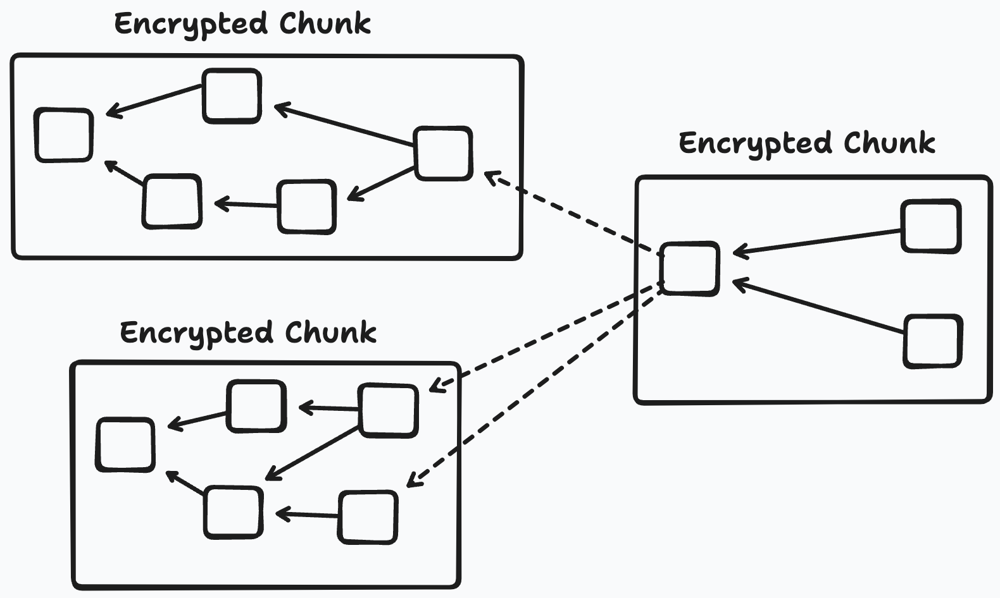

# Design

This directory contains the design rationale for the core components of Keyhive.

## Overview

The Keyhive project focuses on the [authorization][auth n vs z] (authZ) of updates to [local-first][LoFi] data such as [Automerge]. It includes end-to-end encryption (E2EE), continuous group key agreement (CGKA), and a capability system. We designed Keyhive to run both natively and in the browser. It aims to "do one thing well" (local-first access control), and be agnostic about questions of identity and account recovery so that so that it will be compatible with [PKI] and [identity] systems including [DID]s, [Keyoxide], [KERI], [OpenPGP], [petnames], [edgenames], [ATProto], etc.

Below is a high level overview of how the parts fit together. We have included dashed boxes to show where ID and recovery systems would fit, but we emphasize that implementing these are not in scope.

Automerge was designed for the local-first use case. This precludes network-based auth protocols like [OPAQUE], which is a network-based authentication (authN) protocol and thus depends on the encapsulation provided by the network to keep the information on the client and server separate. Crucially, local-first apps require [partition tolerance], so the entire application runs at every replica based on their [eventually-consistent][EC] view of the data, and thus we cannot rely on a network boundary like in OPAQUE (in addition to being authZ not authN). Our authorization needs are very simple: signing and verifying data with public key crypto (in our case: [Ed25519]).

This project uses similar techniques to E2EE messaging, but collaborative documents have different constraints which require different solutions. By way of a single example: in messaging, delivery is the most important, and there is generally no hard dependency between messages. Dropped messages in messaging or gaps in history is often acceptable (e.g. adding someone to a chat and not seeing the prior group's message history). In an op-based [CRDT] like Automerge, any gap in history prevents the application from applying future messages; omitting old history is not possible.

Keyhive itself is made of two parts: mutation control with a [capabilities][caps] and read control with [encryption-at-rest][DARE]. Both interact directly with compression and data sync since more access to CRDT graph metadata makes sync more efficient but access control seeks to protect as much data as possible. To this end, we designed Beelay (the Keyhive Relay) which syncs E2EE chunks. We include special provisions in the protocol for relays and sync servers which can store (but not read) E2EE content, yet needs to efficiently send diffs to authorized clients.

For Keyhive, we have developed a CRDT-focused variant of certificate capabilities (cert cap) that includes some of the statefulness of [object capabilities][ocap] (OCAP). We are calling this category "convergent capabilities" (concap). It would be possible to express the same semantics in certificate capabilities, but with significantly (often exponential) more certificates to enable our desired revocation semantics, which is contraindicated by our real world requirement to keep Automerge documents as small as possible. Concap gets closer to OCAP's simple authority graph model, but without the fail-stop semantics of object capabilities (since Automerge needs partition tolerance, the opposite of OCAP's [fail-stop]). One way of thinking about this is like how certificate capabilities act like a simulation of a capability network; convergent capabilities extend this to include more of the network by maintaining a stateful view. You can think of this as "a CRDT for capabilities". Beyond mutation control, this stateful view also is helpful for other parts of the system like continuous group key agreement (described later).

Upon receipt of an CRDT update/patch, we check the associated capability. Since we have causal delivery, the capability system needs to be aware of the data's causal history. Data from a source that is later discovered to have been revoked cannot simply be [tombstoned][tombstone], because revocation cascades can revoke the revoker. We have instead developed a visibility index for operations: they need to stay available to retain causality, but depending on the auth graph may or may not materialize.

Our encryption-at-rest layer is made of two parts: causal encryption, and continuous group key agreement (CGKA). Causal encryption is straightforward: instead of needing to re-derive keys for any chunk, we include the keys to causal predecessors. This is related to systems like [Cryptree]: it allows access to a document at a point in time. Because of how op-based CRDTs work, we must give up forward secrecy[^fs] (FS), but retain the ability to remove access (PCS) to future updates with the CGKA.

  
> FS vs PCS, adapted from [Cohn-Gordon et al][PCS].

For CGKA, we have developed a concurrent variant of [TreeKEM] (which underlies [MLS]). TreeKEM itself requires strict linearizability, and thus does not work in weaker consistency models. Several proposals have been made to add concurrency to TreeKEM, but they either increase communication cost exponentially, or depend on less common cryptographic primitives (such as commutative asymmetric keys). We have found a way to implement a causal variant of TreeKEM with widely-supported cryptography ([X25519] & [ChaCha]). There should be no issues replacing X25519 and ChaCha as the state of the art evolves (e.g. [PQC]), with the only restriction being that the new algorithms must support asymmetric key exchange. We believe this flexibility to be a major future-looking advantage of our approach. Our capability system drives the CGKA: it determines who's ECDH keys have read (decryption) access and should be included in the CGKA —  something not possible with standard certificate capabilities alone.

For our sync system (Beelay), application-level requests are stateless and run over [TLS] or [mTLS]. The statelessness is useful for those that need to scale horizontally. We do not require IP addresses by default. The only requirement is that patches eventually get from one machine to another, so P2P, sync servers, sneakernets, and carrier pigeon are all feasible in this model. All data is E2EE, but all cryptography is eventually breakable. To mitigate this in a defense-in-depth strategy, we do require that a requester prove that they have the capability to pull data from other replicas, which is managed under the capability system that we describe elsewhere.

The sync system does not require identities. As long as you can invoke a capability, then the other end can calculate what data you should be able to pull or edit. These connections do not in themselves depend on IP addresses, but if you use e.g. an HTTP transport then you will expose your IP address. We are interested in adding a mixnet transport or similar eventually, but is currently out of scope.

The underlying data and auth layers are CRDTs, so they don't depend on sessions or identities beyond public key crypto. If you are delegated to, and can sign with the related key, your update will be accepted by delegation chain self-certification. We have kept those other questions out of the system so that Keyhive can "do one thing well", and be composable with such systems.

<!-- Footnotes -->

[^fs]: Forward secrecy is the restriction of access to historical data. 

<!-- External Links -->

[ATProto]: https://atproto.com/
[Automerge]: https://automerge.org
[CRDT]: https://crdt.tech/
[ChaCha]: https://en.wikipedia.org/wiki/Salsa20#ChaCha_variant
[Cryptree]: https://ieeexplore.ieee.org/document/4032481
[DARE]: https://www.splunk.com/en_us/blog/learn/end-to-end-encryption.html#:~:text=Encryption%20at%20Rest%20refers%20to,two%20nodes%20of%20the%20network.
[DID]: https://www.w3.org/TR/did-core/
[EC]: https://en.wikipedia.org/wiki/Eventual_consistency
[Ed25519]: https://www.rfc-editor.org/rfc/rfc8032
[KERI]: https://keri.one/
[Keyoxide]: https://keyoxide.org/
[LoFi]: https://www.inkandswitch.com/local-first/
[MLS]: https://messaginglayersecurity.rocks/
[OPAQUE]: https://opaque-auth.com/
[OpenPGP]: https://www.openpgp.org/
[PCS]: https://eprint.iacr.org/2016/221.pdf
[PKI]: https://en.wikipedia.org/wiki/Public_key_infrastructure
[PQC]: https://en.wikipedia.org/wiki/Post-quantum_cryptography
[TLS]: https://en.wikipedia.org/wiki/Transport_Layer_Security
[TreeKEM]: https://inria.hal.science/hal-02425247/file/treekem+(1).pdf
[X25519]: https://datatracker.ietf.org/doc/html/rfc8410
[auth n vs z]: https://www.okta.com/identity-101/authentication-vs-authorization/
[caps]: https://en.wikipedia.org/wiki/Capability-based_security
[edgenames]: https://spritelyproject.org/news/petname-systems.html#:~:text=Edgenames
[fail-stop]: https://en.wikipedia.org/wiki/Fail-stop
[identity]: https://en.wikipedia.org/wiki/Digital_identity
[mTLS]: https://www.cloudflare.com/learning/access-management/what-is-mutual-tls/
[ocap]: https://en.wikipedia.org/wiki/Object-capability_model
[partition tolerance]: https://en.wikipedia.org/wiki/Network_partition
[petnames]: http://www.skyhunter.com/marcs/petnames/IntroPetNames.html
[tombstone]: https://crdt.tech/glossary#:~:text=tombstone
