# Causal Encryption

## Properties

* Backward secrecy / PCS: yes
* Forward secrecy: no, but maybe we could change that?

## Assumptions

* It is not possible to materialize an Automerge document without access to all events, back to genesis
* Post-compromise security (PCS) requires that a new, unique, random key is generated periodically (ideally on every change)
* Preventing someone from accessing future updates to a document involves removing their agent ID from the group, and thus removing their public keys from future symmetric key derivation
* [Group membership][Group Membership] is intended to change over time, so any agent that has access now should automatically have access to all prior history, even if they weren't part of the group at the time that block was written

## Key Management

Storing and transmitting all keys for an arbitrarily-sized store is possible, but fragile and unwieldly. Under the assumption that granting an entry point to the document at a point in history should reveal the entire history, our strategy is to include the keys for direct causal ancestors in each block.

While it would be ideal to prevent break-ins from reading prior messages (forward secrecy), doing so imposes a high burden to manage many keys. In the naive scenario, missing any keys from the history prevents (complete) document materialization.

## Crypt Store

When encrypted, there is no dependency on ordering between encrypted blobs. Any choice of set will work for storage.

```mermaid
flowchart LR
    subgraph genesis["oUz 🔒"]
      a["???"]
    end

    subgraph block1["g6z 🔒"]
      op1["???"]
    end

    subgraph block2["Xa2 🔒"]
      op2["???"]
    end

    subgraph block3["e9j 🔒"]
      op3["???"]
    end

    subgraph block4["fv7 🔒"]
      op4["???"]
    end

    block3 ~~~ block4 ~~~ block1 ~~~ genesis ~~~ block2
```

### Decryption Head

When given a $\langle \textsf{pointer}, \textsf{key} \rangle$ pair (via an arbitrary other channel), we're able to decrypt an entry point into this graph:

```mermaid
flowchart
    subgraph genesis["oUz 🔒"]
      a["???"]
    end

    subgraph block1["g6z 🔒"]
      op1["???"]
    end

    subgraph block2["Xa2 🔒"]
      op2["???"]
    end

    subgraph block3["e9j 🔒"]
      op3["???"]
    end

    subgraph block4["fv7 🔒"]
      op4["???"]
    end

    block3 ~~~ block4 ~~~ block1 ~~~ genesis ~~~ block2

    subgraph head[Head 1]
      pointer_head["Pointer #️⃣"]
      key_head["Key 🔑"]
    end

    pointer_head --> block3

    subgraph block3["e9j 🔓"]
      op3[Op 3]

      subgraph block3ancestors[Ancestors]
        subgraph block3ancestor1[Ancestor 1]
          pointer3_1["Pointer #️⃣"]
          key3_1["Key 🔑"]
        end

        subgraph block3ancestor2[Ancestor 2]
          pointer3_2["Pointer #️⃣"]
          key3_2["Key 🔑"]
        end
      end
    end

    pointer3_1 --> block1
    pointer3_2 --> block2
```

### Recursive Discovery

By following the links in the graph recursively, we're able to discover the intermediate pointers and keys back to genesis.

```mermaid
flowchart
    subgraph genesis["oUz 🔓"]
      a[New Doc]
    end

    subgraph block1["g6z 🔓"]
      op1[Op 1]

      subgraph block1ancestors[Ancestors]
        subgraph block1ancestor1[Ancestor 1]
          pointer1_1["Pointer #️⃣"]
          key1_1["Key 🔑"]
        end
      end
    end

    pointer1_1 --> genesis

    subgraph block2["Xa2 🔓"]
      op2[Op 2]

      subgraph block2ancestors[Ancestors]
        subgraph block2ancestor1[Ancestor 1]
          pointer2_1["Pointer #️⃣"]
          key2_1["Key 🔑"]
        end
      end
    end

    pointer2_1 --> genesis

    subgraph block3["e9j 🔓"]
      op3[Op 3]

      subgraph block3ancestors[Ancestors]
        subgraph block3ancestor1[Ancestor 1]
          pointer3_1["Pointer #️⃣"]
          key3_1["Key 🔑"]
        end

        subgraph block3ancestor2[Ancestor 2]
          pointer3_2["Pointer #️⃣"]
          key3_2["Key 🔑"]
        end
      end
    end

    pointer3_1 --> block1
    pointer3_2 --> block2

    subgraph block4["fv7 🔒"]
      op4["???"]
    end

    subgraph head[Head 1]
      pointer_head["Pointer #️⃣"]
      key_head["Key 🔑"]
    end

    pointer_head --> block3
```

Note that this may not immediately cover all of the nodes in the history. For example, above we were able to discover a complete history causally prior to `ej9`. Notably, this _does not_ include `fv7`, which we know a priori must be one of the following:

* A concurrent operation
* A _descendant_ of `ej9`
* Belong to a different document

This is what is meant by "encryption and latency are similar". Despite `fv7` being available in a store, without a key it is not possible to materialize into our document. Assuming that we will receive a key for it eventually, the part of the history that it represents is under partition.

### Multiple Heads

Let us assume that `fv7` is part of this document. By supplying a new head for it, we are able to connect it to the DAG:

```mermaid
flowchart
    subgraph genesis["oUz 🔓"]
      a[New Doc]
    end

    subgraph block1["g6z 🔓"]
      op1[Op 1]

      subgraph block1ancestors[Ancestors]
        subgraph block1ancestor1[Ancestor 1]
          pointer1_1["Pointer #️⃣"]
          key1_1["Key 🔑"]
        end
      end
    end

    pointer1_1 --> genesis

    subgraph block2["Xa2 🔓"]
      op2[Op 2]

      subgraph block2ancestors[Ancestors]
        subgraph block2ancestor1[Ancestor 1]
          pointer2_1["Pointer #️⃣"]
          key2_1["Key 🔑"]
        end
      end
    end

    pointer2_1 --> genesis

    subgraph block3["e9j 🔓"]
      op3[Op 3]

      subgraph block3ancestors[Ancestors]
        subgraph block3ancestor1[Ancestor 1]
          pointer3_1["Pointer #️⃣"]
          key3_1["Key 🔑"]
        end

        subgraph block3ancestor2[Ancestor 2]
          pointer3_2["Pointer #️⃣"]
          key3_2["Key 🔑"]
        end
      end
    end

    pointer3_1 --> block1
    pointer3_2 --> block2

    subgraph block4["fv7 🔓"]
      op4[Op 4]

      subgraph block4ancestors[Ancestors]
        subgraph block4ancestor1[Ancestor 1]
          pointer4_1["Pointer #️⃣"]
          key4_1["Key 🔑"]
        end
      end
    end

    pointer4_1 --> block2

    subgraph head[Head 1]
      pointer_head["Pointer #️⃣"]
      key_head["Key 🔑"]
    end

    pointer_head --> block3

    subgraph head2[Head 2]
      pointer_head_2["Pointer #️⃣"]
      key_head_2["Key 🔑"]
    end

    pointer_head_2 --> block4
```

<!-- External Links -->
[Group Membership]: ./group_membership.md
