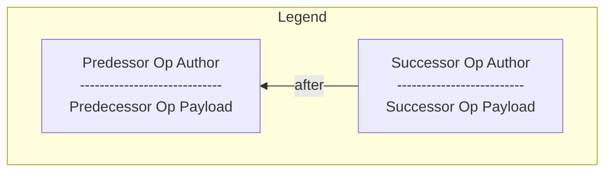

# Collection Sync

# Abstract

Synchronizing the operations for a single document involves finding which ops are not present on each replica. This naturally extends to _collections_ of documents. This introduces a new concern: how to efficiently track _which documents_ to sync, given that either peer may not be aware of the existence of all documents. This further interacts with [Pull Control], which provides a clean mechanism for determining which documents are available to a peer.

# Conventions

## Language

The key words "MUST", "MUST NOT", "REQUIRED", "SHALL", "SHALL NOT", "SHOULD", "SHOULD NOT", "RECOMMENDED", "NOT RECOMMENDED", "MAY", and "OPTIONAL" in this document are to be interpreted as described in [BCP 14] when, and only when, they appear in all capitals, as shown here.

## Diagrams

There are several diagrams below. We use the following graphical conventions:

# 
