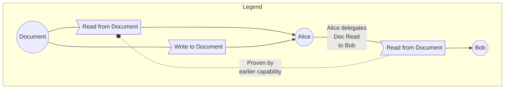
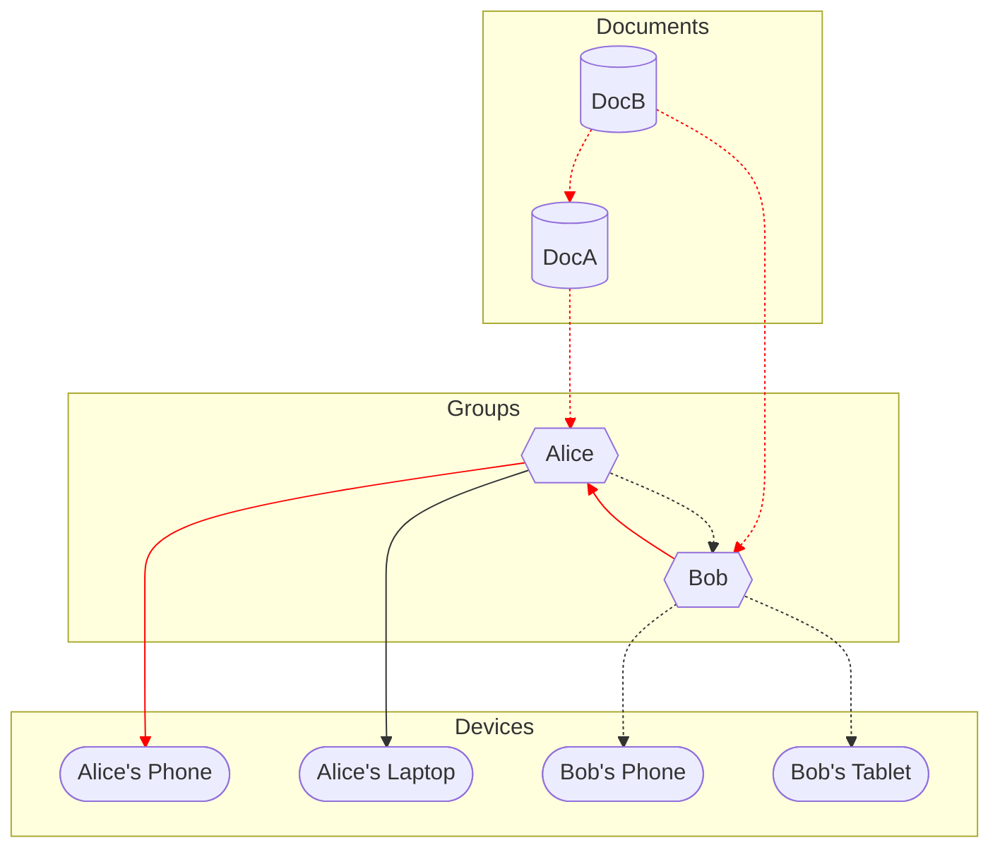

# Collection Sync

## Dependencies

* [Group Membership]

# Abstract

Synchronizing the operations for a single document involves finding which ops are not present on each replica. This naturally extends to _collections_ of documents. This introduces a new concern: how to efficiently track _which documents_ to sync, given that either peer may not be aware of the existence of all documents. This further interacts with [Pull Control], which provides a clean mechanism for determining which documents are available to a peer.

# Conventions

## Language

The key words "MUST", "MUST NOT", "REQUIRED", "SHALL", "SHALL NOT", "SHOULD", "SHOULD NOT", "RECOMMENDED", "NOT RECOMMENDED", "MAY", and "OPTIONAL" in this document are to be interpreted as described in [BCP 14] when, and only when, they appear in all capitals, as shown here.

## Diagrams

There are several diagrams below. We use the following graphical conventions:

# Discovery

Collecton sync proceeds from a specific replica's public key to the Document IDs (also public keys) that they have access to

In this scenario, the following would need to be added to the sync collection for two of the devices:
* Alex's Shared Home Computer
  * Alex (group membership)
  * Groceries (content & group membership)
* Peter's Laptop
  * Peter (group membership)
  * Ink & Switch (group membership)
  * Hiking Plans (content & group membership)
  * Meeting Notes (content & group membership)
  * Week 32 Notes (content & group membership)
  * Week 33 Notes (content & group membership)
  
## Reverse Lookup
  
Even though this search involves a reverse lookup on the links, it can be treated as a valid materialization of the delegation operations. There is nothing preventing an implementation from materializing both forward and backward views of the data.

# Cycles

Recall that [cycles and reduendant links are permitted in the authority graph].

Due to this, the node discovery MUST be run to a fixed point. Memoization is RECOMMENDED to improve the performance of such lookups.

Using the example above, we know that any node that has a path to Alice automatically has a path to Doc A, Doc B, and Bob. Alice's Phone's path is highlighted in red.

Any node that has a path to Bob also has a path to Alice, Doc A and Doc B. Therefore, by virtue of a path to Alice, Alice's Laptop can automatically assume access to Doc A, Doc B, and Bob. Bob's Tablet's paths is denoted with a dotted line.

<!-- External Links -->
[Group Membership](./group_membership.md)
