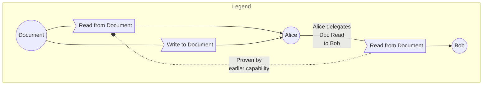

# Convergent Capabilities

We propose naming this class of capabilities "Convergent Capabilities", or "concap" for short.

# Conventions

# Language

The key words "MUST", "MUST NOT", "REQUIRED", "SHALL", "SHALL NOT", "SHOULD", "SHOULD NOT", "RECOMMENDED", "NOT RECOMMENDED", "MAY", and "OPTIONAL" in this document are to be interpreted as described in [BCP 14] when, and only when, they appear in all capitals, as shown here.

## Diagrams

There are several diagrams below. We use the following graphical conventions:

# Delegation

## Variants

Pull, Read, Mutate, Manage.

# FAQ

## Differences from Object Capabilities (ocap)

## Differences from Certificate Capabilities (SPKI)
