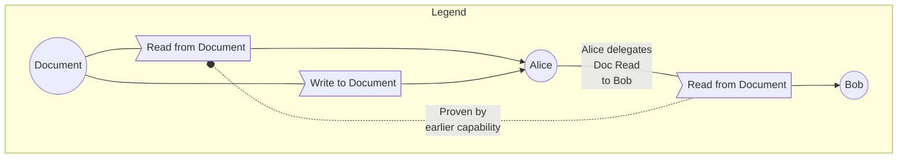
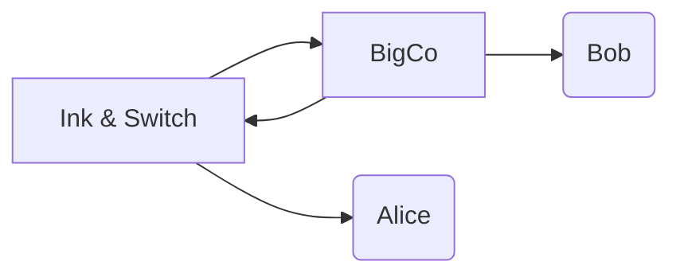

# Convergent Capabilities

We propose naming this class of capabilities "Convergent Capabilities", or "concap" for short.

## Motivation

Keyhive operates in a local-first setting with [partition tolerance] and [eventual consistency]. Traditional capability models do not fit this context:

- **Object capabilities** ([OCAP]) depend on fail-stop semantics — revocation is instant because the runtime controls the reference graph. Under network partitions, an OCAP system cannot guarantee revocation propagation.
- **Certificate capabilities** ([SPKI]) are stateless certificates. Expressing the revocation semantics Keyhive needs (cascading, conditional, concurrent) requires exponentially many certificates as the group grows.

Convergent capabilities bridge these models. They extend certificate capabilities with a _stateful, convergent_ view of the authority graph, bringing OCAP's simple authority model to an eventually consistent setting. The authority graph is a CRDT: concurrent delegations and revocations converge deterministically.

One way to think about this: certificate capabilities simulate a capability network; convergent capabilities extend the simulation to include more of the network state, using CRDTs to resolve conflicts.

## Conventions

### Language

The key words "MUST", "MUST NOT", "REQUIRED", "SHALL", "SHALL NOT", "SHOULD", "SHOULD NOT", "RECOMMENDED", "NOT RECOMMENDED", "MAY", and "OPTIONAL" in this document are to be interpreted as described in [BCP 14] when, and only when, they appear in all capitals, as shown here.

### Diagrams


```mermaid
flowchart
    subgraph Legend
        doc(("Document"))
        capRW>"Write to Document"]
        capRR>"Read from Document"]

        alice(("Alice"))
        bob(("Bob"))

        abRR>Read from Document]
    end

    doc --- capRR ---> alice
    doc --- capRW --> alice

    abRR -.-o|"Proven by<br>earlier capability"| capRR

    alice ---|Alice delegates<br>Doc Read<br>to Bob| abRR --> bob
```

## Access Levels

Capabilities come in four levels, ordered by inclusion:

| Level | Rights | Includes |
|-------|--------|----------|
| **Pull** | Sync E2EE ciphertext from relays | _(base)_ |
| **Read** | Decrypt content | Pull |
| **Write** (Mutate) | Create content operations | Read |
| **Manage** | Change group membership (delegate/revoke) | Write |

Every capability at a higher level implies all lower levels. A Manager can Write, Read, and Pull. A Reader can Pull but not Write.

## Delegation

Any [Agent] MAY delegate authority _that it possesses_ to another Agent. Delegation creates a signed edge in the authority graph.

### Attenuation

Delegations MAY be attenuated — restricted to a subset of the delegator's authority. For example, a Manager may delegate Read-only access. Attenuation is monotonically narrowing: a delegate cannot escalate beyond what was granted.

### Transitivity

Delegation is transitive. If Alice delegates to Bob, and Bob delegates to Carol, then Carol has authority derived from Alice (subject to attenuation at each step).

Sub-delegation MUST NOT be restricted. Attempting to prevent sub-delegation leads to worse outcomes (key sharing) and prevents desirable patterns like delegating narrow authority to ephemeral workers ([PoLA]).

### Cycles

Group delegations form a directed graph that MAY contain cycles. For example, two groups can delegate to each other:


```mermaid
flowchart LR
    ias[Ink & Switch] --> bigco[BigCo]
    bigco --> ias

    ias --> alice(Alice)
    bigco --> bob(Bob)
```

Cycles are resolved by fixed-point evaluation during authorization checks and [collection sync](./collection_sync.md).

## Revocation

Any Agent with Manage authority over a group MAY revoke a delegation. Revocations are signed operations that include causal dependencies:

```rust
struct AuthOp {
    action: AuthAction, // AddSingleton | AddGroup | RemoveAgent
    auth_pred: Vec<Hash>,
    doc_heads: BTreeMap<DocId, Vec<Hash>>,
    author: PublicKey,
    signature: Signature,
}
```

### Causal Locking

The `doc_heads` field locks the revocation to a specific causal state of the document content. Operations from the revoked agent that causally succeed this lock point are not materialized.

### Cascading

Revoking an agent also revokes all of that agent's sub-delegations (transitively). However, if the revoker is themselves later revoked, the cascade may be undone.

### Visibility vs Materialization

Revoked operations are _not_ deleted — they remain in the causal history for integrity. Instead, a _visibility index_ determines which operations materialize into the application state. This prevents the tombstone problem where revocation cascades could corrupt causal chains.

## Differences from Object Capabilities (OCAP)

| Property | OCAP | Concap |
|----------|------|--------|
| Revocation | Immediate (runtime-controlled references) | Eventually consistent (causal CRDT) |
| Fail-stop | Required | Not required (partition tolerant) |
| Authority graph | Implicit in runtime object references | Explicit, replicated, convergent |
| Statefulness | Fully stateful (objects hold state) | Stateful view via CRDT, certificates carry proof |

## Differences from Certificate Capabilities (SPKI)

| Property | SPKI | Concap |
|----------|------|--------|
| Statefulness | Stateless certificates | Stateful convergent view |
| Revocation | CRL or OCSP (centralized) | Causal CRDT (decentralized) |
| Expressiveness | Exponential certificates for complex revocation | Linear operations in the auth DAG |
| Conflict resolution | Not applicable (no concurrency) | CRDT merge semantics |

## Interaction with CGKA

The capability system drives the CGKA: it determines whose ECDH keys have read (decryption) access and should be included in the key agreement tree. When membership changes, the CGKA tree is updated accordingly.

This coupling is _not_ possible with stateless certificate capabilities alone — the CGKA needs to know the current set of authorized readers at any point, which requires the stateful view that concap provides.

<!-- External Links -->
[BCP 14]: https://datatracker.ietf.org/doc/bcp14/
[OCAP]: https://en.wikipedia.org/wiki/Object-capability_model
[SPKI]: https://en.wikipedia.org/wiki/Simple_public-key_infrastructure
[partition tolerance]: https://en.wikipedia.org/wiki/Network_partition
[eventual consistency]: https://en.wikipedia.org/wiki/Eventual_consistency
[PoLA]: https://en.wikipedia.org/wiki/Principle_of_least_privilege
[Agent]: ./group_membership.md#agents
