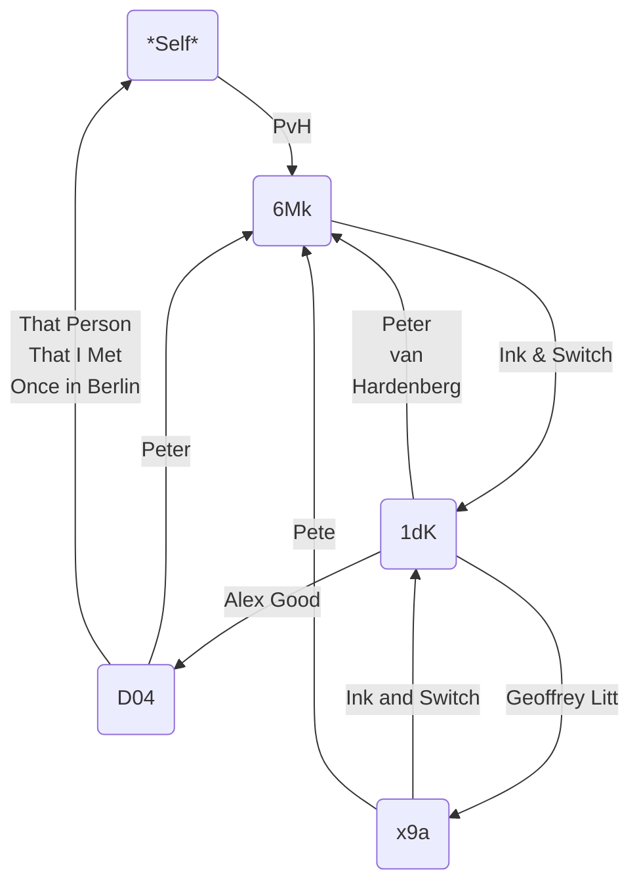

# Edge Names

# Motivation

It is [conjectured][Zooko's Triangle] that having a naming scheme that is cryptographically secure, decentralized, and human readable is impossible. To work around this, many systems have adopted a layered approach where the ground truth is secure and decentralized, and some trusted authority layers on a binding of a human-readable name to one or more public keys.

Since there is a large number of such binding solutions — each with their own tradeoffs — the core Keyhive design intentionally leaves questions of human-readable identifiers out of scope. However, many developers are not experts in the finer distinctions between authz, authn, and identity. As such, Keyhive "should" include some lightweight, loosely coupled, default identity mechanism, with the ability to replace this with a more sophisticated mechanism such as DNS, ENS, the Name Name System, etc.

> [!CAUTION]
> It is extremely important to note that edge names SHOULD NOT be considered authoritative. There is no verifiable proof behind these names other than a claim by some entity in the graph.

# From Pet Names to Edge Names

"Pet names" (PN) is an extremely simple naming mechanism: each agent does the binding themselves. Since you are the root of trust, this list of bindings is fully trusted and kept private. This is often compared to an address book: people maintain a book themselves, but 

The downside is that each agent now must name all others, which is impractical for many applications.

[Edge names][Spritely pet names] (EN) relax the PN privacy restriction to gain a minimalist name discovery system. Instead of a root authority that hands out unique names, each agent MAY share its name bindings. These MUST be namespaced by that agent's identifier. Proceeding recursively, an agent starts from their own bindings, and appends the names on the paths to the other reachable agents. This is arguably the most bare name setting for groups.

> [!WARNING]
> Note that in an EN system, there are no _universal_ names beyond cryptographic identifiers. This meets the underlying need of a common name (typically a public key) and decentralized name discovery.

For example:

Note that these names are _extremely loose_ and depend on the exact path of name authorities. By convention in this document, we will use the familiar URL format since it represents paths under an authority. For example:

* `edgename:PvH` (i.e. your name for `6Mk`)
* `edgename://1dK/Peter van Hardenburg` directly claimed names
* `edgename://1dK/Alex Good/Peter` transitive names

You can also discover others names for you, such as `edgename://D04/That Person That I Met Once in Berlin`.

This is especially helpful with address book documents controlled by groups, since this can be managed by the group itself.

<!-- External Links -->
[Spritely pet names]: https://spritely.institute/static/papers/petnames.html
[Zooko's Triangle]: https://en.wikipedia.org/wiki/Zooko's_triangle
