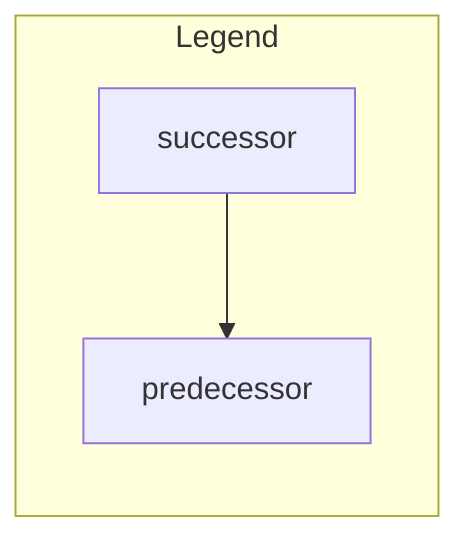
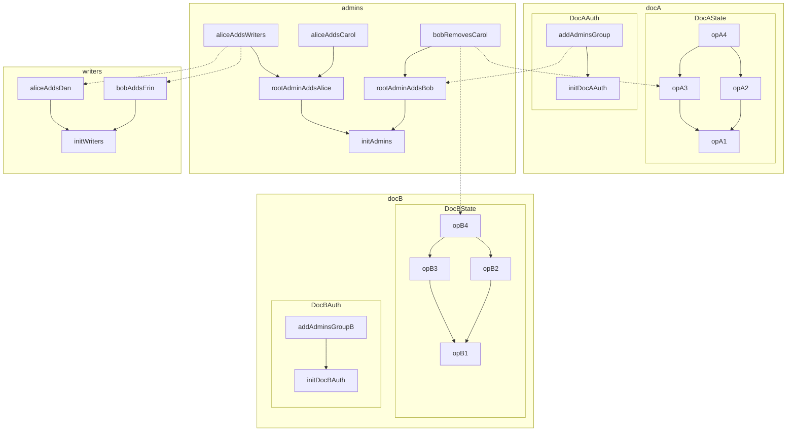

# Group Membership

Group membership in Beehive has two main concepts: a membership CRDT, and a variant of object capabilities adapted to an eventually consistent setting. We propose naming this class of capabilities "Convergent Capabilities", or "concap" for short.

## Example

# State Transition

The state of a 

# Delegated Authority

## Transitive Authority

## Applications to [Collection Sync]

# FAQ

## Differences from Access Control Lists (ACLs)

## Differences from Object Capabilities (ocap)

## Differences from Certificate Capabilities / SPKI

<!-- External Links -->

[Collection Sync]: ./collection_sync.md
