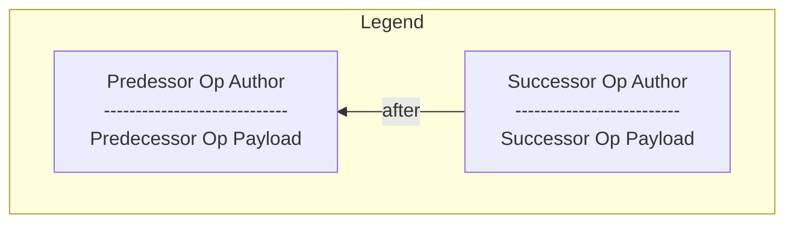
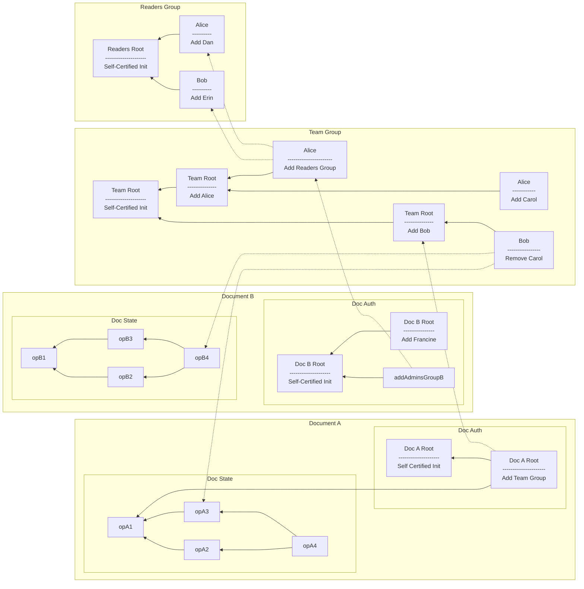
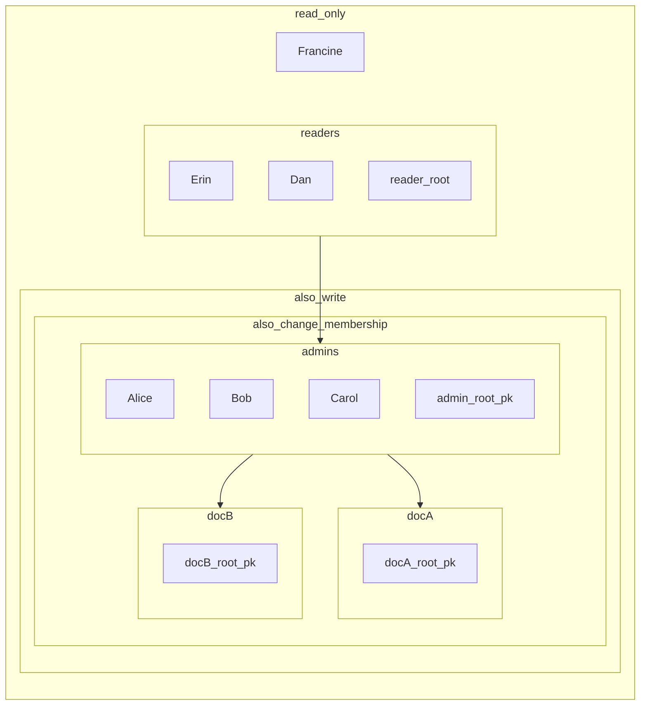
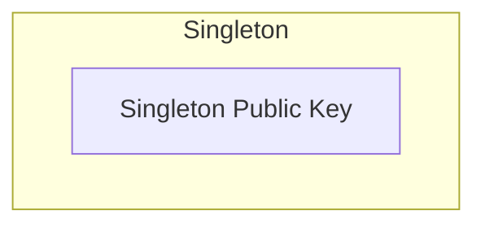
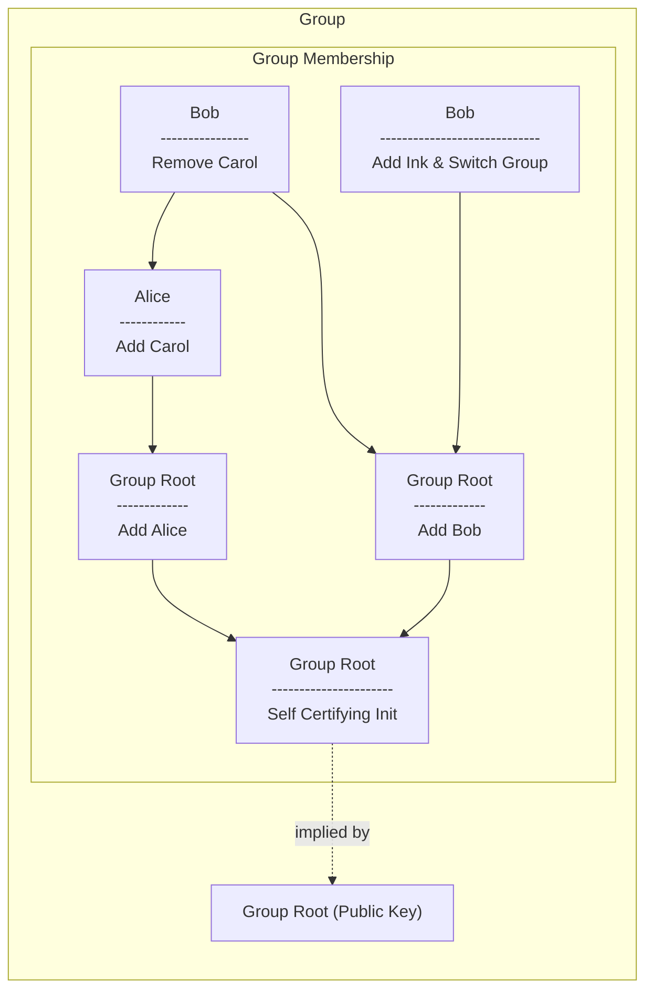
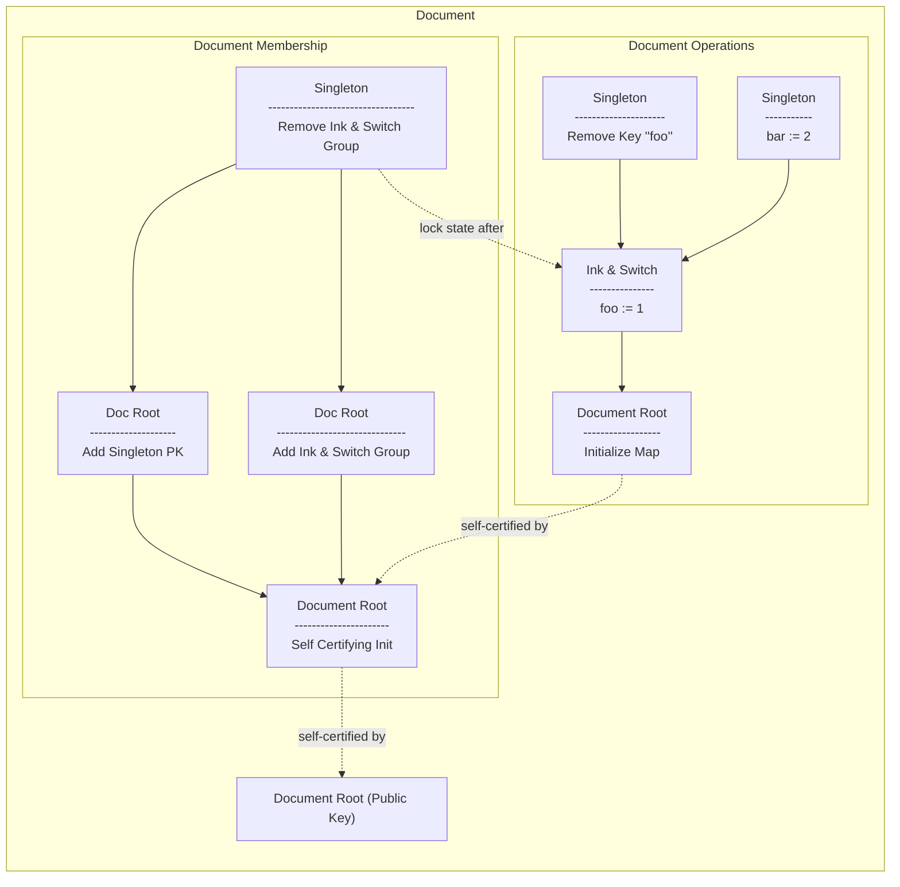
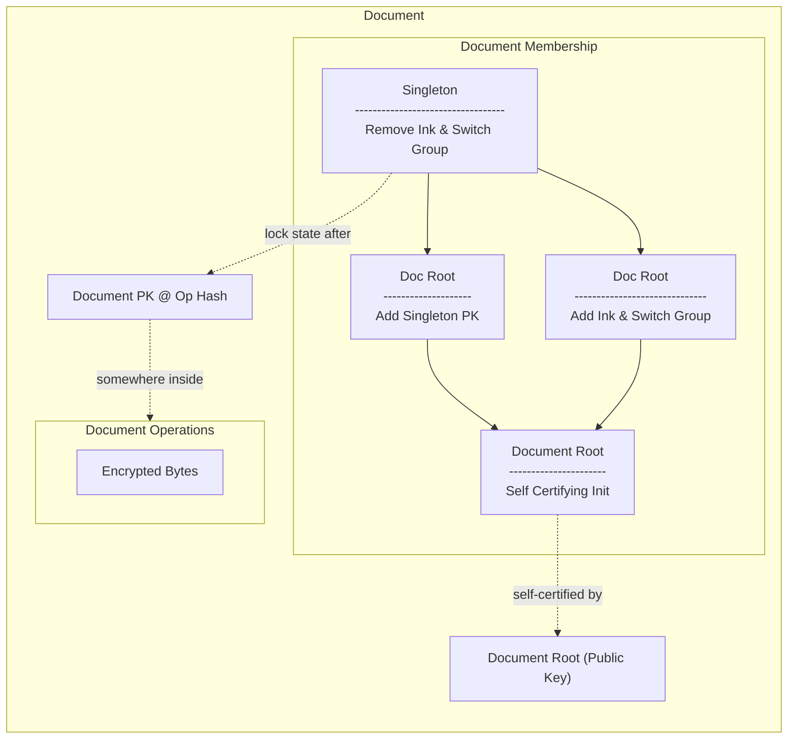
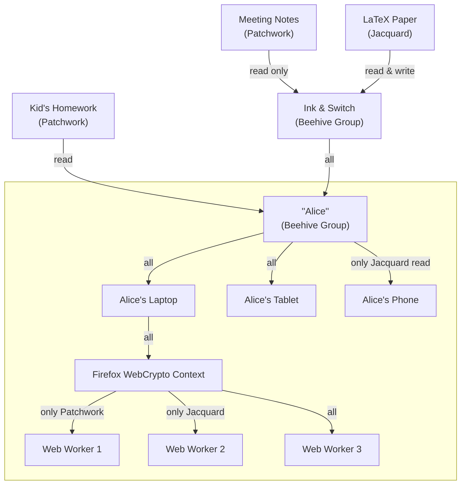

# Group Membership

Group membership in Beehive has two main concepts: a membership op-based CRDT, and a variant of object capabilities adapted to an eventually consistent setting. We propose naming this class of capabilities "Convergent Capabilities", or "concap" for short.

To keep the nuber of pieces small in the example, we will use a short hierarchy: admins (arbitrary access) and read-only. 

## Example

### Objects & Causal State





### Materialized View

The above example materialized to the following:



# State Transition

The state of a 

FIXME: batch signatures (since signatures don't compress)
IXME alternate version from teh paper:

FIXME on add, do we need agent heads, or just the removals? If only removals for efficiency, keep them in a Merkle Set, and reference the root? Given that this is concurrent taht may not work...
FIXME need to include agent heads in revocations?
FIXME discuss deny listing
FIXME do we need to include the proofhead since we can materialize the view. It may make it fster to provide a Merkle proof & compare to the tombstone set
        ...that imples that we define a way to reference auth state heads in a merkle tree, but we may not actually be able to do that thanks to EC
        ... nope, we've opted to allow re-adds, so no tombstone set

TODO: fix formatting; I just find this easier to read as a personal quirk 

```rust
enum AuthAction {
  // Arguably this could be expressed as AddGroup with group_heads: vec![singleton.id].
  // It's a noop if you give a stateless agent a different head,
  // since you will never be able to apply the op.
  AddSingleton { id: PublicKey },
  
  // Add Group includes docs, since Doc :< Group
  // Since Group :< Singleton, you *could* add a group that way,
  // but it would add at the start of its history 
  // (which may or may not be desirable, depending on the domain)
  AddGroup { 
    id: PublicKey, 
    group_heads: Vec<Hash> 
  },
  
  RemoveAgent { id: PublicKey },
}

struct AuthOp {
  action: AuthAction, // ⬆️
  
  auth_pred: Vec<Hash>, 
  doc_heads: Vec<(DocId, Hash)>,
  
  author: PublicKey,
  signature: Signature
}
```

## Materialization

Materialization if access at a certain level proceeds recursively. Given read access to the caveats of each group, a complete list of users and their capabilities $\langle \textsf{agentId}, \textsf{agentOrDocId}, \textsf{[restrictions]} \rangle$. The lowest level of rights in the preset is `pull`, which only requires knowing the current public key of leaf agents.

In this case, we have the following authority for Doc A:

| Agent       | Pull Doc A | E2EE Read Doc A | Write to Doc A | Change Membership on Doc A |
|-------------|------------|-----------------|----------------|----------------------------|
| Alice       | ✅         | ✅              | ✅             | ✅                         |
| Bob         | ✅         | ✅              | ✅             | ✅                         |
| Carol       | ✅         | ✅              | ✅             | ✅                         |
| Dan         | ✅         | ✅              | ❌             | ❌                         |
| Erin        | ✅         | ✅              | ❌             | ❌                         |
| Francine    | ❌         | ❌              | ❌             | ❌                         |
| Reader Root | ✅         | ✅              | ❌             | ❌                         |
| Admin Root  | ✅         | ✅              | ✅             | ✅                         |
| Doc A Root  | ✅         | ✅              | ✅             | ✅                         |
| Doc B Root  | ❌         | ❌              | ❌             | ❌                         |

And for Doc B:

| Agent       | Pull Doc B | E2EE Read Doc B | Write to Doc B | Change Membership on Doc B |
|-------------|------------|-----------------|----------------|----------------------------|
| Alice       | ✅         | ✅              | ✅             | ✅                         |
| Bob         | ✅         | ✅              | ✅             | ✅                         |
| Carol       | ✅         | ✅              | ✅             | ✅                         |
| Dan         | ✅         | ✅              | ❌             | ❌                         |
| Erin        | ✅         | ✅              | ❌             | ❌                         |
| Francine    | ✅         | ✅              | ❌             | ❌                         |
| Reader Root | ✅         | ✅              | ❌             | ❌                         |
| Admin Root  | ✅         | ✅              | ✅             | ✅                         |
| Doc A Root  | ❌         | ❌              | ❌             | ❌                         |
| Doc B Root  | ✅         | ✅              | ✅             | ✅                         |

### Auth Roots

Auth roots are

## Re-Adds


# Anatomy

All groups MUST be represented by a "root" keypair. A 

## Stateless Singletons



## Stateful Groups



## Documents



## Encrypted Op State

Note that the above may not all be available as cleartext. For example, a Puller will see the [Document] example above as something along the following lines:



This enough information for them to know may request document bytes, but not enough to actually decrypt the document state.

# Delegation

## Attenuated Authority

## Transitive Access

# Device Management

This strategy does not distinguish between users, groups, and public keys. In a sense, public keys are stateless singleton groups.



## Applications to [Collection Sync]

# FAQ

## Differences from Access Control Lists (ACLs)

## Differences from Object Capabilities (ocap)

## Differences from Certificate Capabilities / SPKI

<!-- External Links -->

[Collection Sync]: ./collection_sync.md
