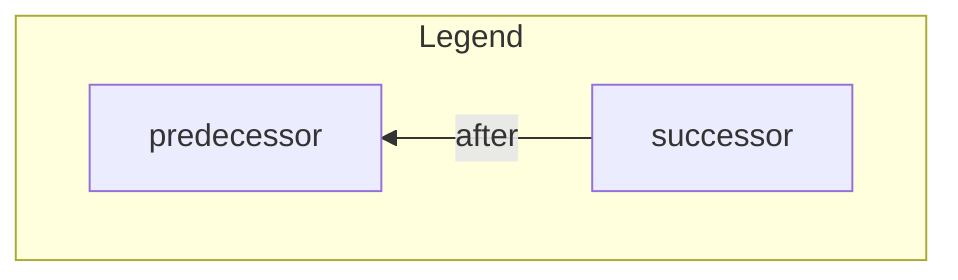
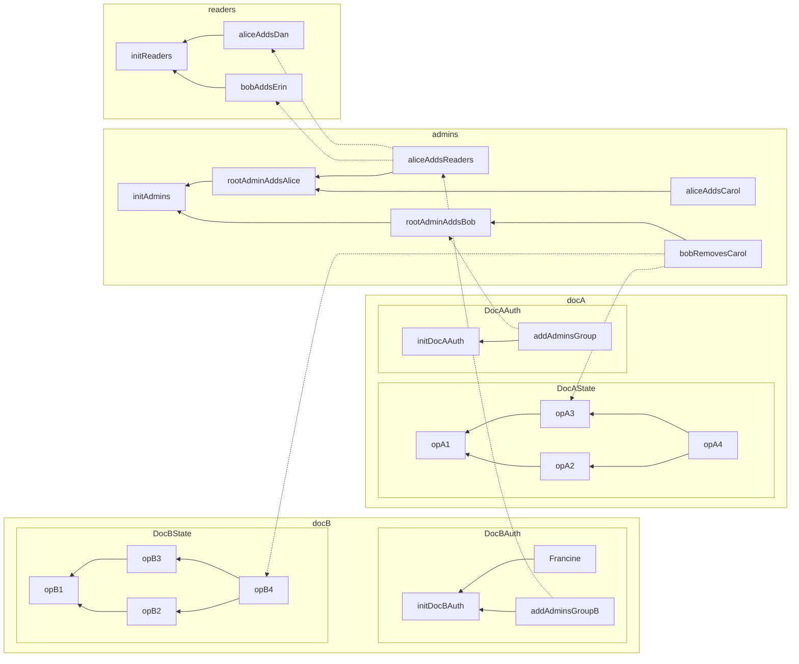
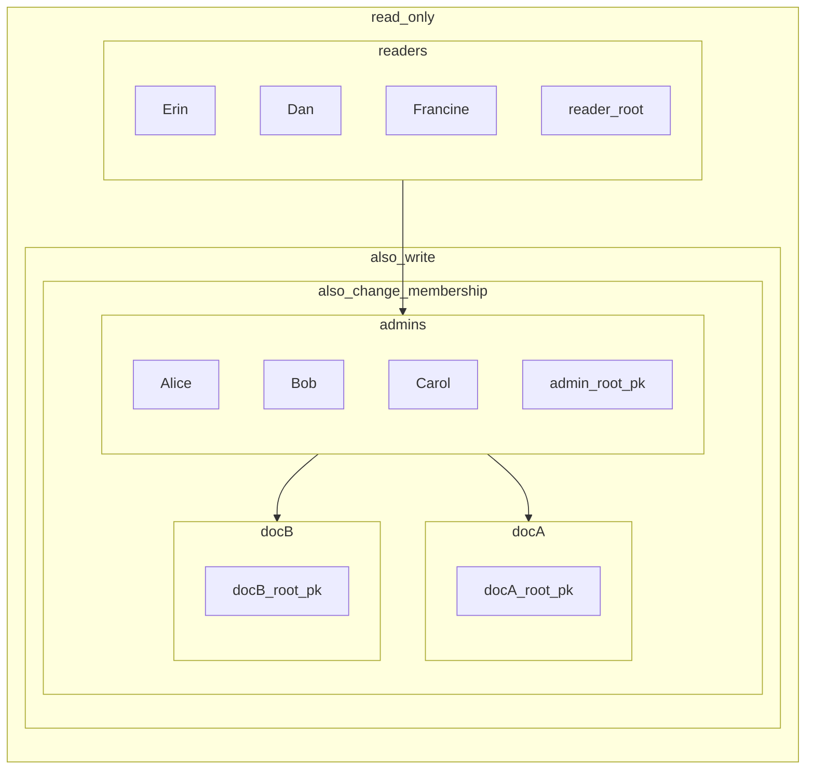

# Group Membership

Group membership in Beehive has two main concepts: a membership CRDT, and a variant of object capabilities adapted to an eventually consistent setting. We propose naming this class of capabilities "Convergent Capabilities", or "concap" for short.

To keep the nuber of pieces small in the example, we will use a short hierarchy: admins (arbitrary access) and read-only. 

## Example

# State Transition

The state of a 

FIXME: batch signatures (since signatures don't compress)

$$
\begin{align*}
&\delta & ::= & \quad \textsf{AddStatelessAgent} \quad & \textsf{agentId} \quad & \quad                             & \textsf{publicKey} \quad & \textsf{signature} \\
&       &   | & \quad \textsf{AddStatefulAgent}  \quad & \textsf{agentId} \quad & \textsf{agentStateHeads}    \quad & \textsf{publicKey} \quad & \textsf{signature} \\
&       &   | & \quad \textsf{RemoveAgent}       \quad & \textsf{agentId} \quad & \textsf{documentStateHeads} \quad & \textsf{publicKey} \quad & \textsf{signature} \\
\end{align*}
$$

FIXME alternate version from teh paper:

FIXME on add, do we need agent heads, or just the removals? If only removals for efficiency, keep them in a Merkle Set, and reference the root? Given that this is concurrent taht may not work...
FIXME need to include agent heads in revocations?
FIXME discuss deny listing
FIXME do we need to include the proofhead since we can materialize the view. It may make it fster to provide a Merkle proof & compare to the tombstone set
        ...that imples that we define a way to reference auth state heads in a merkle tree, but we may not actually be able to do that thanks to EC
        ... nope, we've opted to allow re-adds, so no tombstone set

TODO: fix formatting; I just find this easier to read as a personal quirk 
$$
\begin{align*}
&\delta & ::= & \quad \textsf{AddStatelessAgent} \quad & \textsf{agentId} \quad &                                & \textsf{documentStateHeads} \quad & \textsf{publicKey} \quad & \textsf{signature} \\
&       &   | & \quad \textsf{AddStatefulAgent}  \quad & \textsf{agentId} \quad & \textsf{agentStateHeads} \quad & \textsf{documentStateHeads} \quad & \textsf{publicKey} \quad & \textsf{signature} \\
&       &   | & \quad \textsf{RemoveAgent}       \quad & \textsf{agentId} \quad & \textsf{agentStateHeads} \quad & \textsf{documentStateHeads} \quad & \textsf{publicKey} \quad & \textsf{signature} \\
\end{align*}
$$

## Materialization

Materialization if access at a certain level proceeds recursively. Given read access to the caveats of each group, a complete list of usres and their capabilities ($\lange \textsf{agentId}, \textsf{agentorDocId}, \textsf{[restrictions]} \rangle$). The lowest level of rights in the preset is `pull`, which only requires knowing the public key of leaf agents.

In this case, we have the following authority for Doc A:

| Agent       | Pull Doc A | E2EE Read Doc A | Write to Doc A | Change Membership on Doc A |
|-------------|------------|-----------------|----------------|----------------------------|
| Alice       | ✅         | ✅              | ✅             | ✅                         |
| Bob         | ✅         | ✅              | ✅             | ✅                         |
| Carol       | ✅         | ✅              | ✅             | ✅                         |
| Dan         | ✅         | ✅              | ❌             | ❌                         |
| Erin        | ✅         | ✅              | ❌             | ❌                         |
| Francin     | ❌         | ❌              | ❌             | ❌                         |
| Reader Root | ✅         | ✅              | ❌             | ❌                         |
| Admin Root  | ✅         | ✅              | ✅             | ✅                         |
| Doc A Root  | ✅         | ✅              | ✅             | ✅                         |
| Doc B Root  | ❌         | ❌              | ❌             | ❌                         |

And for Doc B:

| Agent       | Pull Doc B | E2EE Read Doc B | Write to Doc B | Change Membership on Doc B |
|-------------|------------|-----------------|----------------|----------------------------|
| Alice       | ✅         | ✅              | ✅             | ✅                         |
| Bob         | ✅         | ✅              | ✅             | ✅                         |
| Carol       | ✅         | ✅              | ✅             | ✅                         |
| Dan         | ✅         | ✅              | ❌             | ❌                         |
| Erin        | ✅         | ✅              | ❌             | ❌                         |
| Francine    | ✅         | ✅              | ❌             | ❌                         |
| Reader Root | ✅         | ✅              | ❌             | ❌                         |
| Admin Root  | ✅         | ✅              | ✅             | ✅                         |
| Doc A Root  | ❌         | ❌              | ❌             | ❌                         |
| Doc B Root  | ✅         | ✅              | ✅             | ✅                         |

### Auth Roots

Auth roots are

## Re-Adds

# Delegated Authority

## Transitive Authority

## Applications to [Collection Sync]

# FAQ

## Differences from Access Control Lists (ACLs)

## Differences from Object Capabilities (ocap)

## Differences from Certificate Capabilities / SPKI

<!-- External Links -->

[Collection Sync]: ./collection_sync.md
