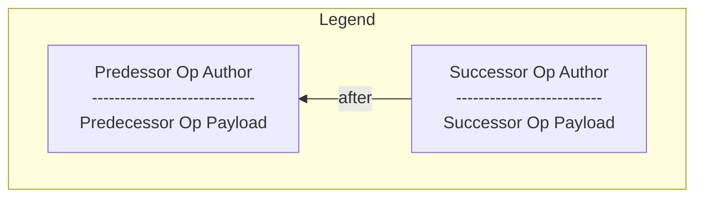
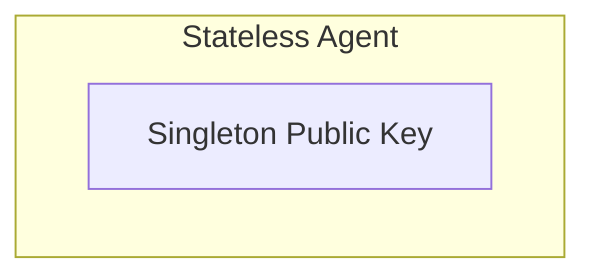
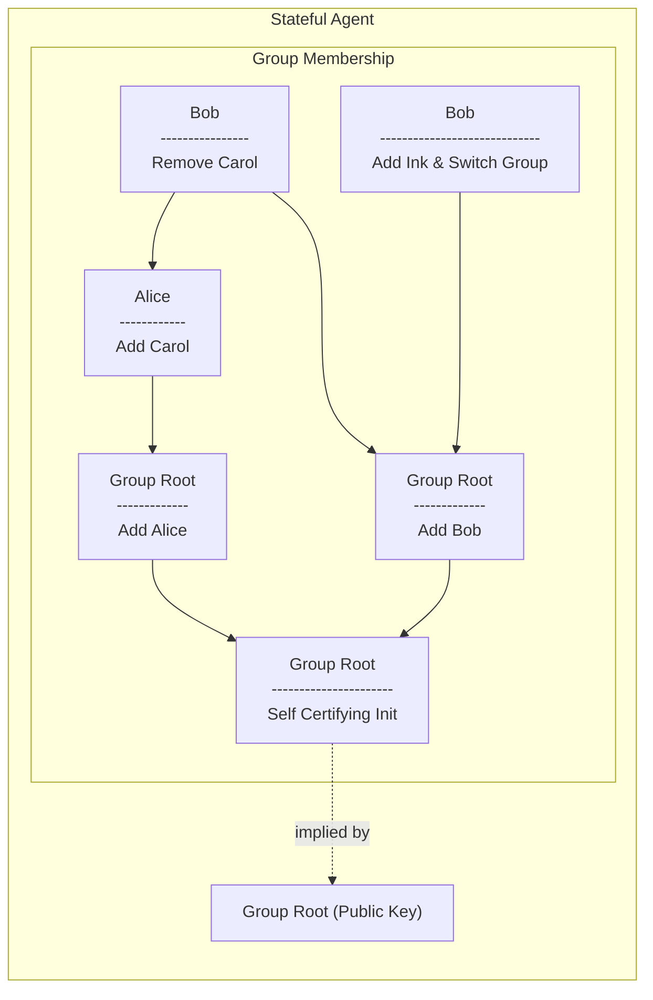
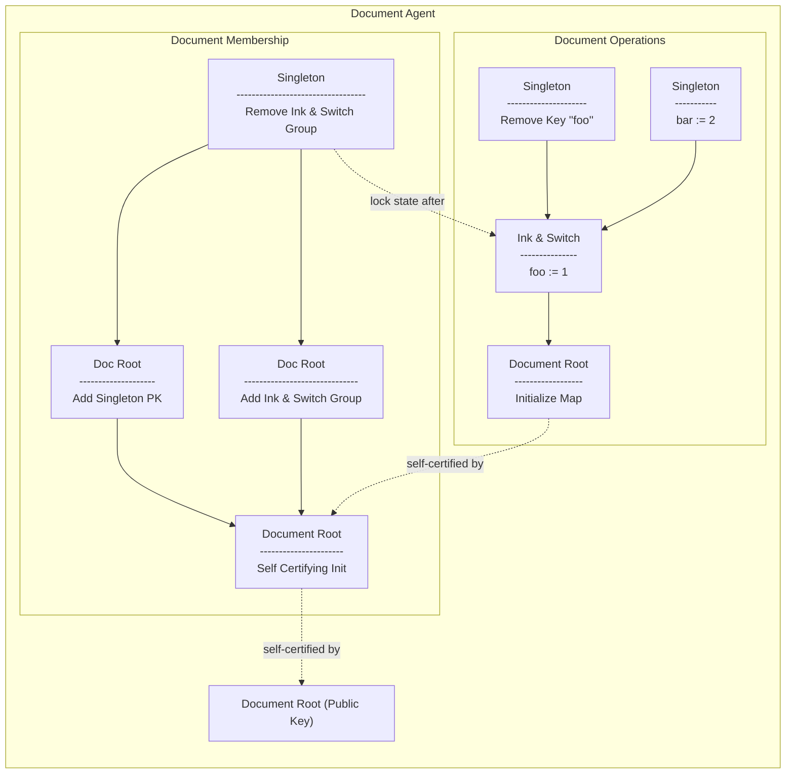
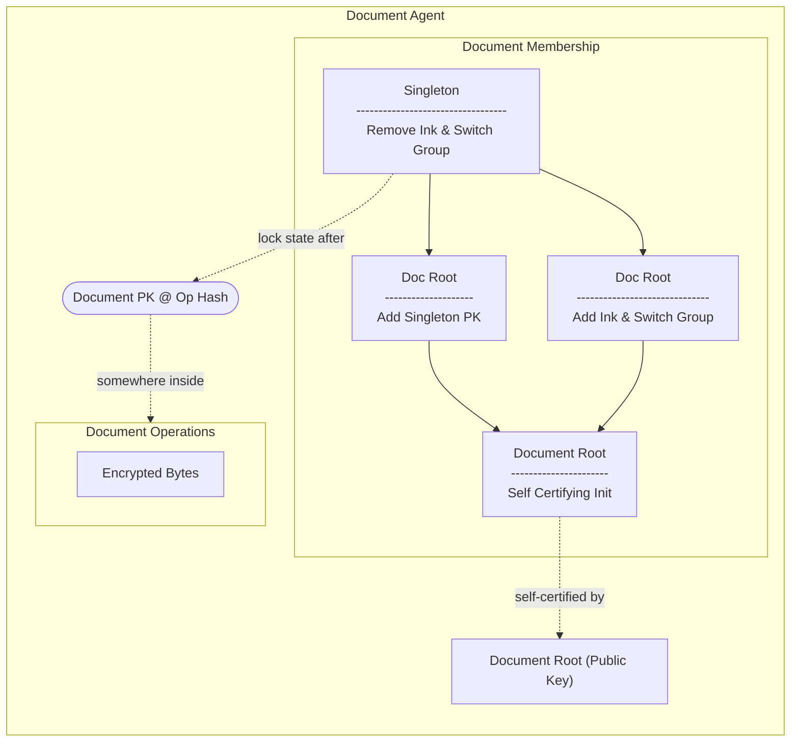
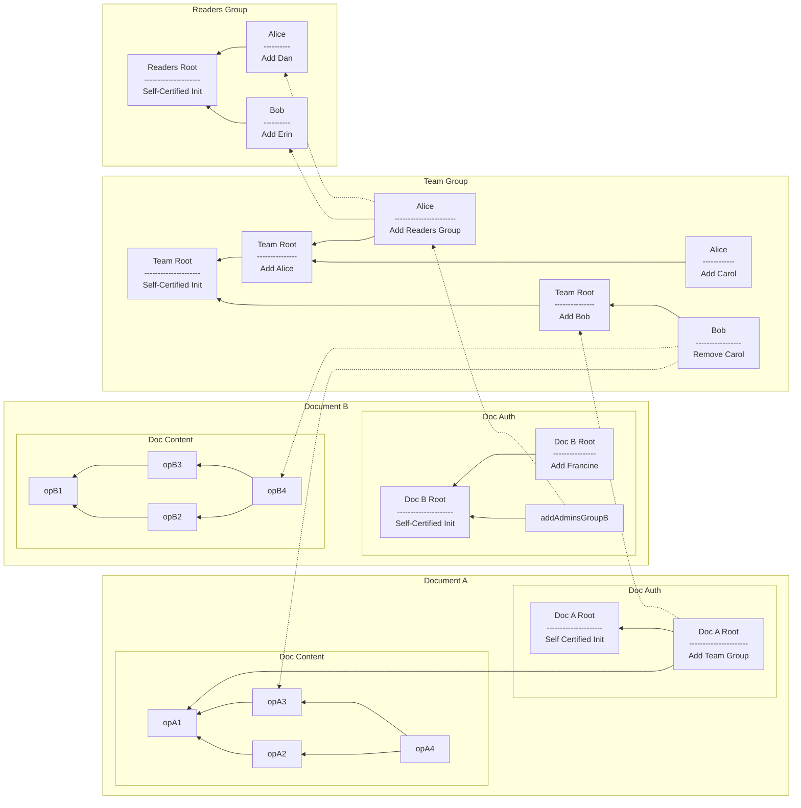
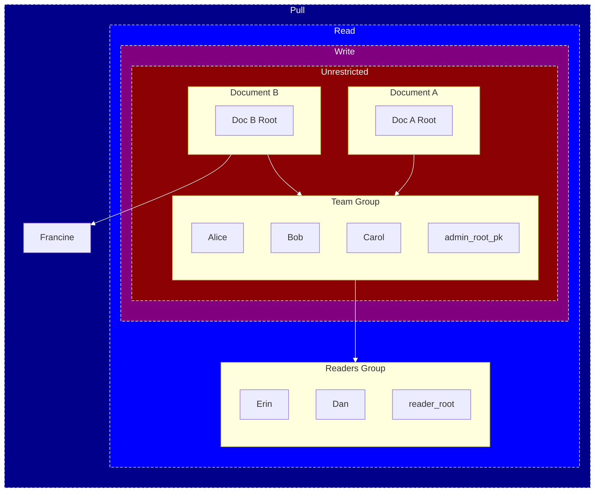
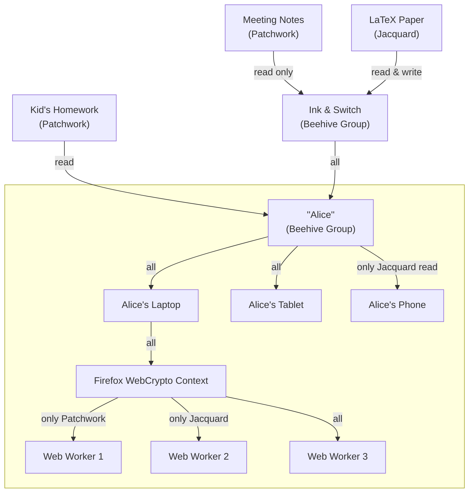

# Group Membership

# Abstract

Group membership in Beehive has two main concepts: a membership op-based CRDT, and a variant of object capabilities adapted to an eventually consistent setting. We propose naming this class of capabilities "Convergent Capabilities", or "concap" for short.

# Conventions

## Language

The key words "MUST", "MUST NOT", "REQUIRED", "SHALL", "SHALL NOT", "SHOULD", "SHOULD NOT", "RECOMMENDED", "NOT RECOMMENDED", "MAY", and "OPTIONAL" in this document are to be interpreted as described in [BCP 14] when, and only when, they appear in all capitals, as shown here.

## Diagrams

There are several diagrams below. We use the following graphical conventions:



# Agents

"Agents" in Beehive represent some principal that is capable of receiving, delegating, and exercising authority. They are distinguished by other entities in the system by being able to cryptographically sign operations. As such, Agents MUST be represented by a "root" keypair which acts as their ID.

Agents form a subtyping hierarchy: `Document :< Stateful :< Stateless`.

``` rust
// Pseudocode
enum Agent {
    Stateless { id: PublicKey },
    Stateful { 
        id: PublicKey,
        auth_state: Vec<AuthOp>
    },
    Document {
        id: PublicKey,
        auth_ops: Vec<AuthOp>,
        content_ops: Vec<AutomergeOp>
    }
}
```

## Stateless (AKA "Singleton")

The simplest Agent variant is a public key with no associated state. Almost (but not all) ops in Beehive are signed by Stateless Agents. These are typically the leaf keys in a [group hierarchy].

Some examples of Stateless Agents include Passkeys, non-extractable WebCrypto keys, hardware keys, or other keys limited by application context.

There is no mechanism to rotate a stateless key itself. However, managing key rotation and/or multiple keys (e.g. [for all of a user's devices]) is possible via [Stateful Agents].



## Stateful (AKA "Group")

Stateful Agents add authorization state. The operations that make up the state's history MUST be rooted in (begin at) the Stateful Agent's public key.

Once another Agent is grated control of it, the Stateful Agent MAY delete its secret key.

A very common pattern is for the creator of an Agent to include ionctsructions to add itself to the child's membership upon initialization. This is known as [Membership by Parenthood].



## Document

Documents are a subtype of Stateful Agents. They add stateful document content in addition to stateful auth. This is important so that the document content can self-certify the associated auth history.



### Encrypted Content

Note that the above may not all be available as cleartext to all participants. For example, a sync server (which only has [Pull] rights) will see the [Document] example above as something along the following lines:



This enough information for the sync server to know may request document bytes, but not enough to actually decrypt the document state.

# Authority Networks

## Objects & Causal State



### Materialized View

The above example materialized to the following:



Validating capabilities proceeds recursively. Given read access to the caveats of each group, a complete list of users and their capabilities. The lowest level of rights MUST be `pull`, which only requires knowing the current public key of leaf agents.

In this case, we have the following authority for Doc A:

| Agent       | Pull Doc A | E2EE Read Doc A | Write to Doc A | Change Membership on Doc A |
|-------------|------------|-----------------|----------------|----------------------------|
| Alice       | ✅         | ✅              | ✅             | ✅                         |
| Bob         | ✅         | ✅              | ✅             | ✅                         |
| Carol       | ✅         | ✅              | ✅             | ✅                         |
| Dan         | ✅         | ✅              | ❌             | ❌                         |
| Erin        | ✅         | ✅              | ❌             | ❌                         |
| Francine    | ❌         | ❌              | ❌             | ❌                         |
| Reader Root | ✅         | ✅              | ❌             | ❌                         |
| Admin Root  | ✅         | ✅              | ✅             | ✅                         |
| Doc A Root  | ✅         | ✅              | ✅             | ✅                         |
| Doc B Root  | ❌         | ❌              | ❌             | ❌                         |

And for Doc B:

| Agent       | Pull Doc B | E2EE Read Doc B | Write to Doc B | Change Membership on Doc B |
|-------------|------------|-----------------|----------------|----------------------------|
| Alice       | ✅         | ✅              | ✅             | ✅                         |
| Bob         | ✅         | ✅              | ✅             | ✅                         |
| Carol       | ✅         | ✅              | ✅             | ✅                         |
| Dan         | ✅         | ✅              | ❌             | ❌                         |
| Erin        | ✅         | ✅              | ❌             | ❌                         |
| Francine    | ✅         | ✅              | ❌             | ❌                         |
| Reader Root | ✅         | ✅              | ❌             | ❌                         |
| Admin Root  | ✅         | ✅              | ✅             | ✅                         |
| Doc A Root  | ❌         | ❌              | ❌             | ❌                         |
| Doc B Root  | ✅         | ✅              | ✅             | ✅                         |


# State Transition

The state of a 

FIXME: batch signatures (since signatures don't compress)
IXME alternate version from teh paper:

FIXME on add, do we need agent heads, or just the removals? If only removals for efficiency, keep them in a Merkle Set, and reference the root? Given that this is concurrent taht may not work...
FIXME need to include agent heads in revocations?
FIXME discuss deny listing
FIXME do we need to include the proofhead since we can materialize the view. It may make it fster to provide a Merkle proof & compare to the tombstone set
        ...that imples that we define a way to reference auth state heads in a merkle tree, but we may not actually be able to do that thanks to EC
        ... nope, we've opted to allow re-adds, so no tombstone set

TODO: fix formatting; I just find this easier to read as a personal quirk 

```rust
pub struct Attenuation {
    group_id: Option<GroupId>,
    ceveats: CeveatDsl // FIXME: TBD
}

enum AuthAction {
  // Arguably this could be expressed as AddGroup with group_heads: vec![singleton.id] or possibly vec![]
  // It's a noop if you give a stateless agent a different head,
  // since you will never be able to apply the op.
  AddSingleton { 
    id: PublicKey,
    attenuation: Attenuation
  },
  
  // Add Group includes docs, since Doc :< Group
  // Since Group :< Singleton, you *could* add a group that way,
  // but it would add at the start of its history 
  // (which may or may not be desirable, depending on the domain)
  AddGroup { 
    id: PublicKey, 
    attenuation: Attenuation,
    group_heads: Vec<Hash>, // REMINDER: this is the group being added's heads (aud), NOT the group being added to (iss)
  },
  
  RemoveAgent { id: PublicKey },
}

struct AuthOp {
  action: AuthAction, // ⬆️
  
  /// The 
  auth_pred: Vec<Hash>, 
  
  /// All heads for all known updated documents.
  /// In effect, this locks the auth change to occur *after* content updates.
  doc_heads: BTreeMap<DocId, Vec<Hash>>,
  
  author: PublicKey,
  signature: Signature
}
```

### Roots

Auth roots are the key pair associtated to a group. These are self-certifying (since their public key is the document ID), and 

## Re-Adds

Re-adding a user is supported as long as the new add is causally after the removal.


# Delegation

Any [Agent] MAY delegate its authority over some other Agent to others.

Restricting sub-delegation MUST NOT be permitted. It is well known that attempting to do so leads to worse outcomes (e.g. users sharing secret keys), and prevents desirable behaviour such as sub-delegating very narrow authority ([PoLA]) to emphemeral workers.

## Attenuated Authority

## Transitive Access


# Device Management

This strategy does not distinguish between users, groups, and public keys. In a sense, public keys are stateless singleton groups.



## Applications to [Collection Sync]

# FAQ

## Differences from Access Control Lists (ACLs)

## Differences from Object Capabilities (ocap)

## Differences from Certificate Capabilities / SPKI

<!-- External Links -->

[BCP 14]: https://datatracker.ietf.org/doc/bcp14/
[Collection Sync]: ./collection_sync.md
