# Group Membership

# Abstract

Keyhive maintains groups with mutable membership (additions and removals). This has two main concepts: a membership op-based CRDT, and a variant of object capabilities adapted to an eventually consistent setting. Some groups are associated with Automerge documents. Membership changes and document content MAY causally depend on each other. This document describes how to maintain this group membership.

# Conventions

## Language

The key words "MUST", "MUST NOT", "REQUIRED", "SHALL", "SHALL NOT", "SHOULD", "SHOULD NOT", "RECOMMENDED", "NOT RECOMMENDED", "MAY", and "OPTIONAL" in this document are to be interpreted as described in [BCP 14] when, and only when, they appear in all capitals, as shown here.

## Diagrams

There are several diagrams below. We use the following graphical conventions:


# Agents

"Agents" in Keyhive represent some principal that is capable of receiving, delegating, and exercising authority. They are distinguished by other entities in the system by being able to cryptographically sign operations. As such, Agents MUST be represented by a "root" key pair which acts as their ID.

Agents form a subtyping hierarchy: `Document :< Stateful :< Stateless`.

``` rust
// Pseudocode
enum Agent {
    Stateless { id: PublicKey },
    Stateful { 
        id: PublicKey,
        auth_state: Vec<AuthOp>
    },
    Document {
        id: PublicKey,
        auth_ops: Vec<AuthOp>,
        content_ops: Vec<AutomergeOp>
    }
}
```

## Stateless (AKA "Singleton")

The simplest Agent variant is a public key with no associated state. Almost (but not all) ops in Keyhive are signed by Stateless Agents. These are typically the leaf keys in a [group hierarchy].

Some examples of Stateless Agents include Passkeys, non-extractable WebCrypto keys, hardware keys, or other keys limited by application context.

There is no mechanism to rotate a stateless key itself. However, managing key rotation and/or multiple keys (e.g. [for all of a user's devices]) is possible via [Stateful Agents].


## Stateful (AKA "Group")

Stateful Agents add authorization state. The operations that make up the state's history MUST be rooted in (begin at) the Stateful Agent's public key.

Once another Agent is grated control of it, the Stateful Agent MAY delete its secret key.

A very common pattern is for the creator of an Agent to include instructions to add itself to the child's membership upon initialization. This is known as [Membership by Parenthood].


## Document

Documents are a subtype of Stateful Agents. They add stateful document content in addition to stateful auth. This is important so that the document content can self-certify the associated auth history.


### Encrypted Content

Note that the above may not all be available as cleartext to all participants. For example, a sync server (which only has [Pull] rights) will see the [Document] example above as something along the following lines:


This enough information for the sync server to know may request document bytes, but not enough to actually decrypt the document state.

### Cross-Group Dependencies

In addition to content and authority operations depending on each other inside a Group, they MAY include causal dependencies into others.


# Authority Graphs

A change to group membership MAY be causally dependent on the state of another group or document content (and vice versa).

## Example


### Materialized View

The above example materializes to the following:


Validating [capabilities] proceeds recursively. Given read access to the caveats of each group, a complete list of users and their capabilities. The lowest level of rights MUST be `pull`, which only requires knowing the current public key of leaf agents.

In this case, we have the following authority for Doc A:

| Agent       | Pull Doc A | E2EE Read Doc A | Write to Doc A | Change Membership on Doc A |
|-------------|------------|-----------------|----------------|----------------------------|
| Alice       | ✅         | ✅              | ✅             | ✅                         |
| Bob         | ✅         | ✅              | ✅             | ✅                         |
| Carol       | ✅         | ✅              | ✅             | ✅                         |
| Dan         | ✅         | ✅              | ❌             | ❌                         |
| Erin        | ✅         | ✅              | ❌             | ❌                         |
| Francine    | ❌         | ❌              | ❌             | ❌                         |
| Reader Root | ✅         | ✅              | ❌             | ❌                         |
| Admin Root  | ✅         | ✅              | ✅             | ✅                         |
| Doc A Root  | ✅         | ✅              | ✅             | ✅                         |
| Doc B Root  | ❌         | ❌              | ❌             | ❌                         |

And for Doc B:

| Agent       | Pull Doc B | E2EE Read Doc B | Write to Doc B | Change Membership on Doc B |
|-------------|------------|-----------------|----------------|----------------------------|
| Alice       | ✅         | ✅              | ✅             | ✅                         |
| Bob         | ✅         | ✅              | ✅             | ✅                         |
| Carol       | ✅         | ✅              | ✅             | ✅                         |
| Dan         | ✅         | ✅              | ❌             | ❌                         |
| Erin        | ✅         | ✅              | ❌             | ❌                         |
| Francine    | ✅         | ❌              | ❌             | ❌                         |
| Reader Root | ✅         | ✅              | ❌             | ❌                         |
| Admin Root  | ✅         | ✅              | ✅             | ✅                         |
| Doc A Root  | ❌         | ❌              | ❌             | ❌                         |
| Doc B Root  | ✅         | ✅              | ✅             | ✅                         |


# Auth State Transition

```rust
pub struct Attenuation {
    group_id: Option<GroupId>,
    ceveats: CeveatDsl
}

enum AuthAction {
  // Arguably this could be expressed as AddGroup with group_heads: vec![singleton.id] or possibly vec![]
  // It's a noop if you give a stateless agent a different head,
  // since you will never be able to apply the op.
  AddSingleton { 
    id: PublicKey,
    attenuation: Attenuation
  },
  
  // Add Group includes docs, since Doc :< Group
  // Since Group :< Singleton, you *could* add a group that way,
  // but it would add at the start of its history 
  // (which may or may not be desirable, depending on the domain)
  AddGroup { 
    id: PublicKey, 
    attenuation: Attenuation,
    group_heads: Vec<Hash>, // REMINDER: this is the group being added's heads (aud), NOT the group being added to (iss)
  },
  
  RemoveAgent { id: PublicKey },
}

struct AuthOp {
  action: AuthAction, // ⬆️
  
  /// The 
  auth_pred: Vec<Hash>, 
  
  /// All heads for all known updated documents.
  /// In effect, this locks the auth change to occur *after* content updates.
  doc_heads: BTreeMap<DocId, Vec<Hash>>,
  
  author: PublicKey,
  signature: Signature
}
```

### Roots

Auth roots are the key pair associated to a group. Since their public key is the document ID, these are REQUIRED to make delegation chains "self-certifying".

## Re-Adds

An Agent MAY be re-added to a group. In this case, the re-add operation MUST (transitively) causally succeed that Agent's revocation.

Note that for purposes of [seniority], the re-added Agent's seniority MUST be calculated from their earliest add (prior to the revocation).

# Delegation

Any [Agent] MAY delegate its authority over _it's own capabilities_ to others.

Restricting _sub-delegation_ of an Agent's capabilities MUST NOT be permitted. It is well known that attempting to do so leads to worse outcomes (e.g. users sharing secret keys), and prevents desirable behavior such as sub-delegating very narrow authority ([PoLA]) to ephemeral workers.

## Transitive Authority

Recall that [capabilities come in the following categories][capabilities]: pull, read, mutate, and manager. All of these MAY be attenuated. For example, an Agent MAY be granted the ability to alter the membership of an external group or document.

```mermaid
sequenceDiagram
    autonumber

    participant Doc
    participant Ink & Switch
    actor PvH
    actor Mallory

    Note over Doc,Ink & Switch: Setup Groups
    Ink & Switch ->> Ink & Switch: 🐣 Init
    Doc ->> Doc: 🐣 Init
    Doc ->> Ink & Switch: 🎟️ Delegate(Doc, Write)

    Note over Ink & Switch,Mallory: Add users to Ink & Switch

    Ink & Switch ->> PvH: 🎟️ Delegate all (including manage membership)
    Ink & Switch ->> Mallory: 🎟️ Delegate [Doc: Write]

    Note over Doc,Mallory: Users write ops to Doc
    PvH -->> Doc: ✍️ Write Op1 (authorized by ➋→➌→➍←➊)
    Mallory -->> Doc: ✍️ Write Op2 (authorized by ➋→➌→➎←➊)

    Note over Doc,Mallory: Mallory Revoked
    PvH -->> Ink & Switch: 💔 Revoke Mallory (authorized by ➊→➍)
    Mallory --x Doc: 🚫 Write Op3 (REJECTED becuase ➑)
```



### Cycles

Group delegations MUST form a directed graph, which MAY contain cycles. For example:


For simplicity, in this scenario BigCo and Ink & Switch have delegated to each other full control (shown in green). While they have different members, they can be considered a single group because they've co-delegated.

# Device Management

This strategy does not distinguish between users, groups, and public keys. In a sense, public keys are stateless singleton groups.


# Applications to [Collection Sync]

Chunk providers (sync servers and peers) need to know which documents that Agents are permitted to pull. Ideally this is done in as few round trips as possible. The requester may not know of all the documents that are allowed to pull. To find the relevant documents, the provider walks the auth graph, starting from the requester. Every reachable document is included in the collection, and sent to the user in one response. If the requester knows of more documents that were not included, it either means that the provider is missing auth operations, and can prove access by pushing the relevant auth histories to the provider at the start of a second round.

<!-- External Links -->

[BCP 14]: https://datatracker.ietf.org/doc/bcp14/
[Collection Sync]: ./collection_sync.md
 [capabilities]: ./convergent_capabilities.md
