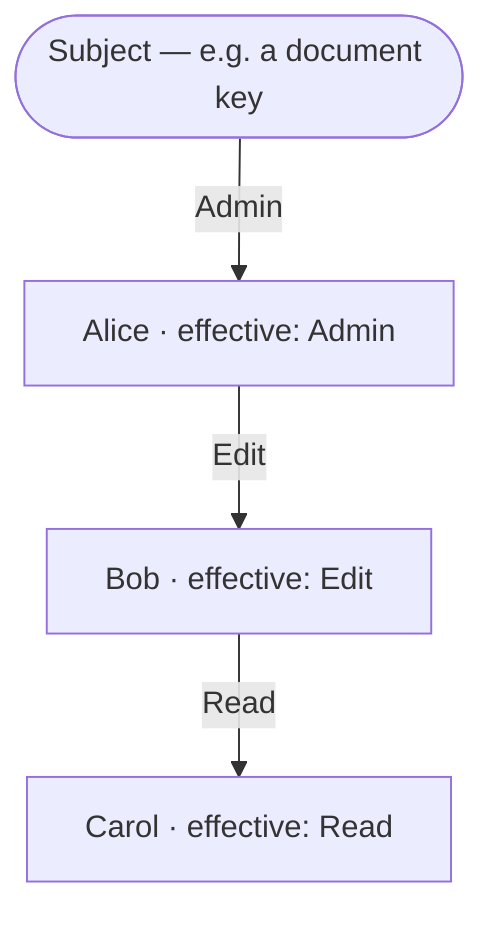

# Keyline

Keyline describes the core authority graph of Keyhive: who can do what, to which subjects, and on whose authority. It is the substrate that the rest of Keyhive (membership, CGKA, encryption) hangs off of.

The adversarial scenarios and field-elimination arguments that shaped this design are fleshed out in more detail in [edge-cases](edge-cases.md).

## Language

The key words "MUST", "MUST NOT", "REQUIRED", "SHALL", "SHALL NOT", "SHOULD", "SHOULD NOT", "RECOMMENDED", "NOT RECOMMENDED", "MAY", and "OPTIONAL" in this document are to be interpreted as described in [BCP 14](https://www.rfc-editor.org/info/bcp14) when, and only when, they appear in all capitals, as shown here.

## Design Goals

Keyline is a *state-based CRDT*. Any two replicas that have seen the same set of delegations and revocations compute the same authority graph, regardless of the order they received them in. This buys us the usual local-first properties: replicas can be offline indefinitely, sync in any order over any transport, and never conflict.

## Intuition & Lineage

> Whether to enable cooperation or to limit vulnerability, we care about _authority_ rather than _permissions._ Permissions determine what actions an individual program may perform on objects it can directly access. Authority describes the effects that a program may cause on objects it can access, either directly by permission, or indirectly by permitted interactions with other programs.
>
> — [Mark Miller](https://github.com/erights), [Robust Composition](https://papers.agoric.com/assets/pdf/papers/robust-composition.pdf)

Keyline is related to certificate capability systems in the [SPKI] lineage (by way of [UCAN]). Delegation and attenuation behave the way a UCAN chain does; the main difference being that UCAN's late binding proof-chain is calculated by anyone validating content updates, not (necessarily) reified into the update. This difference is primarily driven by different consistency between the systems.

|                               | UCAN                         | Keyline                                          |
|-------------------------------|------------------------------|--------------------------------------------------|
| Who assembles the proof chain | The invoker presents a chain | The verifier searches the set                    |
| When authority is evaluated   | At invocation                | Continuously — authority is standing, not action |
| Third-party revocation        | Issuers along the chain      | Jurisdiction-scoped [deep cuts][revocations]     |
| Rough analogy                 | Movie ticket                 | Standing in a community                          |

A couple intuitions carry most of the design:

- All certificate-capability systems — but especially Keyline — behave essentially as an [ocap] network simulation. Nodes act as proxies, and authority flows through the graph.
- Revocation is essentially a forwarder declining to forward: at its own hop (anyone), for its own signatures (issuers and audiences), or across its jurisdiction (admins). Third-party revocation here is not the foreign concept it is in classical ocap; it is the [caretaker][caretakers] pattern.

One ocap property is deliberately absent: delegator-independence. Dropping your reference in ocap leaves the copies you introduced intact. In Keyline, liveness is issuer-recursive, so your grants live and die with your standing. That trade buys healing — a partitioned graph reconnects with every certificate's provenance intact — at the price of [zombies][resurrection].

### An Assembly Language for Authority

The main insight versus prior versions of Keyhive is that once we have a directed authority graph, we can express all scenarios that are otherwise special cased. This does mean relying more on patterns than baking concepts into the core semantics. However, earlier iterations of this design _already admitted these patterns_; they were merely ignored.

This insight has some non-obvious consequences for the semantics. For example, giving admins transitive revocation powers _permanently_ (and thus revocations not relative to a causal ordering) means that even if an admin is unable to update a document they can always revoke anyone downsteam from the node that they _used to_ have the ability to, say, write through. We can still express the desired semantics avoiding griefing by a misbehaving admin by revoking the group they're connected transitively by, and creating a new one connecting the other admins and healing the downstream graph.

## Nodes

All nodes in the graph are Ed25519 verifying keys. At this level there is _no distinction_ between individuals, groups, and documents; they are all merely keys that can appear as the issuer, subject, or recipient of a delegation. This uniformity is deliberate. Higher layers of Keyhive assign meaning to particular keys (this one is a person, that one is a document), but the authority graph itself doesn't care. A delegation from a "document" to a "group" and a delegation from one "person" to another are the same kind of edge, checked the same way.

## Delegations

A delegation is a signed statement extending the issuer's own authority over a subject to a recipient:

| Field     | Type                             | Notes                                                      |
|-----------|----------------------------------|------------------------------------------------------------|
| Issuer    | Ed25519 verifying key            | The key that signs; the edge rides this key's standing     |
| Audience  | Ed25519 verifying key            | The recipient (`aud`)                                      |
| Subject   | Ed25519 verifying key            | The *scope*: which routes this edge may participate in     |
| Can       | `Relay \| Read \| Edit \| Admin` | Access level                                               |
| Seen      | `Option<Hash<Delegation>>`       | Freshness + heal provenance; zero semantics (see below)    |
| Signature | Ed25519 signature                | Over all of the above                                      |

- A delegation reads: *Issuer asserts that the Audience may exercise Can over Subject.*
- When `iss = sub`: a *root edge* — the subject bootstrapping its own authority (see [Root Edges and the Apex][apex]).

All fields are required; `Seen` has type `Option`, and `None` is encoded by omitting the key. The rule against optionality is precise: a field may not be optional when its *absence aliases a present value* — an earlier draft's optional anchor field defaulted to the issuer, so `{from: None}` and `{from: issuer}` meant the same act with two encodings, two hashes, and a revocation that kills one twin and misses the other. `Seen`'s absence aliases nothing: "no predecessor claimed" has no expressible present-value twin (there is no sentinel), so it is one meaning with one canonical encoding — the key simply does not appear in the serialized form. Every meaning in Keyline has exactly one encoding; that, not "no optional fields," is the actual invariant.

An earlier draft carried a `from` field naming the jurisdiction a delegation was exercised in. It was removed: every job it did is an arrangement of nodes instead — scoping is `sub`, acting in a capacity is a dedicated key per capacity, pinning is a [sub-scoped intermediary][pinning], jurisdiction-narrow denial is signing with the narrow key. Where a certificate format wants a *mode*, the graph wants a *vertex*. The elimination arguments are recorded in [edge-cases](edge-cases.md).

### `sub` is a Scope, Not an Endpoint

The edge itself runs `iss → aud`. `sub` says what the edge is *about*, and that controls where it can be used. A delegation with `sub: Doc` only ever helps someone reach Doc; it does one job. A delegation with `sub: Members` is membership in the role itself, which is a much broader thing: it carries whatever the role can reach, now or in the future. If the role later gains access to five more documents, its members get them too — automatically, by [late binding][liveness]. Nobody re-issues the memberships. The certificates never change, and never even learn the new documents exist.

Membership edges are also *self-certifying*: their routes chain to the role's own root edge and never leave the node. A role's roster survives anything that happens upstream — the fact that makes [rotation][rotating a role] cheap and rosters untouchable by outsiders.

### The `seen` Field

Ed25519 is deterministic and certificates are content-addressed, so re-issuing an identical delegation produces the *same certificate* — the same hash, still covered by any revocation that named it. Without a freshness field, healing a mistaken removal on the same terms by the same issuer is literally impossible.

`seen` is essentially a nonce, but set up to be harder to misuse: a re-issuance points at a certificate the issuer has seen — typically the revoked one it is re-issuing past — changing the hash and documenting the heal ("re-granted, knowing of the revocation"). First issuances omit the field.

1. *Optional, absence = first issuance.* Absent means "no predecessor claimed," with a single canonical encoding (the key is omitted); present means one named predecessor. No sentinel exists, so absence aliases nothing — the one-meaning-one-encoding invariant holds.
2. *No semantics, ever.* Evaluation ignores `seen` entirely. It is not supersession (issuing `seen: #d1` does **not** retract `#d1` — retract explicitly), not ordering, not a causal claim anyone verifies. This line is load-bearing: issuer-supplied predecessors must never carry trust, or backdating-by-omission returns.
3. *Anything goes.* A bogus `seen` value, or one naming a certificate the replica doesn't hold, is harmless; it only perturbs the hash.

A nonce was considered and rejected on fail-direction. Nonces turn accidental duplicate issuance into independently live certificates, each needing separate coverage at removal time; a missed duplicate is a lingering live grant. That fails open. With `seen`, identical re-issuance deduplicates, and an unaware re-issue is a grant that silently doesn't take: fail-closed, and detectable by tooling. Ambiguity resolves toward less authority.

### Access Levels

`Can` is (currently) a totally ordered ladder:

```
Relay < Read < Edit < Admin
```

| Level | Grants                    | Notes                                                                                        |
|-------|---------------------------|----------------------------------------------------------------------------------------------|
| Relay | Sync and relay ciphertext | Cannot decrypt; makes untrusted relays (e.g. [Subduction]) first-class citizens of the graph |
| Read  | Decrypt content           |                                                                                              |
| Edit  | Write new content         |                                                                                              |
| Admin | Manage membership         | The one *governance* level: reshape the graph, deny others' certificates                     |

Relay, Read, and Edit are *conveyance* levels — what may ride the routes. Admin is the sole *governance* level — what may act on the graph itself. The distinction carries the [revocation rule][revocation semantics]: denial of a third party's certificate is a governance act, gated on Admin; conveyance levels get denial power only over their own hop and their own signatures.

## Revocations

A revocation breaks a previously issued delegation, identified by hash:

| Field     | Type                    | Notes                              |
|-----------|-------------------------|------------------------------------|
| Issuer    | Ed25519 verifying key   | The key that signs                 |
| Revoke    | `Hash<Delegation>`      | The delegation being revoked       |
| Signature | Ed25519 signature       | Over all of the above              |

Revocations annihilate delegations _on paths controlled by (admin or direct) the revoker_. Both certificate species are add-only; merging is set union.

There is exactly one revocation rule, and it has no case analysis: a revocation breaks the target delegation on every route that passes through the issuer's *service record* — the nodes the issuer ever held Admin over, plus the issuer's own node ([Service Records][service records]).

Where the record doesn't touch the target's routes, the revocation is *inert*: a no-op, not an error. Validity is unconditional; any well-signed revocation is admissible. Authority appears only as reach. A revocation that breaks a certificate far below the issuer's jurisdiction is a *deep cut*.

Because a certificate's endpoints are on every one of its routes, two total kills fall out as corollaries rather than special cases:

- *Retraction* (`iss = target.iss`): the issuer is on every route of their own certificate, so their revocation covers all of them. Unmake what you signed.
- *Renunciation* (`iss = target.aud`): likewise from the recipient's end. Shed what names you.

The full tier structure, each tier matched to its trust basis:

| Who                              | Breaks the edge on…                 | Trust basis                    |
|----------------------------------|-------------------------------------|--------------------------------|
| Anyone                           | routes through their own node       | it's your own conveyance       |
| Issuer / recipient of the target | all routes (total)                  | your signature, your act       |
| Ever-admins                      | routes through their service record | governance, granted explicitly |

The first row means even a Read-level intermediate can refuse to let their standing carry someone else's grant — deny-only, confined to their own hop, and strictly weaker than renouncing (which anyone can do and which kills the same routes plus their own access).

## Graph Semantics

Delegations form a directed graph: each one is an edge carrying an access level. Authorization is a *reachability* question over that graph.

### Late Binding Paths

There is no "proof" field on delegations or revocations. A delegation doesn't name the chain that justifies it — it merely asserts an edge, and justification is computed at verification-time. The `aud` gains access to `sub` as long as *some* unbroken route exists from the subject to the `aud`, where every hop is validly signed and every issuer along the route themselves has sufficient standing.

Consequences:

| Property                | Meaning                                                                                                                                                                                        |
|-------------------------|------------------------------------------------------------------------------------------------------------------------------------------------------------------------------------------------|
| Late binding            | A delegation issued before its issuer had authority becomes effective the moment the issuer gains it, and stops being effective if the issuer loses it. Edges are facts; authority is derived. |
| Redundant routes        | If access arrives via two chains and one is cut, the other keeps working. There is no single brittle proof to invalidate by accident.                                                          |
| Order independence      | Justification is recomputed from the full set, so it doesn't matter in what order a replica learned the edges — the CRDT property.                                                             |
| Healing with provenance | When a severed subgraph is re-supplied, everything not explicitly revoked re-energizes *as the same certificates*: same hashes, same issuers, same audit trail. Heal wholesale, deny retail.   |

Two delegations with identical `aud`, `sub`, and `can` but different hashes due to different `iss` or `seen` are distinct edges.

### Liveness

A delegation is *live* iff some route grounds it: its issuer reaches the subject with sufficient authority, through live delegations, along a route avoiding every node its [revocations][revocation semantics] cover.

The recursion is grounded at root edges — delegations signed by the subject itself — and derived monotonically outward. Revocation coverage is computed separately, against the *revocation-free* graph (see [Computation]); the liveness recursion treats it as fixed.

Because the check happens at evaluation time, liveness is *late-bound*: a delegation dies implicitly the moment its issuer loses standing, and springs back to life if the issuer regains it. Nothing about an individual certificate records whether it is live — liveness is a property of the certificate *in the context of the full set*.



### Attenuation

Routes attenuate to the *lowest* power along them. If Alice holds `Admin`, delegates `Edit` to Bob, and Bob delegates `Admin` to Carol, Carol's effective access is `Edit`: the meet (minimum) of every hop. When multiple routes exist, effective access is the best available — the maximum over routes of the minimum along each (widest-path/bottleneck).

### Revocation Semantics

#### Service Records

A revocation signed by K breaks its target on routes that pass through:

1. any node K ever held Admin over, and
2. K's own node.

This set is K's *service record*. "Ever" means exactly that: we compute it from the delegations alone, as if no revocations existed. A role K was kicked out of still counts. A role K resigned from still counts. The record only grows; nothing that happens later shrinks it.

Computing it while ignoring revocations looks strange at first. There are three reasons, and they are one reason from three angles:

- *Removal has to stick.* If booting an admin shrank their record, it would also cancel every revocation they signed while in office — remove the moderator, and everyone the moderator banned walks back in.
- *Revocations must not judge each other.* If one revocation could shrink the record another depends on, the result would depend on arrival order, and two replicas with the same certificates would disagree. Records built from delegations alone give every replica the same answer, in any order.
- *Quitting must not un-ban anyone.* If resigning shrank your record, resigning would cancel your own past revocations — leaving a role would become a way to let banned people back in.

The growth direction is safe: when K joins a new role, K's old revocations now also cover routes through it. Coverage can only ever expand, and expanding coverage only ever removes access — the surprise, if any, is in the fail-closed direction.

Point 2 — your own node always counts — is what makes retraction and renunciation work with no extra rules: a certificate's issuer and audience sit on every one of its routes, so their revocations always cover it completely.

#### The Effect is Scoped; the Validity is Not

Scoping the *effect* to the record — rather than conditioning validity on topology — is the load-bearing choice, protecting the invariant every alternative violated:

> Once a replica has applied a denial, no merge may un-apply it. Every access-restoring transition requires a fresh signature from live authority — never message scheduling alone.

Total fail-closed is unavailable in any eventually consistent system: unseen denials apply late (bounded by sync), and late binding revives implicit deaths (gated by an authorized signature). The disqualifying failure — denial undone by delivery order — is the one this rule excludes. A rotation does not invalidate an old revocation (nothing ever does); it *moots* it, by routing authority through fresh nodes outside the issuer's frozen record. Any revived access arrives via a new signed supply edge: an authorized act, not a reordering.

Route geometry does two jobs earlier drafts needed a separate independence condition for:

- *Seniority falls out for free.* You cannot cut the branch you stand on: an edge *above* your record's nodes never routes through them, so your revocation of it is inert. Deep cuts only run downward.
- *Peers can revoke each other.* Two admins of one node each have it in their records, and each other's membership certificates route through it. Both cuts of a concurrent duel land; both stand ([permanence]). The branch's parent repairs by [rotation][rotating a role] — under [constitutional flatness] it holds supply, not constitutional membership, so it re-rosters via a successor rather than re-adding directly.

#### Renunciation

Renunciation — the recipient's always-total revocation of what names them — is unconditional: no senior sign-off, no preconditions. Three reasons:

- *Key compromise is the decisive case.* When a key leaks, it is the only signer guaranteed available at the moment it matters. Requiring an appeal upward imposes an unbounded, partition-shaped delay during which the thief acts freely — and at a sole-owner apex there is no upward at all. (The thief can also renounce; that is the least dangerous thing they can do with the key, and deny-only besides.)
- *It follows from the fail-closed axiom.* Shedding authority can never grant, escalate, or touch a third party's independent standing.
- *Prohibition would not prevent the harms attributed to it.* A load-bearing node can strand its downstream anyway: retract every grant it issued, or simply lose the key. Banning renunciation removes only the honest exit.

A caveat: renunciation is *not* the pure ocap capability drop. In ocap, dropping your reference leaves the copies you introduced intact; here, liveness is issuer-recursive, so renouncing a membership also unwinds everything you issued through it — drop *plus retroactive unwinding of your introductions*. The externalities are answered by *stewardship* at the protocol layer while keeping the semantics unconditional:

- *Succession discipline.* Renouncing a load-bearing position SHOULD be preceded by handoff: confirm a successor, let peers re-issue what needs re-issuing, *then* renounce. Because the apex is append-only-growable, an orderly succession path always exists before the exit — and never after.
- *Stranding is repairable except in one case.* A renouncing leaf strands nothing; a load-bearing member's dead grants are re-issued by survivors; a severed subtree is re-granted from above. The sole unrecoverable case is a *sole apex member* renouncing.
- *Burn-after-reading.* That last case is intentional, irreversible document destruction, and should be named as such — not discovered. Prohibiting renunciation would not prevent it: sole-apex fragility is inherent to sole-apex.

#### Permanence

Delegations and revocations have deliberately *asymmetric* justification requirements — one principle applied twice:

> Ambiguity resolves toward less authority.

| Statement | Justification | When the issuer is booted |
|---|---|---|
| Delegation | *Ongoing* — recomputed at every check | Their grants die (transitive cascade) |
| Revocation | *Ever* — the frozen service record | Their revocations stand, forever — within the record |

Both arms fail closed. Late-bound revocation validity would mean booting an admin *resurrects everyone that admin ever removed* — and worse, would let a later merge un-apply an applied denial, restoring access by delivery order. Permanence is also forced by the absence of global ordering: a revocation signed by a booted admin is bit-for-bit indistinguishable whether signed before or after the boot, so "old ones stay, new ones don't" is not an expressible rule, and causal predecessors would not fix it (a dishonest ex-admin backdates by omitting heads).

What is *chosen* is the scoped effect. Reach is confined to a record that froze when the issuer's career ended, and jurisdictions rotate. Permanent validity plus disposable jurisdictions is the trade.

#### Transitive Effect

Revocation cascades, but *implicitly*: cutting Alice's membership does not enumerate or revoke anything she issued. Every delegation she issued fails the [liveness] check on next evaluation, and everything downstream fails in turn. An explicit cascade would make a revocation's meaning depend on its issuer's sync state — two replicas producing "the same" revocation with different effects, destroying order independence. Implicit cascade keeps revocations self-contained: one hash, one signature, same meaning everywhere.

Redundant routes interact correctly for the same reason: each certificate's liveness is evaluated on its own, so cutting one of Carol's two grants leaves the other untouched.

#### Death, Revocation, and Resurrection

A delegation can be dead without being revoked. If Alice is booted from Members, everything she issued through that standing dies *implicitly* — no revocation names it.

> [!WARNING]
> If the same verifying key regains standing, its previously issued delegations spring back to life.

This follows from late-bound liveness, and it is two-faced by design:

- *As the healing mechanism:* boot by mistake, re-add (a fresh certificate via [`seen`][the seen field]), and everything the person issued revives with provenance intact. Implicit removal is *fully reversible* — the mistake costs one certificate. Selective revival composes: re-add plus explicit revocations on the unwanted branch heads ("everyone comes back except Eve" is one re-add and one cut per branch).
- *As the zombie hazard:* an unintended re-grant revives certificates everyone forgot. Two practices blunt it: *fresh-key discipline* (after a compromise, re-adding MUST use a new verifying key; the old key's certificates stay dead) and *explicit revocation on boot* (RECOMMENDED for removals that must survive any future re-add — the explicit cut is permanent, and deep certificates keep their hashes, so it keeps biting).

The removal tiers, by what you believe about the removal:

| Removal | Durable against re-add? | Recoverable if mistaken? |
|---|---|---|
| Implicit (cut memberships only) | No — revival on re-add | Fully — one cert, everything heals |
| Explicit (also cut their issued certs) | Yes | Partially — kept certs must be re-issued |
| Fresh-key re-add | N/A — old key stays dead | New key re-issues what it should hold |

#### The Ex-Admin Sharp Edge

Permanence has a price:

> An ex-admin retains revocation power over their service record, forever.

Booted from Members, Bob can still validly cut certificates on routes through Members — including grants issued years later. What bounds the damage: revocation is deny-only (he can never grant or escalate); his record froze at ejection (nobody is adding him to anything); and durable escape is *rotation* — mint a fresh role node, re-supply it, re-roster. This upgrades rotation from remedy to hygiene:

> Removing an admin from a role SHOULD be followed by rotating the role node — otherwise the removal is not durable against griefing.

Which is BeeKEM's PCS discipline surfacing at the authority layer:

|                              | BeeKEM (keys)                      | Keyline (authority)              |
|------------------------------|------------------------------------|----------------------------------|
| What a removed party retains | Old key material                   | A frozen service record          |
| Why removal alone fails      | Can still decrypt old-path secrets | Can still sign covering revocations |
| The fix                      | Rotate keys on the path (PCS)      | Rotate the role node             |
| Cost                         | $O(\log n)$ path rotation          | Mint a key + re-roster           |

You cannot un-know someone; you can only move to where they have never been. Under record scoping, that place is well-defined:

- *The boundary is frozen, by construction.* A fresh node post-dates the ex-admin on every graph; no fact will ever put it in his record. Rotation is permanent escape, and it costs one roster, not a subtree.
- *Visibility does not matter.* He can sync every certificate ever minted; cuts covering only dead routes are inert. (An earlier draft leaned on hash-visibility to bound griefing; that bound is fiction under set-reconciliation sync, which enumerates missing hashes to any peer. Record scoping replaces it with something that holds.)
- *The subject is out of reach, for everyone.* Every admin who ever served could *reach* the subject — that is what supply chains are for. The subject is also the one node that cannot rotate. This is why records are built from holding Admin *over* a node, not from reaching it *through* the graph: nobody ever held Admin over the subject itself, so no record can name it. Built on reach instead, every ever-admin would hold a permanent whole-document kill.
- *Legitimate denials need no maintenance.* Because records grow with their holders' careers, a surviving admin's old revocations automatically cover the successor nodes they are re-rostered into. Wanted denials follow the living through every rotation; the griefer's stay pinned to dead nodes. There is no carry-over deny-list to re-sign.

One correction to the tempting intuition that rotation leaves the old node harmlessly dead: it leaves it *dormant*. See [Reconnection and Sealing][sealing].

### Computation

Evaluation is graph-global rather than certificate-local: no certificate can be verified in isolation, only against a set. The structure above makes it tame — one engine, run twice, with a single negation boundary.

```
Stratum 0 — base facts
  all certificates in the set

Stratum 1 — the positive pass
  run the liveness fixpoint IGNORING ALL REVOCATIONS
  → record(K) for every revocation issuer
  → covered(c, n)  for each revocation of c and each n ∈ record(iss) ∪ {iss}

Stratum 2 — the live pass
  live(c) ← ∃ route for c through live certs avoiding every n with covered(c, n)
```

Stratum 1 and stratum 2 are the same grounded, issuer-recursive, level-thresholded route search — the positive pass simply runs blind to denials, to learn who ever stood where. Negation appears exactly once, over fully computed lower strata: stratified Datalog, unique least model.

#### Why the Strata Are Mandatory

The tempting shortcut — subtract revoked edges, then compute reachability — is wrong, not merely slow, because revocations would then affect each other's authority. Concretely: `r1` (Brooke cuts Bob's membership) and `r2` (Bob cuts some grant) — subtract-first, applying `r1` before checking `r2`, rejects `r2`; the reverse order lands it. Same set, different results by merge order. Stratification restores determinism: records are computed where no revocation can see any other. Two properties fall out:

- *Coverage is monotone-stable.* Stratum 1 consults only delegations, and the positive graph only grows. Coverage can activate or expand as delegations arrive, never retract. Once applied anywhere, applied everywhere, forever.
- *Denials are mutually invisible.* Revocations target delegations, never other revocations, so mutual invisibility is structural. Cutting the cutter does not undo their cuts; that is [permanence] again, seen from the evaluation side.

#### Revocations Cannot Be Revoked

The `revoke` field's type is `Hash<Delegation>`. A revocation naming another revocation is not invalid — it is unwritable. The classic regress ("who may revoke the revocation? and who may revoke *that*?") never starts, because the question cannot be spelled in the format.

Nothing is lost by this. A mistaken revocation is repaired by granting again, not by un-denying: issue a fresh delegation, with [`seen`][the seen field] pointing at the dead certificate. The old denial stays in the set forever, a dead letter naming a dead hash. This is the [permanence] invariant doing its job — access comes back because someone with live authority signed something new, never because a denial was un-applied.

The evaluator is simpler for it. Denials are terminal facts: there is no "is this revocation itself revoked?" check, stratum 1 never recurses over revocations, and applied coverage never switches off. Compare what un-revocation would require: an authority rule for the un-revoker, another for revoking the un-revocation, and an ordering to settle revoke/un-revoke/re-revoke races — causal metadata or merge-order dependence, all the way up the tower. Declining the feature costs one workflow (re-grant instead of un-deny) and deletes the tower.

#### Cost

- *Per-subject scoping.* Every query ranges over one subject's certificate set.
- *Stratum 1 is append-only cheap.* Monotone: merges evaluate deltas; records and coverage cache forever.
- *Pay per dispute.* Un-revoked certificates — the vast majority — evaluate in one shared widest-path pass (four levels ⇒ bucketed BFS, linear). Each covered certificate pays one route search with its exclusion set, plus the cascade of actual deaths. A jurisdiction accumulating cuts is one under dispute, and rotation — already the hygiene response — moots them and restores the fast path.
- *Junk never enters the fixpoint.* Evaluation forward-chains from root edges, so ungrounded certificates cost storage but no computation. Cycles: *assume dead on revisit* — the least fixed point. Assuming live computes the greatest and makes ungrounded cycles self-certifying: a one-line bug with a security consequence.
- *Timeless is the cheap option.* Ordering-aware revocation would require temporal reachability over historical graphs plus causal metadata on every certificate. Here there is one graph, ever; results are a pure function of the set, and the set digest is a perfect cache key.

#### Witness Hints

The [no-proof design][no proof field] pushes route information out of the certificate, but transport may carry it: a peer asserting a conclusion may attach the witness route, and checking a claimed route costs its length. Soundness never depends on the hint — a wrong hint falls back to search. Pure optimization: witness-carrying gossip, verify-cheap, search-rare.

#### Partial Visibility

The honest cost of graph-global evaluation is possession, not computation. A replica cannot confirm a revocation's coverage without the issuer's constitutional history, and cannot mint a *working* re-issue of a certificate it has never seen revoked (the [`seen`][the seen field] collision is silent and fail-closed; tooling SHOULD surface it). Provisionally honoring unconfirmed revocations is RECOMMENDED: over-applying a denial fails closed, and fuller sync confirms or retires it.

## Root Edges and the Apex

Subjects bootstrap their own authority. At creation, the subject key signs exactly one delegation — `{iss: Doc, aud: Owners, sub: Doc, can: Admin}` — to a freshly minted apex role, and the subject's signing key is destroyed (cf. Keyhive's `EphemeralSigner`). The subject's *identity* is its verifying key, permanent; its *authority* immediately lives elsewhere.

```
┌─────┐  Admin (sole root edge)  ┌────────┐        ┌─────────┐
│ Doc │◄─────────────────────────│ Owners │◄───...──│ Members │◄── ...
└─────┘  key destroyed after     └────────┘        └─────────┘
         signing this one cert    rotatable…        …all the way down
```

### The Root Edge Protects Itself

Who can revoke `Doc → Owners`? The edge's route is itself, grounded at Doc — so a covering revocation needs Doc in its issuer's record. Nobody's record can ever contain Doc: no constitutional certificate for Doc exists beyond the root edge itself, and the only key that could mint one is destroyed. Retraction is equally impossible, for the same reason. The apex edge is structurally undeniable — a consequence of the record rule, not a special case.

> [!IMPORTANT]
> Destroy the subject key after the ceremony, or guard it as the recovery instrument it is: a retained subject key can retract the root edge and re-root the document (below) — total power, in both directions.

### The Apex is Append-Only (Unless the Subject Key Survives)

Rotation works at every layer except the top. Rotating Owners requires a new root edge, and with the subject key destroyed, none can ever be minted. Meanwhile every ever-apex-admin has Owners in their record — and every route in the document transits Owners — so apex ejection is never durable. There is no surviving senior to appeal aud: the apex's parent destroyed itself at the creation ceremony.

| Layer | Removal semantics |
|---|---|
| Apex role (Owners) | Append-only trust — membership can grow; ejection is never durable |
| Every layer below | Fully rotatable — durable ejection via mint-and-re-roster |

A *retained* subject key (cold storage, threshold-split) changes this: it can retract the old root edge and mint `Doc → Owners′` — and the old apex admins' records contain Owners, which the new hierarchy's routes never transit. True apex rotation, durable ejection included, at the custody cost of a key that can do the same *to* you. The ceremony's choice is between an append-only apex (destroy the key) and a re-rootable document (guard the key); there is no third option.

### Mutual Assured Destruction at the Apex

Apex peers can cut each other's memberships (Owners is in every apex admin's record), and both cuts of a concurrent duel are independently covered — so under [permanence], both stand: mutual destruction is deterministic, not prevented.[^mad] Below the apex this is survivable — the senior holds supply, not constitutional membership ([constitutional flatness]), so it adjudicates by rotation: mint a successor node, re-roster whichever party (or neither) with fresh keys.

At the apex there is no senior. If all apex members revoke one another, every human's standing dies in the cascade, and no one can ever mint new apex members (that requires *live* Admin over the apex). The graph is permanently bricked: replicas keep their data, but no new grant will ever be live again.

Mitigations: a single-owner apex has no peers and therefore no duel; edges signed by the ephemeral role key at the ceremony ground through the undeniable root edge and outlive apex destruction; a retained subject key enables repair (or re-rooting), at its custody cost. Keeping the apex minimal is RECOMMENDED — one key per human owner, or just the creator — with all churn conducted in second-layer roles, where rotation works. The apex is a root CA / recovery key. Choose it once, exercise it rarely, treat it as permanent.

[^mad]: "Mutual assured destruction," from Cold War deterrence theory. The analogy is structural: symmetric annihilation capability *is* the governance mechanism among peer admins (retaliation is guaranteed — a cut admin's revocations still validate, since records ignore revocations — so first strikes gain nothing durable), and the apex, having no higher authority, remains in a state of nature. Below the apex, deterrence is *adjudicated*: destruction is survivable by rotation, so a duel is an appeal to the senior — trial by combat with the supply-holder as judge.

## Patterns

Roles, pinning, caretakers, rotation, sealing, constitutional flatness, and the memberships-only shape are conventions over the two primitives, not extra mechanism. They live in [patterns](patterns.md).

## Griefing

Anyone upstream can deny access downstream — and "upstream" includes *ever*-admins. The griefer set has an exact characterization: a grantee's access dies iff every live route is cut, and X can cut a route iff it transits X's service record. So:

> X can grief Y ⟺ every live route from Y to the subject transits X's service record.

Three consequences:

- *The set grows with depth and fan-in.* A chain of depth $d$ through roles of $m$ admins each exposes $O(d \cdot m)$ potential griefers per route.
- *It grows monotonically in time.* Records are append-only.
- *Availability is a min-cut problem.* Redundant routes defend only if *jurisdictionally disjoint* — a second route through the same role adds nothing. Access is widest-path over $(\max, \min)$; grief-resistance is min-cut over jurisdictions.

Why this is survivable:

- *Deny-only.* A griefer can never read, write, or escalate.
- *Only admins are in the set.* Under [memberships as the only shape][memberships], conveyance-level members acquire no ever-power.
- *Bounded by local-first.* Revocation confiscates nothing: the grantee keeps their replica and everything already decrypted. Griefing severs new content keys and authorized sync — real, but not data loss.
- *Attributable and repairable.* Revocations are signed; a spree is a self-incriminating audit trail.
- *Blast radius and griefer count are inversely related.* Upstream cuts kill whole subtrees, but upstream jurisdictions have fewer ever-admins, and route geometry bars everyone standing on an edge from cutting it. The apex can grief everything — but that is just ownership.
- *Rotation ends it.* A griefer's record froze at ejection; rotating the named jurisdictions moots every cut they ever signed and every cut they ever will.

The tension is inherent: revocation power *is* denial power. Any design with decentralized durable removal hands every remover a griefing capability. Keyline chose durable (fail-closed); record scoping and rotation hygiene shrink the surface, and no semantics tweak eliminates it.

## Worked Example

Setup as in [Roles]: Brooke roots Doc, supplies Members, and administers it; Alice and Bob are Admin members.

*1. Alice invites Carol, submitted to the role.* Alice mints `M2` and issues `{iss: Alice, aud: M2, sub: Members, can: Edit}` and `#d1 = {iss: Alice, aud: Carol, sub: M2, can: Edit}` ([pinning]). Carol's effective access is Edit: $\min$ along Doc ← Brooke's supply ← Members ← Alice's membership ← M2, clamped by each hop.

*2. Brooke boots Alice.* Brooke issues `{iss: Brooke, revoke: #m_Alice}`. Members is in Brooke's record, and the membership's only route grounds there: total. By liveness recomputation alone: Alice loses Admin over Members; `Alice → M2` dies (pinned to her standing); Carol's Edit dies transitively, though nothing named `#d1`. All three certificates remain in the set: dead, not revoked.

*3a. It was a mistake.* Brooke re-adds Alice: `{iss: Brooke, aud: Alice, sub: Members, can: Admin, seen: #m_Alice}` — a fresh hash pointing at the certificate it heals past. Everything revives by late binding: `M2`, `#d1`, Carol's access — same hashes, same provenance. The mistake cost one certificate.

*3b. It was not, and Carol should stay.* Brooke instead re-grants Carol directly (membership in another role, or her own caretaker). `#d1` stays dead with Alice; Carol's new access hangs on Brooke's standing.

*4. The zombie.* If the boot was for key compromise, re-adding "Alice" means a *fresh key* — the old key's certificates stay dead. Re-adding the same key revives everything it ever issued (step 3a run by accident). Explicit revocations on boot are the durable form. See [Death, Revocation, and Resurrection][resurrection].

## Open Questions

- *Whiteout.* Carol wrote content while validly authorized; after the cascade her authorization is gone. Whether her past writes remain materialized is a content-layer question (see causal encryption), but Keyline should expose enough to answer "was this issuer live at the time of this write?" — which, absent causal metadata, it cannot. If whiteout ever forces causal metadata into the system, the per-(issuer, capacity) stream design in [edge-cases](edge-cases.md) is the fallback shape.
- *Relay and revocation.* Cutting a `Relay` edge stops future authorization but not decryption by parties holding key material. Effective removal requires the revocation to trigger key rotation (BeeKEM) at the layer above; the coupling point needs specifying.
- *Delegation below Admin.* The [attenuation] example implies any grantee can extend the chain, clamped by min; the access-level table reserves invitation for Admin (a membership is a constitutional edge). The revocation side is settled — estate-scoped denial is Admin-only, self-scoped denial is universal — but the grant side needs the same decision made explicitly.
- *Silent collision UX.* An issuer who re-mints a grant identical to one that was revoked — unaware, because the revocation never synced (device restore, partial visibility) — produces the same hash: the grant silently doesn't take. Fail-closed, but tooling must surface it ("matches a revoked certificate; re-issue with `seen`?").

Resolved in this draft: concurrent mutual revocation (both stand; the parent adjudicates by rotation), grantee survival of grantor removal (no — unless a jurisdictionally disjoint route exists), deny-list carry-over across rotation (dissolved: survivors' records grow to cover successors), and the `from`/`via` fields (eliminated; see [edge-cases](edge-cases.md)).

<!-- Links -->

[apex]: #root-edges-and-the-apex
[attenuation]: #attenuation
[caretakers]: patterns.md#caretakers
[computation]: #computation
[constitutional flatness]: patterns.md#constitutional-flatness
[liveness]: #liveness
[memberships]: patterns.md#memberships-as-the-only-shape
[no proof field]: #late-binding-paths
[permanence]: #permanence
[pinning]: patterns.md#pinning-sub-scoped-intermediaries
[renunciation]: #renunciation
[resurrection]: #death-revocation-and-resurrection
[revocation semantics]: #revocation-semantics
[roles]: patterns.md#roles
[rotating a role]: patterns.md#rotating-a-role
[sealing]: patterns.md#reconnection-and-sealing
[service records]: #service-records
[sub is a scope, not an endpoint]: #sub-is-a-scope-not-an-endpoint
[ocap]: http://erights.org/elib/capability/index.html
[revocations]: #revocations
[spki]: https://www.rfc-editor.org/rfc/rfc2693.html
[subduction]: https://github.com/inkandswitch/subduction
[ucan]: https://github.com/ucan-wg/spec
[the seen field]: #the-seen-field
[the ex-admin sharp edge]: #the-ex-admin-sharp-edge
[the root edge protects itself]: #the-root-edge-protects-itself
[subject]: #nodes
