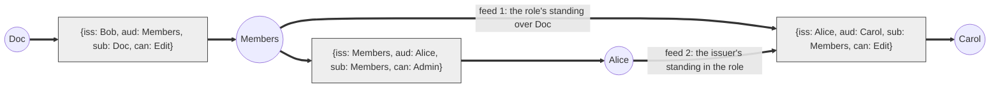

# Keyline

Keyline describes the core authority graph of Keyhive: who can do what, to which subjects, and on whose authority. It is the substrate that the rest of Keyhive (membership, CGKA, encryption) hangs off of.

The adversarial scenarios and field-elimination arguments that shaped this design are fleshed out in more detail in [edge-cases](edge-cases.md).

## Language

The key words "MUST", "MUST NOT", "REQUIRED", "SHALL", "SHALL NOT", "SHOULD", "SHOULD NOT", "RECOMMENDED", "NOT RECOMMENDED", "MAY", and "OPTIONAL" in this document are to be interpreted as described in [BCP 14](https://www.rfc-editor.org/info/bcp14) when, and only when, they appear in all capitals, as shown here.

## Design Goals

Keyline is a _state-based CRDT_. Any two replicas that have seen the same set of delegations and revocations compute the same authority graph, regardless of the order they received them in. This buys us the usual local-first properties: replicas can be offline indefinitely, sync in any order over any transport, and never conflict.

## Intuition & Lineage

> Whether to enable cooperation or to limit vulnerability, we care about _authority_ rather than _permissions._ Permissions determine what actions an individual program may perform on objects it can directly access. Authority describes the effects that a program may cause on objects it can access, either directly by permission, or indirectly by permitted interactions with other programs.
>
> — [Mark Miller](https://github.com/erights), [Robust Composition](https://papers.agoric.com/assets/pdf/papers/robust-composition.pdf)

Keyline is related to certificate capability systems in the [SPKI] lineage (by way of [UCAN]). Delegation and attenuation behave the way a UCAN chain does; the main difference being that UCAN's late binding proof-chain is calculated by anyone validating content updates, not (necessarily) reified into the update. This difference is primarily driven by different consistency between the systems.

|                               | UCAN                                            | Keyline                                                                                          |
|-------------------------------|-------------------------------------------------|--------------------------------------------------------------------------------------------------|
| Who assembles the proof chain | The invoker presents a chain                    | The verifier searches the graph                                                                  |
| When authority is evaluated   | At invocation, by replaying the presented chain | At invocation, by replaying the whole set: all delegations, then all revocations, then the check |
| Third-party revocation        | Issuers along the chain                         | Jurisdiction-scoped [deep cuts][revocations]                                                     |
| Rough analogy                 | Movie ticket                                    | Daisy-chained power strips                                                                       |

Certificate capabilities are already a simulation of an ocap network: each certificate is a proxy forwarding authority to its audience, and validating a chain replays that network along one path. Keyline runs the same simulation with the clock removed. Because arrival order carries no meaning, every replica evaluates the set as if it had arrived in one canonical order — all delegations, then all revocations, then the invocation being checked — and the result is the fixed point of the proxy network over the full set rather than over one presented path. Late binding and healing follow: an edge that could not forward before forwards now, as the same certificate, because the simulation is rerun on every set. Nothing about ocap's semantics is abandoned; what is abandoned is the assumption that the network's state at one moment is knowable.

### The Flow of Authority

A movie ticket is checked on its own terms at the door. Authority in Keyline is checked by whether it actually arrives: authority flows from the subject outward through the graph, and a grantee has whatever reaches them. Picture daisy-chained power strips: your device works if there is an unbroken chain of strips from it back to the wall socket, and every operation is something you do with your hands.

| Keyline                  | Power strips                                                                                                                                |
|--------------------------|---------------------------------------------------------------------------------------------------------------------------------------------|
| Subject                  | The wall socket                                                                                                                             |
| Delegation               | Plugging a strip into another strip, or your device into a strip                                                                            |
| Attenuation              | The breaker on each strip: you never draw more than the weakest strip on your chain allows ($\min$ along the route)                         |
| Widest path              | Two chains to the wall: you get the better one ($\max$ over routes)                                                                         |
| Liveness                 | Current flows only while every strip on the chain is plugged in                                                                             |
| Cascade                  | Unplug one strip and everything downstream goes dark; nothing about those devices changed                                                   |
| Late binding, healing    | Plug it back in and everything lights up again — same devices, same cords, no rewiring                                                      |
| Dead vs. revoked         | A dark device is not a broken device; its chain is interrupted somewhere upstream                                                           |
| Revocation, jurisdiction | You can always unplug what you plugged in. A key to a room lets you pull any cord running through that room, however far downstream it goes |
| Admin reach           | You can still pull plugs in any room you ever had a key to                                                                                  |
| Rotation                 | Run the cords through a different room; the old room's plugs no longer touch them                                                           |
| No proof field           | You carry no wiring diagram; plug into the nearest strip and current finds you if any path exists                                           |

The direction is the one capabilities want — device to strip to wall, user to resource — and the analogy is honest about the cost: a daisy chain is exactly the arrangement where one yank in a back room darkens the office.

A couple intuitions carry most of the design:

- All certificate-capability systems — but especially Keyline — behave as an [ocap] network simulation. Nodes act as proxies, and authority flows through the graph.
- Revocation is a forwarder declining to forward: at its own hop (anyone), for its own signatures (issuers and audiences), or across its jurisdiction (admins). Third-party revocation here is not the foreign concept it is in classical ocap; it is the [caretaker][caretakers] pattern.

One ocap property is deliberately absent: delegator-independence. Dropping your reference in ocap leaves the copies you introduced intact. That property depends on a moment of transfer — an instant at which the recipient definitively holds the reference — and in a weakly consistent system with no finality and no wall clock there is no such instant. Two timeless replacements remain: a grant is live if its issuer was _ever_ authorized (independence recovered, but fail-open — a booted admin's grants stand), or only while its issuer is _currently_ authorized. Keyline takes the second for delegations, so your grants live and die with your standing; it takes the first for revocations, where "ever" is the [admin reach][admin reach]. Both choices are the same rule — ambiguity resolves toward less authority — applied to opposite tenses. The trade buys healing (a partitioned graph reconnects with every certificate's provenance intact) at the price of [zombies][resurrection].

### Prior Art

Keyline's wire format is certificate-capability and its evaluation is graph-based. Both halves have history, and naming it saves the reader from rediscovering it.

| System                            | What Keyline takes from it                                                                                                                   | What differs                                                                                                         |
|-----------------------------------|----------------------------------------------------------------------------------------------------------------------------------------------|----------------------------------------------------------------------------------------------------------------------|
| [SPKI/SDSI]                       | Signed, self-certifying certificates; keys as the only principals; attenuation along a chain; and _chain discovery_ by the verifier ([Clarke et al.][sdsi discovery]), which is the SDSI half that later systems dropped | No CRLs; revocation is a first-class signed fact with scoped effect                                                   |
| [UCAN]                            | Certificate shape (`iss`, `aud`, `sub`, `can`), content addressing, offline verification                                                    | UCAN embeds the proof chain and evaluates it at invocation; Keyline has no proof field and searches the set          |
| [RT₀][rt]                         | Roles as principals; membership in a role as an edge (`Members.member ← Alice`); role-to-resource supply (`Doc.admin ← Members.member`); evaluation as reachability over the credential graph; the chain-discovery complexity results | RT has no revocation. Keyline adds it without leaving the Datalog fragment                                            |
| [ARBAC97][arbac]                  | Administrative relations: authority _over_ a role's membership as distinct from membership in it. "Admin over `N` lets you act as `N`" is an administrative role | ARBAC assumes a central RBAC store; Keyline's admin relation is a signed edge and its reach is the frozen admin reach |
| [Binder], [SecPAL]                | Authorization as stratified Datalog with a unique least model; negation only over fully computed strata                                     | Those are policy languages; Keyline fixes one program                                                                |
| [Zanzibar]                        | Operational shape: `group#member` usersets, admin relations, membership as the only edge kind                                              | Zanzibar's tuple store is trusted and central; its consistency problem (the "new enemy": a revocation and a later write observed out of order) is one Keyline cannot express, because it has no order. That problem reappears at the content layer as whiteout |
| [ocap]                            | The proxy-network reading of a certificate chain; revocation as a forwarder declining to forward; the caretaker pattern                     | Delegator-independence, given up for the reasons above                                                               |

One comparison is easy to get wrong. UCAN _without_ revocation has certificate-local validity: a chain is checked on its own terms. UCAN _with_ revocation does not — the moment a verifier honors a revocation list, validity depends on a set the verifier holds, and a revoked certificate deep in a chain kills everything below it. That is issuer-recursive, set-global liveness, and every deployed certificate-capability system has it. Keyline did not introduce it; it made it the model instead of a bolt-on. Likewise delegator-independence was never a certificate-capability property; it belongs to ocap references, and SPKI with a CRL lacks it too. What Keyline gives up relative to ocap it does not give up relative to SPKI or UCAN.

Structurally, then: RT₀ with SDSI chain discovery, revocation semantics closest to ARBAC97's administrative relations, evaluated as stratified Datalog. The certificate layer is not packaging over that model. It is the reason the model needs no server: any replica holding the set computes the same answer, offline, and two replicas merge by set union.

### An Assembly Language for Authority

With a uniform directed authority graph, the cases a capability system usually special-cases — roles, pinning, caretakers, rotation — are arrangements of nodes ([patterns]). The core carries two certificate kinds and one evaluation rule; meaning is assigned above it. The cost is that some guarantees become conventions rather than semantics, and that one consequence of the rule set is sharp: an admin's revocation power over a node is permanent, so an admin who has lost the ability to write through a node can still cut everything downstream of it. The remedy is topological — rotate the node, re-roster the survivors — and is worked out under [The Ex-Admin Sharp Edge][the ex-admin sharp edge].

## Nodes

All nodes in the graph are Ed25519 verifying keys. At this level there is _no distinction_ between individuals, groups, and documents; they are all merely keys that can appear as the issuer, subject, or recipient of a delegation. This uniformity is deliberate. Higher layers of Keyhive assign meaning to particular keys (this one is a person, that one is a document), but the authority graph itself doesn't care. A delegation from a "document" to a "group" and a delegation from one "person" to another are the same kind of edge, checked the same way.

## Delegations

A delegation is a signed statement extending the issuer's own authority over a subject to a recipient:

| Field     | Type                          | Notes                                                   |
|-----------|-------------------------------|---------------------------------------------------------|
| Issuer    | Ed25519 verifying key         | The key that signs; the edge rides this key's standing  |
| Audience  | Ed25519 verifying key         | The recipient (`aud`)                                   |
| Subject   | Ed25519 verifying key         | The _scope_: which routes this edge may participate in  |
| Can       | `Relay < Read < Edit < Admin` | Access level                                            |
| Seen      | `Option<Hash<Revocation>>`    | Freshness + heal provenance; zero semantics (see below) |
| Signature | Ed25519 signature             | Over all of the above                                   |

- A delegation reads: _Issuer asserts that the Audience may exercise Can over Subject._
- When `iss = sub`: a _root edge_ — the subject bootstrapping its own authority (see [Root Edges and the Apex][apex]).

All fields are required; `Seen` has type `Option`, and `None` is encoded by omitting the key. The rule against optionality is precise: a field may not be optional when its _absence aliases a present value_ — an optional field with a default would give one act two encodings, two hashes, and a revocation that kills one twin and misses the other ([alternatives, `from`](alternatives.md#a-from-jurisdiction-field-on-delegation)). `Seen`'s absence aliases nothing: "no predecessor claimed" has no expressible present-value twin (there is no sentinel), so it is one meaning with one canonical encoding — the key simply does not appear in the serialized form. Every meaning in Keyline has exactly one encoding; that, not "no optional fields," is the actual invariant.

There is no jurisdiction field. Every job one would do is an arrangement of nodes: scoping is `sub`, acting in a capacity is a dedicated key per capacity, pinning is a [sub-scoped intermediary][pinning], jurisdiction-narrow denial is signing with the narrow key. Where a certificate format wants a _mode_, the graph wants a _vertex_. The arguments are in [alternatives](alternatives.md#a-from-jurisdiction-field-on-delegation) and [edge-cases](edge-cases.md).

### `sub` is a Scope, Not an Endpoint

The edge itself runs `iss → aud`. `sub` says what the edge is _about_, and that controls where it can be used. A delegation with `sub: Doc` only ever helps someone reach Doc; it does one job. A delegation with `sub: Members` is membership in the role itself, which is a much broader thing: it carries whatever the role can reach, now or in the future. If the role later gains access to five more documents, its members get them too — automatically, by [late binding][liveness]. Nobody re-issues the memberships. The certificates never change, and never even learn the new documents exist.

Under [constitutional flatness] — a roster naming only individuals — membership edges are also _self-certifying_: their routes chain to the role's own root edge and never leave the node, so the roster survives anything that happens upstream. That is what makes [rotation][rotating a role] cheap and rosters untouchable by outsiders. A roster that names an upstream role instead rides that role's standing, and the upstream role's admins can cut inside it.

### The `seen` Field

Ed25519 is deterministic and certificates are content-addressed, so re-issuing an identical delegation produces the _same certificate_ — the same hash, still covered by any revocation that named it. Without a freshness field, healing a mistaken removal on the same terms by the same issuer is impossible.

`seen` does a nonce's job with a fail-closed default: a re-issuance points at the _revocation_ the issuer has seen and is re-issuing past, changing the hash and documenting the heal ("re-granted, knowing of the revocation"). First issuances omit the field.

It names the revocation rather than the revoked delegation for three reasons. The revoked delegation's hash is a function of the fields being re-issued, so pointing at it adds no information and a second heal of the same grant would collide with the first; each revocation is a distinct certificate, so each heal gets a fresh hash for free. The only event that ever poisons a hash is a revocation — an implicitly dead delegation revives on its own when its issuer regains standing — so the thing one must have seen to heal is always a revocation. And the tooling loop closes: the collision is surfaced by `revocations_naming`, whose output is exactly the value to put in `seen`.

1. _Optional, absence = first issuance._ Absent means "no revocation acknowledged"; present means one named revocation.
2. _No semantics, ever._ Evaluation ignores `seen` entirely. It is not supersession, not ordering, not a causal claim anyone verifies, and it does not retract or un-apply the revocation it names. This line is load-bearing: issuer-supplied predecessors must never carry trust, or backdating-by-omission returns.
3. _Anything goes._ A bogus `seen` value, or one naming a certificate the replica doesn't hold, is harmless; it only perturbs the hash. When several revocations name the same delegation, any of them serves.

A nonce was considered and rejected on fail-direction. Nonces turn accidental duplicate issuance into independently live certificates, each needing separate coverage at removal time; a missed duplicate is a lingering live grant. That fails open. With `seen`, identical re-issuance deduplicates, and an unaware re-issue is a grant that silently doesn't take: fail-closed, and detectable by tooling. Ambiguity resolves toward less authority.

### Access Levels

`Can` is (currently) a totally ordered ladder:

```
Relay < Read < Edit < Admin
```

| Level | Grants                    | Notes                                                                                        |
|-------|---------------------------|----------------------------------------------------------------------------------------------|
| Relay | Sync and relay ciphertext | Cannot decrypt; makes untrusted relays (e.g. [Subduction]) first-class citizens of the graph |
| Read  | Decrypt content           |                                                                                              |
| Edit  | Write new content         |                                                                                              |
| Admin | Manage membership         | The one _governance_ level: reshape the graph, deny others' certificates                     |

Relay, Read, and Edit are _conveyance_ levels — what may ride the routes. Admin is the sole _governance_ level — what may act on the graph itself. The distinction carries the [revocation rule][revocation semantics]: denial of a third party's certificate is a governance act, gated on Admin; conveyance levels get denial power only over their own hop and their own signatures.

## Revocations

A revocation breaks a previously issued delegation, identified by hash:

| Field     | Type                    | Notes                              |
|-----------|-------------------------|------------------------------------|
| Issuer    | Ed25519 verifying key   | The key that signs                 |
| Revoke    | `Hash<Delegation>`      | The delegation being revoked       |
| Signature | Ed25519 signature       | Over all of the above              |

Revocations kill delegations on the routes the revoker controls, or that the revoker signed. Both certificate species are add-only; merging is set union.

There is one revocation rule for third parties and one for the parties themselves. Third parties: a revocation breaks the target on every route that passes through the issuer's _admin reach_ — the nodes the issuer ever held Admin over, plus the issuer's own node ([Admin Reach][admin reach]). The parties: whoever signed the certificate, as issuer or as recipient, may kill it on every route.

Where the admin reach doesn't touch the target's routes and the issuer is neither party, the revocation is _inert_: a no-op, not an error. Validity is unconditional; any well-signed revocation is admissible. A revocation has no authority of its own, only coverage. One that breaks a certificate far below the issuer's jurisdiction is a _deep cut_.

- _Retraction_ (`iss = target.iss`) needs no second rule: the issuer is the final node on every route of their own certificate and in their own admin reach. Unmake what you signed.
- _Renunciation_ (`iss = target.aud`) is why the second rule exists. Routes end at the issuer, so no admin reach — not even the recipient's own — reaches a certificate through its `aud`; if it did, every admin of a role could cut the supply edges _into_ that role, which they never issued and hold no reach over on the supplier's side. Shed what names you, by signature rather than by reach.

The full tier structure, each tier matched to its trust basis:

| Who                              | Breaks the edge on…              | Trust basis                    |
|----------------------------------|----------------------------------|--------------------------------|
| Anyone                           | routes through their own node    | it's your own conveyance       |
| Issuer / recipient of the target | all routes (total)               | your signature, your act       |
| Ever-admins                      | routes through their admin reach | governance, granted explicitly |

The first row means even a Read-level intermediate can refuse to let their standing carry someone else's grant — deny-only, confined to their own hop, and strictly weaker than renouncing (which anyone can do and which kills the same routes plus their own access).

## Graph Semantics

Delegations form a directed graph: each one is an edge carrying an access level. Authorization is a _reachability_ question over that graph.

### Late Binding Paths

There is no "proof" field on delegations or revocations. A delegation doesn't name the chain that justifies it — it merely asserts an edge, and justification is computed at verification-time. The `aud` gains access to `sub` as long as _some_ unbroken route exists from the subject to the `aud`, where every hop is validly signed and every issuer along the route has standing of their own (at any level; levels clamp, they do not gate).

Consequences:

| Property                | Meaning                                                                                                                                                                                        |
|-------------------------|------------------------------------------------------------------------------------------------------------------------------------------------------------------------------------------------|
| Late binding            | A delegation issued before its issuer had authority becomes effective the moment the issuer gains it, and stops being effective if the issuer loses it. Edges are facts; authority is derived. |
| Redundant routes        | If access arrives via two chains and one is cut, the other keeps working. There is no single brittle proof to invalidate by accident.                                                          |
| Order independence      | Justification is recomputed from the full set, so it doesn't matter in what order a replica learned the edges — the CRDT property.                                                             |
| Healing with provenance | When a severed subgraph is re-supplied, everything not explicitly revoked re-energizes _as the same certificates_: same hashes, same issuers, same audit trail. Heal wholesale, deny retail.   |

Two delegations with identical `aud`, `sub`, and `can` but different hashes due to different `iss` or `seen` are distinct edges.

### Liveness

A delegation is _live_ iff some route grounds it: its issuer reaches the subject (at any level), through live delegations, along a route avoiding every node its [revocations][revocation semantics] cover.

The recursion is grounded at root edges — delegations signed by the subject itself — and derived monotonically outward. Revocation coverage is computed separately, against the _revocation-free_ graph (see [Computation]); the liveness recursion treats it as fixed.

Because the check happens at evaluation time, liveness is _late-bound_: a delegation dies implicitly the moment its issuer loses standing, and springs back to life if the issuer regains it. Nothing about an individual certificate records whether it is live — liveness is a property of the certificate _in the context of the full set_.

```mermaid
flowchart TD
    Subject(["Subject — e.g. a document key"])
    Subject -- "Admin" --> Alice["Alice · effective: Admin"]
    Alice -- "Edit" --> Bob["Bob · effective: Edit"]
    Bob -- "Read" --> Carol["Carol · effective: Read"]
```



### Attenuation

Routes attenuate to the _lowest_ power along them. If Alice holds `Admin`, delegates `Edit` to Bob, and Bob delegates `Admin` to Carol, Carol's effective access is `Edit`: the meet (minimum) of every hop. When multiple routes exist, effective access is the best available — the maximum over routes of the minimum along each (widest-path/bottleneck).

### Two Graphs, One Stored

The picture above — nodes, edges, paths — is the right intuition for routes that stay inside one subject's certificates. The abstraction leaks the moment `sub` names a role, so it pays to be precise about what it abstracts.

There are two graphs. The _message graph_ is the certificate set: who signed what, to whom, about what. It is stored, append-only, and unconditional — any key may sign any edge about any subject. The _authority graph_ is what the evaluator derives from it: who actually holds standing over what. It is stored nowhere and recomputed from the message graph at every evaluation. Everything this document calls late binding, implicit death, healing, and resurrection is the authority graph changing while the message graph only grows.

The authority graph is not a plain graph. It alternates between two kinds of node with different combination rules:

| Node              | Kind    | Rule                                                                                                                             |
|-------------------|---------|----------------------------------------------------------------------------------------------------------------------------------|
| Principal (a key) | OR  | Standing arrives by _any_ certificate that conducts to it; effective level is the `max` over arrivals. This is redundant routes. |
| Certificate       | AND | Conducts only when _every_ feed into it is live; output is the `min` of its feeds and its own `can`. This is attenuation.        |

A certificate about the subject itself (`sub: Doc`) has one feed — its issuer's standing over `Doc` — and a chain of such certificates is a path. A certificate about a role (`sub: Members`) has _two_ feeds of different kinds, and this is where the path picture breaks:



Alice's sponsorship of Carol conducts `Doc`-standing to Carol only if _both_ `Members` has standing over `Doc` _and_ Alice has standing in `Members` — and both of those are themselves derived facts. A justification is therefore a tree, not a path; "route" throughout this document means a derivation in this AND/OR graph, and "transits a node" means the node appears anywhere in the derivation. The evaluator never walks `iss → aud` edges as such: Alice's certificate sits on `Doc`'s route to Carol because Alice has standing in `Members`, not because Alice is the previous node.

Three things fall out of the AND/OR view directly:

- _Dead certificates are visible at a glance._ A certificate box with no live feed conducts nothing — inert, not invalid. An ungrounded island (a role nobody ever supplied) is a fragment of the authority graph that never touches a subject.
- _Cycles resolve to dead._ The authority graph is the _least_ fixed point: nothing conducts until a feed from a subject reaches it. A ring of certificates vouching for each other with no path to a subject derives nothing.
- _Griefing is a cut on this graph._ A grantee survives iff some derivation avoids every node the cutter's [admin reach][admin reach] covers; redundant routes defend only when they are disjoint at the AND-nodes, i.e. through distinct roles.

The two-feed AND-node is also the reason evaluation is a fixed point rather than a graph search: which edges _exist_ in the authority graph is an output of the computation, not an input. See [implementation, Evaluation](implementation.md#evaluation) for the program.

### Revocation Semantics

#### Admin Reach

A revocation signed by Bob breaks its target on routes that pass through:

1. any node Bob ever held Admin over — directly, or through a role he was Admin in — and
2. Bob's own node.

This set is Bob's _admin reach_. Admin standing composes like any other: if Bob is an Admin member of `Owners` and `Owners` is Admin over `Members`, Bob holds Admin over `Members` and has it in reach — he controls `Members`' delegations as if he were `Members`. "Ever" means exactly that: we compute it from the delegations alone, as if no revocations existed. A role Bob was kicked out of still counts. A role he resigned from still counts. Admin reach only grows; nothing that happens later shrinks it.

Computing it while ignoring revocations looks strange at first. There are three reasons, and they are one reason from three angles:

- _Removal has to stick._ If booting an admin shrank their admin reach, it would also cancel every revocation they signed while in office — remove the moderator, and everyone the moderator banned walks back in.
- _Revocations must not judge each other._ If one revocation could shrink the admin reach another depends on, the result would depend on arrival order, and two replicas with the same certificates would disagree. Reach built from delegations alone gives every replica the same answer, in any order.
- _Quitting must not un-ban anyone._ If resigning shrank your admin reach, resigning would cancel your own past revocations — leaving a role would become a way to let banned people back in.

The growth direction is safe: when Bob joins a new role, his old revocations now also cover routes through it. Coverage can only ever expand, and expanding coverage only ever removes access — the surprise, if any, is in the fail-closed direction.

Point 2 — your own node always counts — is what makes retraction total with no extra rule: a certificate's issuer is the last node on every one of its routes, so the issuer's revocation always covers it completely. Renunciation does not work this way; the recipient is where a route delivers, not a node it transits, and is handled by signature ([Revocations][revocations]).

#### The Effect is Scoped; the Validity is Not

Scoping the _effect_ to the admin reach — rather than conditioning validity on topology — is the load-bearing choice, protecting the invariant every alternative violated:

> Once a replica has applied a denial, no merge may un-apply it. Every access-restoring transition requires a fresh signature from live authority — never message scheduling alone.

Total fail-closed is unavailable in any eventually consistent system: unseen denials apply late (bounded by sync), and late binding revives implicit deaths (gated by an authorized signature). The disqualifying failure — denial undone by delivery order — is the one this rule excludes. A rotation does not invalidate an old revocation (nothing ever does); it _moots_ it, by routing authority through fresh nodes outside the issuer's frozen admin reach. Any revived access arrives via a new signed supply edge: an authorized act, not a reordering.

Route geometry does two jobs without any separate independence condition:

- _Seniority falls out for free._ You cannot cut the branch you stand on: an edge _above_ your admin reach never routes through it, so your revocation of it is inert. Deep cuts only run downward.
- _Peers can revoke each other._ Two admins of one node each have it in their admin reach, and each other's membership certificates route through it. Both cuts of a concurrent duel land; both stand ([permanence]). The branch's parent repairs by [rotation][rotating a role] — under [constitutional flatness] it holds supply, not constitutional membership, so it re-rosters via a successor rather than re-adding directly.

#### Renunciation

Renunciation — the recipient's always-total revocation of what names them — is unconditional: no senior sign-off, no preconditions. Three reasons:

- _Key compromise is the decisive case._ When a key leaks, it is the only signer guaranteed available at the moment it matters. Requiring an appeal upward imposes an unbounded, partition-shaped delay during which the thief acts freely — and at a sole-owner apex there is no upward at all. (The thief can also renounce; that is the least dangerous thing they can do with the key, and deny-only besides.)
- _It follows from the fail-closed axiom._ Shedding authority can never grant, escalate, or touch a third party's independent standing.
- _Prohibition would not prevent the harms attributed to it._ A load-bearing node can strand its downstream anyway: retract every grant it issued, or simply lose the key. Banning renunciation removes only the honest exit.

A caveat: renunciation is _not_ the pure ocap capability drop. In ocap, dropping your reference leaves the copies you introduced intact; here, liveness is issuer-recursive, so renouncing a membership also unwinds everything you issued through it — drop _plus retroactive unwinding of your introductions_. The externalities are answered by _stewardship_ at the protocol layer while keeping the semantics unconditional:

- _Succession discipline._ Renouncing a load-bearing position SHOULD be preceded by handoff: confirm a successor, let peers re-issue what needs re-issuing, _then_ renounce. Because the apex is append-only-growable, an orderly succession path always exists before the exit — and never after.
- _Stranding is repairable except in one case._ A renouncing leaf strands nothing; a load-bearing member's dead grants are re-issued by survivors; a severed subtree is re-granted from above. The sole unrecoverable case is a _sole apex member_ renouncing.
- _Burn-after-reading._ That last case is intentional, irreversible document destruction, and should be named as such — not discovered. Prohibiting renunciation would not prevent it: sole-apex fragility is inherent to sole-apex.

#### Permanence

Delegations and revocations have deliberately _asymmetric_ justification requirements — one principle applied twice:

> Ambiguity resolves toward less authority.

| Statement  | Justification                         | When the issuer is booted                                   |
|------------|---------------------------------------|-------------------------------------------------------------|
| Delegation | _Ongoing_ — recomputed at every check | Their grants die (transitive cascade)                       |
| Revocation | _Ever_ — the frozen admin reach       | Their revocations stand, forever — within their admin reach |

Both arms fail closed. Late-bound revocation validity would mean booting an admin _resurrects everyone that admin ever removed_ — and worse, would let a later merge un-apply an applied denial, restoring access by delivery order. Permanence is also forced by the absence of global ordering: a revocation signed by a booted admin is bit-for-bit indistinguishable whether signed before or after the boot, so "old ones stay, new ones don't" is not an expressible rule, and causal predecessors would not fix it (a dishonest ex-admin backdates by omitting heads).

What is _chosen_ is the scoped effect. Reach is confined to an admin reach that froze when the issuer's career ended, and jurisdictions rotate. Permanent validity plus disposable jurisdictions is the trade.

#### Transitive Effect

Revocation cascades, but _implicitly_: cutting Alice's membership does not enumerate or revoke anything she issued. Every delegation she issued fails the [liveness] check on next evaluation, and everything downstream fails in turn. An explicit cascade would make a revocation's meaning depend on its issuer's sync state — two replicas producing "the same" revocation with different effects, destroying order independence. Implicit cascade keeps revocations self-contained: one hash, one signature, same meaning everywhere.

Redundant routes interact correctly for the same reason: each certificate's liveness is evaluated on its own, so cutting one of Carol's two grants leaves the other untouched.

#### Death, Revocation, and Resurrection

A delegation can be dead without being revoked. If Alice is booted from Members, everything she issued through that standing dies _implicitly_ — no revocation names it.

> [!WARNING]
> If the same verifying key regains standing, its previously issued delegations spring back to life.

This follows from late-bound liveness, and it is two-faced by design:

- _As the healing mechanism:_ boot by mistake, re-add (a fresh certificate via [`seen`][the seen field]), and everything the person issued revives with provenance intact. Implicit removal is _fully reversible_ — the mistake costs one certificate. Selective revival composes: re-add plus explicit revocations on the unwanted branch heads ("everyone comes back except Eve" is one re-add and one cut per branch).
- _As the zombie hazard:_ an unintended re-grant revives certificates everyone forgot. Two practices blunt it: _fresh-key discipline_ (after a compromise, re-adding MUST use a new verifying key; the old key's certificates stay dead) and _explicit revocation on boot_ (RECOMMENDED for removals that must survive any future re-add — the explicit cut is permanent, and deep certificates keep their hashes, so it keeps biting).

The removal tiers, by what you believe about the removal:

| Removal                                | Durable against re-add?  | Recoverable if mistaken?                 |
|----------------------------------------|--------------------------|------------------------------------------|
| Implicit (cut memberships only)        | No — revival on re-add   | Fully — one cert, everything heals       |
| Explicit (also cut their issued certs) | Yes                      | Partially — kept certs must be re-issued |
| Fresh-key re-add                       | N/A — old key stays dead | New key re-issues what it should hold    |

#### Persistence Past Removal

Can a grant be made to outlive its issuer's removal, without causal metadata? Not from the issuer's side. Any rule that keeps a delegation live after its issuer loses standing must decide liveness from something other than current standing, and without a clock the only other timeless fact is whether the issuer was _ever_ authorized — the [admin reach][admin reach] computation. That does give persistence for free, but it also lets a booted issuer mint new persistent grants afterwards: "issued before the boot" and "issued after the boot" are the same bits. The [ex-admin sharp edge][the ex-admin sharp edge] is tolerable because it is deny-only; this would be the same edge with grant power. A `durable` flag, a witness chain embedded in the certificate, or a proof snapshot all reduce to this, because a witness proves the issuer _was_ authorized, never _when_. Telling the two apart needs exactly the causal metadata the design avoids.

Persistence is available from the surviving side. A live authority re-grants: `{iss: Dan, aud: Carol, sub: Doc, can: Edit}`. Carol's standing now hangs on Dan, and everything Carol issued revives by late binding, because her edges reference her key rather than Alice's certificate. This is an explicit act by a live signer — fail-closed, order-independent, no new mechanism — and is step 3b of the [worked example][worked example]. An "adoption" certificate that keeps the _original_ certificate live under a new sponsor was considered and rejected: it would preserve the original's hash and provenance at the cost of a third certificate kind and a second liveness rule, and re-grant already heals everything below Carol with provenance intact.

#### The Ex-Admin Sharp Edge

Permanence has a price:

> An ex-admin retains revocation power over their admin reach, forever.

Booted from Members, Bob can still validly cut certificates on routes through Members — including grants issued years later. What bounds the damage: revocation is deny-only (he can never grant or escalate); his admin reach froze at ejection (nobody is adding him to anything); and durable escape is _rotation_ — mint a fresh role node, re-supply it, re-roster. This upgrades rotation from remedy to hygiene:

> Removing an admin from a role SHOULD be followed by rotating the role node — otherwise the removal is not durable against griefing.

Which is BeeKEM's PCS discipline surfacing at the authority layer:

|                              | BeeKEM (keys)                      | Keyline (authority)                 |
|------------------------------|------------------------------------|-------------------------------------|
| What a removed party retains | Old key material                   | A frozen admin reach                |
| Why removal alone fails      | Can still decrypt old-path secrets | Can still sign covering revocations |
| The fix                      | Rotate keys on the path (PCS)      | Rotate the role node                |
| Cost                         | $O(\log n)$ path rotation          | Mint a key + re-roster              |

You cannot un-know someone; you can only move to where they have never been. Under admin-reach scoping, that place is well-defined:

- _The boundary is frozen, by construction._ A fresh node post-dates the ex-admin on every graph; no fact will ever put it in his admin reach. Rotation is permanent escape, and it costs one roster, not a subtree.
- _Visibility does not matter._ He can sync every certificate ever minted; cuts covering only dead routes are inert. (Hash-visibility is no bound: set-reconciliation sync enumerates missing hashes to any peer; see [edge-cases, Finding 3](edge-cases.md#finding-3-the-visibility-bound-does-not-hold).)
- _The subject is the one node that cannot rotate — and it is in reach._ Every admin who ever held Admin over the subject, directly or through the apex role, has the subject in their frozen admin reach and can cover every certificate on it, the root edge included. That is a permanent whole-document kill, and it is accepted: it is not a new power. A root admin can already revoke every peer's membership and then lose their own key, and the document is equally dead. One certificate instead of many changes the ergonomics, not the trust model. A document that wants its root edge undeniable roots at Edit instead ([Root Edges and the Apex][apex]); nothing about Admin over a document is needed for anything but this.
- _Legitimate denials need no maintenance._ Because admin reach grows with its holder's career, a surviving admin's old revocations automatically cover the successor nodes they are re-rostered into. Wanted denials follow the living through every rotation; the griefer's stay pinned to dead nodes. There is no carry-over deny-list to re-sign.

One correction to the tempting intuition that rotation leaves the old node harmlessly dead: it leaves it _dormant_. See [Reconnection and Sealing][sealing].

### Computation

Evaluation is graph-global rather than certificate-local: no certificate can be verified in isolation, only against a set. The structure above makes it tame — one engine, run twice, with a single negation boundary.

```
Stratum 0 — base facts
  all certificates in the set

Stratum 1 — the positive pass
  run the liveness fixpoint IGNORING ALL REVOCATIONS
  → admin_reach(k) for every revocation issuer k
  → covered(c, n)  for each revocation of c and each n ∈ admin_reach(iss) ∪ {iss}

Stratum 2 — the live pass
  live(c) ← ∃ route for c through live certs avoiding every n with covered(c, n)
```

Stratum 1 and stratum 2 are the same grounded, issuer-recursive, level-thresholded route search — the positive pass simply runs blind to denials, to learn who ever stood where. Negation appears exactly once, over fully computed lower strata: stratified Datalog, unique least model.

#### Why the Strata Are Mandatory

The tempting shortcut — subtract revoked edges, then compute reachability — is wrong, not merely slow, because revocations would then affect each other's authority. Concretely: `r1` (Dan cuts Bob's membership) and `r2` (Bob cuts some grant) — subtract-first, applying `r1` before checking `r2`, rejects `r2`; the reverse order lands it. Same set, different results by merge order. Stratification restores determinism: admin reach is computed where no revocation can see any other. Two properties fall out:

- _Coverage is monotone-stable._ Stratum 1 consults only delegations, and the positive graph only grows. Coverage can activate or expand as delegations arrive, never retract. Once applied anywhere, applied everywhere, forever.
- _Denials are mutually invisible._ Revocations target delegations, never other revocations, so mutual invisibility is structural. Cutting the cutter does not undo their cuts; that is [permanence] again, seen from the evaluation side.

#### Revocations Cannot Be Revoked

The `revoke` field's type is `Hash<Delegation>`. A revocation naming another revocation is not invalid — it is unwritable. The classic regress ("who may revoke the revocation? and who may revoke _that_?") never starts, because the question cannot be spelled in the format.

Nothing is lost by this. A mistaken revocation is repaired by granting again, not by un-denying: issue a fresh delegation, with [`seen`][the seen field] pointing at the dead certificate. The old denial stays in the set forever, a dead letter naming a dead hash. This is the [permanence] invariant doing its job — access comes back because someone with live authority signed something new, never because a denial was un-applied.

The evaluator is simpler for it. Denials are terminal facts: there is no "is this revocation itself revoked?" check, stratum 1 never recurses over revocations, and applied coverage never switches off. Compare what un-revocation would require: an authority rule for the un-revoker, another for revoking the un-revocation, and an ordering to settle revoke/un-revoke/re-revoke races — causal metadata or merge-order dependence, all the way up the tower. Declining the feature costs one workflow (re-grant instead of un-deny) and deletes the tower.

#### Cost

- _Rooted at one subject._ Every query is grounded at one subject and ranges over the subjects it reaches: `sub: Members` edges are on Doc's routes because Members has standing over Doc. Scoping is by reachability, not by which certificates carry `sub: Doc`.
- _Stratum 1 is append-only cheap._ Monotone: merges evaluate deltas; admin reach and coverage cache forever.
- _Pay per dispute._ Un-revoked certificates — the vast majority — evaluate in one shared widest-path pass (four levels ⇒ bucketed BFS, linear). Each distinct exclusion set — one per revoker, not one per revoked certificate — pays one route search, plus the cascade of actual deaths. A jurisdiction accumulating cuts is one under dispute, and rotation — already the hygiene response — moots them and restores the fast path.
- _Junk never enters the fixpoint._ Evaluation forward-chains from root edges, so ungrounded certificates cost storage but no computation. Cycles: _assume dead on revisit_ — the least fixed point. Assuming live computes the greatest and makes ungrounded cycles self-certifying: a one-line bug with a security consequence.
- _Timeless is the cheap option._ Ordering-aware revocation would require temporal reachability over historical graphs plus causal metadata on every certificate. Here there is one graph, ever; results are a pure function of the set, and the set digest is a perfect cache key.

#### Witness Hints

The [no-proof design][no proof field] pushes route information out of the certificate, but transport may carry it: a peer asserting a conclusion may attach the witness route, and checking a claimed route costs its length. Soundness never depends on the hint — a wrong hint falls back to search. Pure optimization: witness-carrying gossip, verify-cheap, search-rare.

#### Partial Visibility

The honest cost of graph-global evaluation is possession, not computation. A replica cannot confirm a revocation's coverage without the issuer's constitutional history, and cannot mint a _working_ re-issue of a certificate it has never seen revoked (the [`seen`][the seen field] collision is silent and fail-closed; tooling SHOULD surface it). Provisionally honoring unconfirmed revocations is RECOMMENDED: over-applying a denial fails closed, and fuller sync confirms or retires it.

Absence is dangerous in both directions, which is easy to get backwards. A missing _delegation_ usually costs access, but it can also grant it: admin reach is computed from delegations, so a replica that has not seen the certificate making K an admin of `Members` will judge K's revocations there inert, and honor access the full set denies. Coverage [activates and expands as delegations arrive][why the strata are mandatory]; a replica short of delegations is a replica short of denials.

#### What a Replica Must Hold

A replica does not need the world. Define the _closure_ of a subject `S` as `S`, every node reachable from it, every certificate about those nodes, and every revocation naming one of those certificates. Then:

> No certificate outside `closure(S)` can change any answer about `S`.

Every step of evaluation stays inside it. `reaches(S, ·)` extends along edges about `S` and composes through nodes `S` reaches, whose own rows come from edges about them. Admin reach is consulted only for nodes on a route, so only for nodes in the closure. Liveness and caps are rooted at the certificate's own subject. Nothing looks outward.

The same boundary confines revocations, which is the less obvious half:

> A revocation whose issuer lies outside `closure(S)` is inert for `S`.

For the cut to bite, some node `n` on the target's route must be in the issuer's admin reach, and `n` is in the closure. Either `n` is the issuer, putting it in the closure; or the issuer is reachable from `n` at Admin, and the closure is closed under reachability. Either way the issuer was in the closure to begin with. So "who can affect this document" has a finite, checkable answer.

Three consequences for replication:

- _Closure size is a topology choice._ Flat constitutions keep it small; nesting and shared roles enlarge it. [Constitutional flatness][constitutional flatness] is usually argued from griefing containment, but it also decides how much a phone has to hold.
- _Closures only grow._ More certificates can only enlarge a closure, never shrink one, so a subscription never has to be retracted — only extended as new supplies pull new roles into scope.
- _Derivation belongs to the larger peer._ A small replica cannot compute its own closure: it lacks the certificates that say what is reachable. It does not need to. It names its interest — a handful of subject identifiers — and a peer holding a superset derives the closure and ships it. The expensive half runs where the graph already is.

What no protocol can supply is proof of completeness. A replica cannot verify it holds every relevant revocation, because absence is not witnessable, and in a system without consensus there is no canonical set to prove non-membership against. What holds instead is weaker and sufficient: merging is union and denial is [permanent][permanence], so a peer that withholds a revocation can only delay it, and any other peer repairs the omission. One honest peer suffices, and nothing a dishonest one sends afterwards can un-apply a denial. The exposure is a window, not a state.

Asking narrower questions does not shrink the requirement much. "Does _this_ key have access?" needs only the routes to that key — but judging whether those routes are cut needs the admin reach of everyone who revoked anything on them, and that is computed from those nodes' own graphs. Coverage pulls the closure back in. The closure is close to the floor for exact answers; anything less is an approximation, and it approximates in the fail-open direction.

## Root Edges and the Apex

Subjects bootstrap their own authority. At creation, the subject key signs exactly one delegation — `{iss: Doc, aud: Owners, sub: Doc, can: Admin}` (or `can: Edit`; see [Who Can Revoke the Root Edge][who can revoke the root edge]) — to a freshly minted apex role, and the subject's signing key is destroyed (cf. Keyhive's `EphemeralSigner`). The subject's _identity_ is its verifying key, permanent; its _authority_ immediately lives elsewhere.

```
┌─────┐  Admin (sole root edge)  ┌────────┐         ┌─────────┐
│ Doc │◄─────────────────────────│ Owners │◄───...──│ Members │◄── ...
└─────┘  key destroyed after     └────────┘         └─────────┘
         signing this one cert    rotatable…        …all the way down
```

### Who Can Revoke the Root Edge

The route of `Doc → Owners` is itself, grounded at Doc, so a covering revocation needs Doc in its issuer's admin reach. Whether anyone's does is decided by the ceremony, not by a rule:

| Root edge                                       | Who holds Admin over Doc              | Root edge deniable by                                                 |
|-------------------------------------------------|---------------------------------------|-----------------------------------------------------------------------|
| `{iss: Doc, aud: Owners, sub: Doc, can: Admin}` | every Admin member of Owners, ever    | every ever-apex-admin: one revocation bricks the document permanently |
| `{iss: Doc, aud: Owners, sub: Doc, can: Edit}`  | nobody (the subject key is destroyed) | nobody                                                                |

Admin over a document gates nothing except reach over it — delegation is open, and membership is governed by Admin over the _role_ — so the Edit-rooted document loses no capability. It gains an undeniable apex, and a retained subject key can re-root it out from under old admins ([below](#the-apex-is-append-only-unless-the-subject-key-survives)). The Admin-rooted document gives every apex admin the power to destroy it, which is the power they already hold by other means (eject every peer, lose the key); it is the right shape when the owners _are_ the document. See [patterns, Rooting Level][rooting level].

> [!IMPORTANT]
> Destroy the subject key after the ceremony, or guard it as the recovery instrument it is: a retained subject key can retract the root edge and re-root the document (below) — total power, in both directions.

### The Apex is Append-Only (Unless the Subject Key Survives)

Rotation works at every layer except the top. Rotating Owners requires a new root edge, and with the subject key destroyed, none can ever be minted. Meanwhile every ever-apex-admin has Owners in their admin reach — and every route in the document transits Owners — so apex ejection is never durable. There is no surviving senior to appeal to: the apex's parent destroyed itself at the creation ceremony.

| Layer              | Removal semantics                                                  |
|--------------------|--------------------------------------------------------------------|
| Apex role (Owners) | Append-only trust — membership can grow; ejection is never durable |
| Every layer below  | Fully rotatable — durable ejection via mint-and-re-roster          |

A _retained_ subject key (cold storage, threshold-split) changes this for an Edit-rooted document: it can retract the old root edge and mint `Doc → Owners′`, and the old apex admins' admin reach contains Owners, which the new hierarchy's routes never transit. True apex rotation, durable ejection included, at the custody cost of a key that can do the same _to_ you. For an Admin-rooted document the retained key buys nothing durable: the old admins' reach contains Doc itself, so `Doc → Owners′` is as deniable as its predecessor. The ceremony's choices are therefore rooting level and key custody; there is no third lever.

### Mutual Assured Destruction at the Apex

Apex peers can cut each other's memberships (Owners is in every apex admin's admin reach), and both cuts of a concurrent duel are independently covered — so under [permanence], both stand: mutual destruction is deterministic, not prevented.[^mad] Below the apex this is survivable — the senior holds supply, not constitutional membership ([constitutional flatness]), so it adjudicates by rotation: mint a successor node, re-roster whichever party (or neither) with fresh keys.

At the apex there is no senior. If all apex members revoke one another, every human's standing dies in the cascade, and no one can ever mint new apex members (that requires _live_ Admin over the apex). The graph is permanently bricked: replicas keep their data, but no new grant will ever be live again.

Mitigations: a single-owner apex has no peers and therefore no duel; in an Edit-rooted document, edges signed by the ephemeral role key at the ceremony ground through the undeniable root edge and outlive apex destruction, and a retained subject key enables repair (or re-rooting), at its custody cost. Keeping the apex minimal is RECOMMENDED — one key per human owner, or just the creator — with all churn conducted in second-layer roles, where rotation works. The apex is a root CA / recovery key. Choose it once, exercise it rarely, treat it as permanent.

[^mad]: "Mutual assured destruction," from Cold War deterrence theory. The analogy is structural: symmetric annihilation capability _is_ the governance mechanism among peer admins (retaliation is guaranteed — a cut admin's revocations still validate, since admin reach ignores revocations — so first strikes gain nothing durable), and the apex, having no higher authority, remains in a state of nature. Below the apex, deterrence is _adjudicated_: destruction is survivable by rotation, so a duel is an appeal to the senior — trial by combat with the supply-holder as judge.

## Patterns

Roles, pinning, caretakers, rotation, sealing, constitutional flatness, and the memberships-only shape are conventions over the two primitives, not extra mechanism. They live in [patterns](patterns.md).

Design choices that were considered and rejected, each with the condition under which to reopen it, are collected in [alternatives](alternatives.md).

For implementers of an evaluator — why it is a fixed point and not a graph search, what SQL can and cannot express, evaluation cost as an attack surface — see [evaluation notes](evaluation-notes.md).

## Griefing

Anyone upstream can deny access downstream — and "upstream" includes _ever_-admins. The griefer set has an exact characterization: a grantee's access dies iff every live route is cut, and X can cut a route iff it transits X's admin reach. So:

> X can grief Y ⟺ every live route from Y to the subject transits X's admin reach.

Three consequences:

- _The set grows with depth and fan-in._ A chain of depth $d$ through roles of $m$ admins each exposes $O(d \cdot m)$ potential griefers per route.
- _It grows monotonically in time._ Admin reach is append-only.
- _Availability is a min-cut problem._ Redundant routes defend only if _jurisdictionally disjoint_ — a second route through the same role adds nothing. Access is widest-path over $(\max, \min)$; grief-resistance is min-cut over jurisdictions.

Why this is survivable:

- _Deny-only._ A griefer can never read, write, or escalate.
- _Only admins are in the set._ Under [memberships as the only shape][memberships], conveyance-level members acquire no ever-power.
- _Bounded by local-first._ Revocation confiscates nothing: the grantee keeps their replica and everything already decrypted. Griefing severs new content keys and authorized sync — real, but not data loss.
- _Attributable and repairable._ Revocations are signed; a spree is a self-incriminating audit trail.
- _Blast radius and griefer count are inversely related._ Upstream cuts kill whole subtrees, but upstream jurisdictions have fewer ever-admins, and route geometry bars everyone standing on an edge from cutting it. The apex can grief everything — but that is just ownership.
- _Rotation ends it._ A griefer's admin reach froze at ejection; rotating the named jurisdictions moots every cut they ever signed and every cut they ever will.

The tension is inherent: revocation power _is_ denial power. Any design with decentralized durable removal hands every remover a griefing capability. Keyline chose durable (fail-closed); admin-reach scoping and rotation hygiene shrink the surface, and no semantics tweak eliminates it.

## Worked Example

Setup as in [Roles]: Dan roots Doc, supplies Members, and administers it; Alice (`#m_Alice = {iss: Dan, aud: Alice, sub: Members, can: Admin}`) and Bob are Admin members.

_1. Alice invites Carol, submitted to the role._ Alice mints `M2` and issues `{iss: Alice, aud: M2, sub: Members, can: Edit}` and `#d1 = {iss: Alice, aud: Carol, sub: M2, can: Edit}` ([pinning]). Carol's effective access is Edit: $\min$ along Doc ← Dan's supply ← Members ← Alice's membership ← M2, clamped by each hop.

_2. Dan boots Alice._ Dan issues `#r_Alice = {iss: Dan, revoke: #m_Alice}`. Members is in Dan's admin reach, and the membership's only route grounds there: total. By liveness recomputation alone: Alice loses Admin over Members; `Alice → M2` dies (pinned to her standing); Carol's Edit dies transitively, though nothing named `#d1`. All three certificates remain in the set: dead, not revoked.

_3a. It was a mistake._ Dan re-adds Alice: `{iss: Dan, aud: Alice, sub: Members, can: Admin, seen: #r_Alice}` — a fresh hash pointing at the revocation it heals past. Everything revives by late binding: `M2`, `#d1`, Carol's access — same hashes, same provenance. The mistake cost one certificate.

_3b. It was not, and Carol should stay._ Dan instead re-grants Carol directly (membership in another role, or her own caretaker). `#d1` stays dead with Alice; Carol's new access hangs on Dan's standing.

_4. The zombie._ If the boot was for key compromise, re-adding "Alice" means a _fresh key_ — the old key's certificates stay dead. Re-adding the same key revives everything it ever issued (step 3a run by accident). Explicit revocations on boot are the durable form. See [Death, Revocation, and Resurrection][resurrection].

## Open Questions

- _Whiteout._ Carol wrote content while validly authorized; after the cascade her authorization is gone. Whether her past writes remain materialized is a content-layer question (see causal encryption), but Keyline should expose enough to answer "was this issuer live at the time of this write?" — which, absent causal metadata, it cannot. If whiteout ever forces causal metadata into the system, the per-(issuer, capacity) stream design in [edge-cases](edge-cases.md) is the fallback shape.
- _Relay and revocation._ Cutting a `Relay` edge stops future authorization but not decryption by parties holding key material. Effective removal requires the revocation to trigger key rotation (BeeKEM) at the layer above; the coupling point needs specifying.
- _Delegation below Admin._ Resolved in [implementation.md](implementation.md#delegation): anyone may delegate, clamped by attenuation; Admin matters only for admin reach.
- _Silent collision UX._ An issuer who re-mints a grant identical to one that was revoked — unaware, because the revocation never synced (device restore, partial visibility) — produces the same hash: the grant silently doesn't take. Fail-closed, but tooling must surface it ("matches a revoked certificate; re-issue with `seen`?").

Settled elsewhere in this document: concurrent mutual revocation (both stand; the parent adjudicates by rotation), grantee survival of grantor removal (no — unless a jurisdictionally disjoint route exists), deny-list carry-over across rotation (none: survivors' admin reach grows to cover successors), and the `from`/`via` fields (eliminated; [alternatives](alternatives.md), [edge-cases](edge-cases.md)).

<!-- Links -->

[apex]: #root-edges-and-the-apex
[attenuation]: #attenuation
[caretakers]: patterns.md#caretakers
[computation]: #computation
[constitutional flatness]: patterns.md#constitutional-flatness
[liveness]: #liveness
[memberships]: patterns.md#memberships-as-the-only-shape
[no proof field]: #late-binding-paths
[permanence]: #permanence
[pinning]: patterns.md#pinning-sub-scoped-intermediaries
[renunciation]: #renunciation
[resurrection]: #death-revocation-and-resurrection
[revocation semantics]: #revocation-semantics
[roles]: patterns.md#roles
[rotating a role]: patterns.md#rotating-a-role
[sealing]: patterns.md#reconnection-and-sealing
[admin reach]: #admin-reach
[sub is a scope, not an endpoint]: #sub-is-a-scope-not-an-endpoint
[arbac]: https://doi.org/10.1145/300830.300839
[binder]: https://doi.org/10.1109/SECPRI.2002.1004365
[ocap]: http://erights.org/elib/capability/index.html
[rt]: https://doi.org/10.1109/SECPRI.2002.1004366
[sdsi discovery]: https://doi.org/10.3233/JCS-2001-9402
[secpal]: https://doi.org/10.3233/JCS-2009-0364
[spki/sdsi]: https://www.rfc-editor.org/rfc/rfc2693.html
[zanzibar]: https://research.google/pubs/zanzibar-googles-consistent-global-authorization-system/
[revocations]: #revocations
[patterns]: patterns.md
[worked example]: #worked-example
[spki]: https://www.rfc-editor.org/rfc/rfc2693.html
[subduction]: https://github.com/inkandswitch/subduction
[ucan]: https://github.com/ucan-wg/spec
[the seen field]: #the-seen-field
[why the strata are mandatory]: #why-the-strata-are-mandatory
[the ex-admin sharp edge]: #the-ex-admin-sharp-edge
[rooting level]: patterns.md#rooting-level
[who can revoke the root edge]: #who-can-revoke-the-root-edge
[subject]: #nodes
