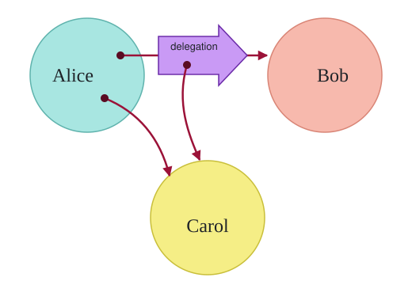
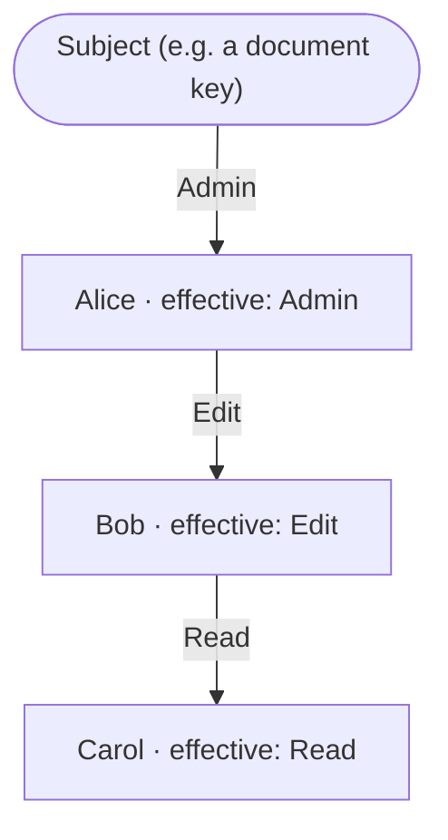
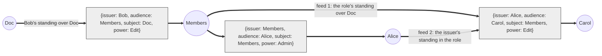

# Keyline

Keyline describes the core authority graph of Keyhive: who can do what, to which subjects, and on whose authority. It is the substrate that the rest of Keyhive (membership, CGKA, encryption) hangs off of. Terms in _italics_ are defined where they first appear and collected in the [Glossary](#glossary).

## Documents

| Document                                | Contents                                                                                                                                              |
|-----------------------------------------|-------------------------------------------------------------------------------------------------------------------------------------------------------|
| [implementation](implementation.md)     | The crates (`keyline`, `keyline_memory`): types, the `Keyline` trait, the evaluation program, the conformance suite                                   |
| [patterns](patterns.md)                 | Conventions over the two primitives: roles, pinning, caretakers, rotation, sealing, constitutional flatness, rooting level, steward, memberships-only |
| [alternatives](alternatives.md)         | Rejected designs, each with the condition under which to reopen it                                                                                    |
| [evaluation notes](evaluation-notes.md) | For evaluator implementers: fixed point vs. graph search, what SQL can express, evaluation cost as a DoS surface                                      |
| [edge-cases](edge-cases.md)             | The design record: the adversarial scenarios and field-elimination arguments that shaped the design                                                   |

## Design Goals

Keyline is a _state-based CRDT_. Any two replicas that have seen the same set of delegations and revocations compute the same authority graph, regardless of the order they received them in. This buys us the usual local-first properties: replicas can be offline indefinitely, sync in any order over any transport, and never conflict.

## Intuition

> Whether to enable cooperation or to limit vulnerability, we care about _authority_ rather than _permissions._ Permissions determine what actions an individual program may perform on objects it can directly access. Authority describes the effects that a program may cause on objects it can access, either directly by permission, or indirectly by permitted interactions with other programs.
>
> — [Mark Miller](https://github.com/erights), [Robust Composition](https://papers.agoric.com/assets/pdf/papers/robust-composition.pdf)

A delegation is the Granovetter operator from object capabilities: Alice, who has a reference to Carol, introduces Bob to Carol by handing him that reference. In the classic diagram the arrows are references; here they are authority over a subject.



This is [Miller's diagram][granovetter], with the message named for what it is here. A dot inside an object is a reference it holds, and the arrow from the dot points at what it refers to. Alice holds references to Bob and to Carol. She sends Bob a message along her reference to him, and the message carries a copy of her reference to Carol. Once it arrives, Bob holds his own reference to Carol. In Keyline the message is the certificate `{issuer: Alice, audience: Bob, subject: Carol, power}`, and the copy is capped at `power`.

### The Flow of Authority

A movie ticket is checked on its own terms at the door. Authority in Keyline is checked by whether it actually arrives: authority flows from the subject outward through the graph, and an audience has whatever reaches it. Picture daisy-chained power strips: your device works if there is an unbroken chain of strips from it back to the wall socket, and every operation is something you do with your hands. The table is a preview: each Keyline term in it is defined later in this document and collected in the [Glossary](#glossary).

| Keyline               | Power strips                                                                                                                                |
|-----------------------|---------------------------------------------------------------------------------------------------------------------------------------------|
| Subject               | The wall socket                                                                                                                             |
| Delegation            | Plugging a strip into another strip, or your device into a strip                                                                            |
| Attenuation           | The breaker on each strip: you never draw more than the weakest strip on your chain allows ($\min$ along the route)                         |
| Widest path           | Two chains to the wall: you get the better one ($\max$ over routes)                                                                         |
| Liveness              | Current flows only while every strip on the chain is plugged in                                                                             |
| Cascade               | Unplug one strip and everything downstream goes dark; nothing about those devices changed                                                   |
| Late binding, revival | Plug it back in and everything lights up again: same devices, same cords, no rewiring                                                       |
| Dead vs. revoked      | A dark device is not a broken device; its chain is interrupted somewhere upstream                                                           |
| Revocation            | You can always unplug what you plugged in. A key to a room lets you pull any cord running through that room, however far downstream it goes |
| Admin reach           | You can still pull plugs in any room you ever had a key to                                                                                  |
| Rotation              | Run the cords through a different room; the old room's plugs no longer touch them                                                           |
| No proof field        | You carry no wiring diagram; plug into the nearest strip and current finds you if any path exists                                           |

The analogy also shows the cost: one unplugged strip upstream darkens everything below it.

Every diagram after this one draws arrows the way authority flows: from where it comes from (the subject, or the role whose authority is carried) toward the audience that receives it. That is the reverse of a reference, which points from the user to the resource, as a device's cord runs to the wall.

## Nodes

All nodes in the graph are Ed25519 verifying keys. At this level there is _no distinction_ between individuals, groups, and documents; they are all merely keys that can appear as the issuer, audience, or subject of a delegation. Higher layers of Keyhive assign meaning to particular keys (this one is a person, that one is a document), but the authority graph itself doesn't care. A delegation from a "document" to a "group" and a delegation from one "person" to another are the same kind of edge, checked the same way.

## Delegations

A delegation is a signed statement extending the issuer's own authority over a subject to an audience. A key's _standing_ over a subject is its effective power over that subject; a delegation is live only while its issuer has standing over its subject, and conveys no more than that.

| Field      | Type                           | Notes                                                   |
|------------|--------------------------------|---------------------------------------------------------|
| `issuer`   | Ed25519 verifying key          | The key that signs; the edge rides this key's standing  |
| `audience` | Ed25519 verifying key          | The key the delegation is issued to                     |
| `subject`  | Ed25519 verifying key          | The _scope_: which routes this edge may participate in  |
| `power`    | `Relay < Read < Edit < Admin`  | Power level                                             |
| `citation` | `Option<Digest<RevocationId>>` | Freshness + heal provenance; zero semantics (see below) |
| signature  | Ed25519 signature              | Over all of the above                                   |

- A delegation reads: _`issuer` asserts that `audience` may exercise `power` over `subject`._
- When `issuer = subject`: a _root edge_: the subject bootstrapping its own authority (see [Root Edges and the Apex][apex]).

A _route_ is a derivation of that standing from the subject through live delegations (a tree once roles compose; see [Two Graphs, One Stored](#two-graphs-one-stored)).

`citation` is the one optional field. Its absence has exactly one encoding, because no digest stands for "none" ([Encoding](implementation.md#encoding)). The invariant is that every meaning has exactly one encoding: an optional field with a default would give one act two encodings, two hashes, and a revocation that kills one twin and misses the other ([alternatives, `from`](alternatives.md#a-from-field-on-delegation)).

A delegation has no field naming the node it is issued through. Every job such a field would do is an arrangement of nodes: scoping is `subject`, acting in a capacity is a dedicated key per capacity, pinning is a [sub-scoped intermediary][pinning], and a narrowly scoped revocation is one signed with a key whose _admin reach_ (the nodes it ever held Admin over; [Admin Reach][admin reach]) is narrow. The arguments are in [alternatives](alternatives.md#a-from-field-on-delegation) and [edge-cases](edge-cases.md).

### Roles

A role is just a node that others hold membership in. Nothing in the format marks a key as a role: a key becomes one when delegations name it as `subject` (memberships, such as `{issuer: Dan, audience: Alice, subject: Members, power: Admin}`) and when supplies name it as `audience`. A _supply_ is a delegation to a role about some other subject, such as `{issuer: Dan, audience: Members, subject: Doc, power: Edit}`; it connects the role to that subject. Later sections use `Members` and `Owners` as example roles. Conventions for building them are in [patterns, Roles][roles].

### `subject` is a Scope, Not an Endpoint

The edge itself runs `issuer → audience`. `subject` says what the edge is _about_, and that controls where it can be used. A delegation with `subject: Doc` only ever helps someone reach Doc; it does one job. A delegation with `subject: Members` is membership in the role itself, which is a much broader thing: it carries whatever the role can reach, now or in the future. If the role later gains access to five more documents, its members get them too, automatically, by [late binding][liveness]. Nobody re-issues the memberships. No certificate changes.

Under [constitutional flatness] (a role whose Admin memberships name only individuals, never another role), membership edges are also _self-certifying_: their routes chain to the role's own _creation edges_ (the delegations the role's key signs at creation, to its first admins) and never leave the node, so the roster survives anything that happens upstream. That is what makes [rotation][rotating a role] cheap and rosters untouchable by outsiders. A role that grants an upstream role Admin over itself puts itself in the reach of every admin of that upstream role, and they can revoke memberships inside it.

### The `citation` Field

Ed25519 is deterministic and certificates are content-addressed, so re-issuing an identical delegation produces the _same certificate_: the same hash, still covered by any revocation that named it. Without a freshness field, healing a mistaken removal on the same terms by the same issuer is impossible.

`citation` does a nonce's job with a fail-closed default: a re-issuance points at the _revocation_ the issuer has seen and is re-issuing past, changing the hash and documenting the heal ("re-granted, knowing of the revocation"). First issuances omit the field.

It names the revocation rather than the revoked delegation. The revoked delegation's hash is a function of the fields being re-issued, so pointing at it adds no information and a second heal of the same delegation would collide with the first; each revocation is a distinct certificate, so each heal gets a fresh hash. The only event that ever poisons a hash is a revocation (an implicitly dead delegation revives on its own when its issuer regains standing), so the thing one must have seen to heal is always a revocation. `revocations_naming` reports the collision, and its output is the value to put in `citation`.

1. _Optional, absence = first issuance._ Absent means "no revocation acknowledged"; present means one named revocation.
2. _No semantics, ever._ Evaluation ignores `citation` entirely. It is not supersession, not ordering, not a causal claim anyone verifies, and it does not cancel or un-apply the revocation it names. Issuer-supplied predecessors must never carry trust, or backdating-by-omission returns.
3. _Anything goes._ A bogus `citation` value, or one naming a certificate the replica doesn't hold, is harmless; it only perturbs the hash. When several revocations name the same delegation, any of them serves.

A random nonce would fail open where `citation` fails closed ([alternatives](alternatives.md#a-random-nonce-instead-of-citation)).

### Power Levels

`Power` is a totally ordered ladder:

```
Relay < Read < Edit < Admin
```

| Level | Grants                    | Notes                                                                                        |
|-------|---------------------------|----------------------------------------------------------------------------------------------|
| Relay | Sync and relay ciphertext | Cannot decrypt; makes untrusted relays (e.g. [Subduction]) first-class citizens of the graph |
| Read  | Decrypt content           |                                                                                              |
| Edit  | Write new content         |                                                                                              |
| Admin | Act on the graph          | Revoke on routes through the node; over a role, that is managing its roster                  |

`Relay`, `Read`, and `Edit` are _data_ levels: what may travel along the edge. `Admin` is the only level that acts on the graph. The distinction carries the [revocation rule][revocation semantics]: revoking a third party's certificate acts on the graph, so it is gated on Admin; non-admin levels get revocation power only over their own hop and their own signatures.

## Graph Semantics

Delegations form a directed graph: each one is an edge carrying a power level. Authorization is a _reachability_ question over that graph.

### Late Binding Paths

There is no "proof" field on delegations or revocations. A delegation doesn't name the chain that justifies it: it asserts an edge, and justification is computed at verification-time. The `audience` gains access to `subject` as long as _some_ unbroken route exists from the subject to the `audience`, where every hop is validly signed and every issuer along the route has standing of their own (at any level; levels clamp, they do not gate).

Consequences:

| Property                | Meaning                                                                                                                                                                                        |
|-------------------------|------------------------------------------------------------------------------------------------------------------------------------------------------------------------------------------------|
| Late binding            | A delegation issued before its issuer had authority becomes effective the moment the issuer gains it, and stops being effective if the issuer loses it. Edges are facts; authority is derived. |
| Redundant routes        | If access arrives via two chains and one breaks, the other keeps working. There is no single brittle proof to invalidate by accident.                                                          |
| Order independence      | Justification is recomputed from the full set, so it doesn't matter in what order a replica learned the edges. This is the CRDT property.                                                      |
| Revival with provenance | When a severed subgraph is re-supplied, everything not explicitly revoked re-energizes _as the same certificates_: same hashes, same issuers, same audit trail.                                |

Two delegations with identical `audience`, `subject`, and `power` but different hashes due to different `issuer` or `citation` are distinct edges.

### Liveness

A delegation is _live_ iff some route grounds it (its issuer reaches the subject, at any level, through live delegations, along a route avoiding every node its [revocations][revocation semantics] cover) and its audience has not revoked it.

The recursion is grounded at root edges (delegations signed by the subject itself) and derived monotonically outward. Revocation coverage is computed separately, against the _positive graph_, the graph with every revocation ignored (see [Computation]); the liveness recursion treats it as fixed.

Because the check happens at evaluation time, liveness is _late-bound_: a delegation dies implicitly the moment its issuer loses standing, and springs back to life if the issuer regains it. Nothing about an individual certificate records whether it is live: liveness is a property of the certificate _in the context of the full set_.


```mermaid
flowchart TD
    Subject(["Subject (e.g. a document key)"])
    Subject -- "Admin" --> Alice["Alice · effective: Admin"]
    Alice -- "Edit" --> Bob["Bob · effective: Edit"]
    Bob -- "Read" --> Carol["Carol · effective: Read"]
```

### Attenuation

Routes _attenuate_ to the lowest power along them. If Alice holds `Admin`, delegates `Edit` to Bob, and Bob delegates `Admin` to Carol, Carol's effective power is `Edit`: the meet (minimum) of every hop. When multiple routes exist, effective power is the best available: the maximum over routes of the minimum along each (widest-path/bottleneck).

### Two Graphs, One Stored

The picture above (nodes, edges, paths) is the right intuition for routes that stay inside one subject's certificates. When `subject` names a role, the path picture no longer holds.

There are two graphs. The _message graph_ is the certificate set: who signed what, to whom, about what. It is stored, append-only, and unconditional: any key may sign any edge about any subject. The _authority graph_ is what the evaluator derives from it: who actually holds standing over what. It is stored nowhere and recomputed from the message graph at every evaluation. Everything this document calls late binding, implicit death, and revival is the authority graph changing while the message graph only grows.

The authority graph is not a plain graph. It alternates between two kinds of node with different combination rules:

| Node              | Kind | Rule                                                                                                                             |
|-------------------|------|----------------------------------------------------------------------------------------------------------------------------------|
| Principal (a key) | OR   | Standing arrives by _any_ certificate that conducts to it; effective power is the `max` over arrivals. This is redundant routes. |
| Certificate       | AND  | Conducts only when _every_ feed into it is live; output is the `min` of its feeds and its own `power`. This is attenuation.      |

A certificate about the subject itself (`subject: Doc`) has one feed (its issuer's standing over `Doc`), and a chain of such certificates is a path. A certificate about a role (`subject: Members`) has _two_ feeds of different kinds, and this is where the path picture breaks:


```mermaid
flowchart LR
    classDef cert fill:#eee,stroke:#333

    Doc((Doc))
    Members((Members))
    Alice((Alice))
    Carol((Carol))

    supply["{issuer: Bob, audience: Members, subject: Doc, power: Edit}"]:::cert
    roster["{issuer: Members, audience: Alice, subject: Members, power: Admin}"]:::cert
    sponsor["{issuer: Alice, audience: Carol, subject: Members, power: Edit}"]:::cert

    Doc ==>|"Bob's standing over Doc"| supply ==> Members
    Members ==> roster ==> Alice
    Members ==>|"feed 1: the role's standing over Doc"| sponsor
    Alice ==>|"feed 2: the issuer's standing in the role"| sponsor
    sponsor ==> Carol
```

Alice's delegation to Carol conducts `Doc`-standing to Carol only if _both_ `Members` has standing over `Doc` _and_ Alice has standing in `Members`. Both of those are themselves derived facts. A justification is therefore a tree, not a path; "route" throughout this document means a derivation in this AND/OR graph, and "transits a node" means the node appears anywhere in the derivation. The evaluator never walks `issuer → audience` edges as such: Alice's certificate sits on `Doc`'s route to Carol because Alice has standing in `Members`, not because Alice is the previous node.

The AND/OR view shows directly:

- _Dead certificates are visible at a glance._ A certificate box with no live feed conducts nothing: it is inert, not invalid. An ungrounded island (a role nobody ever supplied) is a fragment of the authority graph that never touches a subject.
- _Cycles resolve to dead._ The authority graph is the _least_ fixed point: nothing conducts until a feed from a subject reaches it. A ring of certificates vouching for each other with no path to a subject derives nothing.
- _Griefing is a cut on this graph._ An audience survives iff some derivation avoids every node the griefer's [admin reach][admin reach] covers; redundant routes defend only when they are disjoint at the AND-nodes, i.e. through distinct roles.

The two-feed AND-node is also the reason evaluation is a fixed point rather than a graph search: which edges _exist_ in the authority graph is an output of the computation, not an input. See [implementation, Evaluation](implementation.md#evaluation) for the program.

## Root Edges and the Apex

Subjects bootstrap their own authority. At creation, the subject key signs exactly one delegation, to a freshly minted _apex_ role: `{issuer: Doc, audience: Owners, subject: Doc, power: Admin}` (or `power: Edit`; see [Who Can Revoke the Root Edge][who can revoke the root edge]). The subject's signing key is then destroyed (cf. Keyhive's `EphemeralSigner`). The subject's _identity_ is its verifying key, permanent; its _authority_ immediately lives elsewhere.

```
┌─────┐  Admin (sole root edge)  ┌────────┐         ┌─────────┐
│ Doc ├─────────────────────────►│ Owners ├───...──►│ Members ├──► ...
└─────┘  key destroyed after     └────────┘         └─────────┘
         signing this one cert   apex: append-only  rotatable, all the way down
```

### Who Can Revoke the Root Edge

The route of `Doc → Owners` is itself, grounded at Doc. A third party's revocation covers it only if Doc is in the revoker's admin reach, and the level chosen at creation decides whether it is in anyone's. Rooted at Admin, Doc is in the reach of everyone who ever held Admin in Owners, and any of them can brick the document with one revocation. Rooted at Edit, Doc is in nobody's reach.

The root edge's two parties can always revoke it ([Revocation by the Audience][revocation by the audience]). Its issuer is the subject key, destroyed at creation. Its audience is the apex role's own key. An Edit-rooted root edge is therefore revocable by nobody _provided the apex role's key was discarded after creation_, as the [roles][roles] convention prescribes. A retained apex key can brick the document under either level.

Admin over a document gates nothing except reach over it, so Edit-rooting costs no capability ([patterns, Rooting Level][rooting level] has the argument and the comparison table). A retained subject key can re-root an Edit-rooted document out from under old admins ([below](#the-apex-is-append-only-unless-the-subject-key-survives)). Admin-rooting gives every apex admin the power to destroy the document, which is not a new power ([Griefing](#griefing)); it is the right shape when the owners _are_ the document.

> [!IMPORTANT]
> Destroy the subject key after creation, or guard it as the recovery instrument it is: a retained subject key can revoke the root edge and re-root the document (below).

### The Apex is Append-Only (Unless the Subject Key Survives)

Rotation works at every layer except the top. Rotating Owners requires a new root edge, and with the subject key destroyed, none can ever be minted. Meanwhile everyone who ever held Admin in Owners has Owners in their admin reach, and every route in the document transits Owners, so apex removal is never durable. There is no surviving senior to appeal to: the apex's parent destroyed itself at creation.

| Layer              | Removal semantics                                                |
|--------------------|------------------------------------------------------------------|
| Apex role (Owners) | Append-only trust: membership can grow; removal is never durable |
| Every layer below  | Fully rotatable: durable removal via mint-and-re-roster          |

A _retained_ subject key (cold storage, threshold-split) changes this for an Edit-rooted document: it can revoke the old root edge and mint `Doc → Owners′`, and the old apex admins' admin reach contains Owners, which the new hierarchy's routes never transit. This is a true apex rotation, durable removal included, but the retained key can do the same to the new owners. For an Admin-rooted document the retained key buys nothing durable: the old admins' reach contains Doc itself, so `Doc → Owners′` is as revocable as its predecessor. The choices made at creation are rooting level and key custody.

### Mutual Assured Destruction at the Apex

Apex peers can revoke each other's memberships (Owners is in every apex admin's admin reach), and both revocations of a concurrent duel are independently covered, so under [permanence] both stand. Mutual destruction is deterministic, not prevented.[^mad] Below the apex this is survivable. The _senior_ (whoever supplies the role) holds a supply into the role, not a membership in it ([constitutional flatness]), so it resolves the duel by rotation: mint a successor node, and re-roster whichever party (or neither) with fresh keys. Rotation shuts the duelists out only if the role holds at most Edit over the subject ([The Ex-Admin Sharp Edge][the ex-admin sharp edge]).

At the apex there is no senior. If all apex members revoke one another, every human's standing dies in the cascade, and no one can ever mint new apex members (that requires _live_ Admin over the apex). The graph is permanently bricked: replicas keep their data, but no new delegation will ever be live again.

Mitigations: a single-owner apex has no peers and therefore no duel. Memberships signed by the apex role's own key at creation never die by cascade, because the role key stands over itself, but any apex admin can still revoke them explicitly, whatever the rooting level, so they do not survive a duel. A retained subject key enables repair (or re-rooting), at its custody cost. Keep the apex minimal (one key per human owner, or just the creator), with all churn conducted in second-layer roles, where rotation works. Treat the apex like a root CA: set it up once and use it rarely.

[^mad]: "Mutual assured destruction," from Cold War deterrence theory.

## Revocations

A revocation breaks a previously issued delegation, identified by hash:

| Field     | Type                  | Notes                                             |
|-----------|-----------------------|---------------------------------------------------|
| `issuer`  | Ed25519 verifying key | The key that signs                                |
| `revoke`  | `Digest<Delegation>`  | The delegation being revoked                      |
| `retain`  | subject ↦ watermark   | Content-layer retention; never read by evaluation |
| signature | Ed25519 signature     | Over all of the above                             |

`retain` answers a question that the authority graph cannot answer: what happens to the content that the revoked key already wrote ([whiteout](#open-questions)). It plays no part in anything below. It is in the certificate so that the answer is signed by the same act that revokes the edge.

Both certificate species are add-only; merging is set union.

There is one revocation rule for third parties and one for the parties themselves. Third parties: a revocation breaks the target on every route that passes through the issuer's _admin reach_: the nodes the issuer ever held Admin over, plus the issuer's own node ([Admin Reach][admin reach]). The parties: whoever signed the certificate, as issuer or as audience, may kill it on every route.

Where the admin reach doesn't touch the target's routes and the issuer is neither party, the revocation is _inert_: a no-op, not an error. Validity is unconditional; any well-signed revocation is admissible. A revocation has no authority of its own, only coverage. One that breaks a certificate far below its issuer, through the issuer's admin reach, is a _deep revocation_.

- _Revocation by the issuer_ (`issuer = target.issuer`) needs no second rule: the issuer is the final node on every route of their own certificate and in their own admin reach.
- _Revocation by the audience_ (`issuer = target.audience`) is why the second rule exists. Routes end at the issuer, so no admin reach (not even the audience's own) reaches a certificate through its `audience`; if it did, every admin of a role could revoke the supply edges _into_ that role, which they never issued and hold no reach over on the supplier's side.

The full tier structure, each tier matched to its trust basis:

| Who                             | Breaks the edge on…              | Trust basis               |
|---------------------------------|----------------------------------|---------------------------|
| Anyone                          | routes through their own node    | it's your own hop         |
| Issuer / audience of the target | all routes (total)               | your signature, your act  |
| Anyone who ever held Admin      | routes through their admin reach | Admin, granted explicitly |

The first row means even a Read-level intermediate can refuse to let their standing carry someone else's delegation. This is deny-only and confined to their own hop. Revoking their own incoming delegation as its audience is a different tool: it kills only the routes through that delegation, plus their own access along it.

### Revocation Semantics

#### Admin Reach

A revocation signed by Bob breaks its target on routes that pass through:

1. any node Bob ever held Admin over (directly, or through a role he was Admin in), and
2. Bob's own node.

This set is Bob's _admin reach_. Admin standing composes like any other: if Bob is an Admin member of `Owners` and `Owners` is Admin over `Members`, Bob holds Admin over `Members` and has it in reach: he controls `Members`' delegations as if he were `Members`. "Ever" means exactly that: we compute it from the delegations alone, as if no revocations existed. A role Bob was removed from still counts. A role he resigned from still counts. Admin reach only grows; nothing that happens later shrinks it.

A rule that shrank it would break each of these:

- _Removal has to stick._ If removing an admin shrank their admin reach, it would also cancel every revocation they signed while in office: remove the moderator, and everyone the moderator banned walks back in. (Rotating the role does moot them; see [The Ex-Admin Sharp Edge][the ex-admin sharp edge].)
- _Revocations must not judge each other._ If one revocation could shrink the admin reach another depends on, the result would depend on arrival order, and two replicas with the same certificates would disagree. Reach built from delegations alone gives every replica the same answer, in any order.
- _Quitting must not un-ban anyone._ If resigning shrank your admin reach, resigning would cancel your own past revocations. Leaving a role would become a way to let banned people back in.

The growth direction is safe: when Bob joins a new role, his old revocations now also cover routes through it. Coverage can only ever expand, and expanding coverage only ever removes access, so the surprise, if any, is in the fail-closed direction.

#### The Effect is Scoped; the Validity is Not

Scoping the _effect_ to the admin reach, rather than conditioning validity on topology, is what preserves this invariant:

> Once a replica has applied a revocation, no merge may un-apply it. Every access-restoring transition requires a fresh signature from live authority, never message scheduling alone.

Total fail-closed is unavailable in any eventually consistent system: unseen revocations apply late (bounded by sync), and late binding revives implicit deaths (gated by an authorized signature). The disqualifying failure, revocation undone by delivery order, is the one this rule excludes. A rotation does not invalidate an old revocation (nothing ever does); it _moots_ it, by routing authority through fresh nodes outside the issuer's frozen admin reach. Any revived access arrives via a new signed supply edge: an authorized act, not a reordering.

Route geometry alone gives both of the following:

- _Seniority needs no rule._ You cannot revoke the branch you stand on: an edge _above_ your admin reach never routes through it, so your revocation of it is inert. Deep revocations only run downward.
- _Peers can revoke each other._ Two admins of one node each have it in their admin reach, and each other's membership certificates route through it. Both revocations of a concurrent duel land; both stand ([permanence]). The branch's parent repairs by [rotation][rotating a role]. Under [constitutional flatness] (the role's Admin memberships name only individuals), the parent holds a supply into the role, not a membership in it, so it re-rosters a successor role rather than re-adding members directly.

#### Revocation by the Audience

An audience may always revoke a delegation that names it, totally and unconditionally: no senior sign-off, no preconditions.

- _Key compromise._ When a key leaks, it is the only signer guaranteed available at the moment it matters. Requiring an appeal upward imposes an unbounded, partition-shaped delay during which the thief acts freely. At a sole-owner apex there is no upward at all. (The thief can also revoke what names the key; that is the least dangerous thing they can do with the key, and deny-only besides.)
- _It follows from the fail-closed axiom._ Shedding authority can never grant, escalate, or touch a third party's independent standing.
- _Prohibition would not prevent the harms attributed to it._ A node others depend on can strand its downstream anyway: revoke every delegation it issued, or simply lose the key. Banning revocation by the audience removes only the legitimate exit.

A caveat: revocation by the audience is _not_ the pure ocap capability drop. In ocap, dropping your reference leaves the copies you introduced intact; here, liveness is issuer-recursive, so revoking your own membership also unwinds everything you issued through it: a drop _plus retroactive unwinding of your introductions_. The externalities are answered by _stewardship_ at the protocol layer while keeping the semantics unconditional:

- _Succession discipline._ Revoking your own membership in a position others depend on should be preceded by a handoff: confirm a successor, let peers re-issue what needs re-issuing, _then_ revoke it. Because the apex is append-only-growable, an orderly succession path always exists before the exit, and never after.
- _Stranding is repairable below the apex._ A leaf revoking its own membership strands nothing; when a member others depend on leaves, survivors re-issue its dead delegations; a severed subtree is re-supplied from above. The unrecoverable case is the _last_ apex member revoking their own membership.
- _Sole-apex exit._ A sole apex member revoking their own membership destroys the document, irreversibly. Tooling should warn. Prohibiting revocation by the audience would not prevent it: sole-apex fragility is inherent to sole-apex.

#### Permanence

Delegations and revocations have deliberately _asymmetric_ justification requirements, from one principle applied twice:

> Ambiguity resolves toward less authority.

| Statement  | Justification                        | When the issuer is removed                                |
|------------|--------------------------------------|-----------------------------------------------------------|
| Delegation | _Ongoing_: recomputed at every check | Their delegations die (transitive cascade)                |
| Revocation | _Ever_: the frozen admin reach       | Their revocations stand forever, within their admin reach |

Both arms fail closed. Late-bound revocation validity would mean removing an admin _revives everyone that admin ever removed_. Worse, it would let a later merge un-apply an applied revocation, restoring access by delivery order. Permanence is also forced by the absence of global ordering: a revocation signed by a removed admin is bit-for-bit indistinguishable whether signed before or after the removal, so "old ones stay, new ones don't" is not an expressible rule, and causal predecessors would not fix it (a dishonest ex-admin backdates by omitting heads).

What is _chosen_ is the scoped effect. Reach is confined to an admin reach that froze when the issuer's career ended, and roles rotate.

#### Transitive Effect

Revocation cascades, but _implicitly_: revoking Alice's membership does not enumerate or revoke anything she issued. Every delegation she issued fails the [liveness] check on next evaluation, and everything downstream fails in turn. An explicit cascade would make a revocation's meaning depend on its issuer's sync state: two replicas would produce "the same" revocation with different effects, which destroys order independence. Implicit cascade keeps revocations self-contained: one hash, one signature, same meaning everywhere.

Redundant routes interact correctly for the same reason: each certificate's liveness is evaluated on its own, so revoking one of Carol's two delegations leaves the other untouched.

#### Death, Revocation, and Revival

A delegation can be dead without being revoked. If Alice is removed from Members, everything she issued through that standing dies _implicitly_: no revocation names it.

> [!WARNING]
> If the same verifying key regains standing, its previously issued delegations spring back to life.

This follows from late-bound liveness. It is a repair mechanism and a hazard:

- _As a repair mechanism:_ remove by mistake, re-add (a fresh certificate via [`citation`][the citation field]), and everything the person issued revives with provenance intact. Implicit removal is _fully reversible_: the mistake costs one certificate. Selective revival composes: re-add plus explicit revocations on the unwanted branch heads ("everyone comes back except Eve" is one re-add and one revocation per branch).
- _As a hazard:_ an unintended re-add revives certificates everyone forgot. Two practices blunt it: _fresh-key discipline_ (after a compromise, re-add with a new verifying key; the old key's certificates stay dead) and _explicit revocation on removal_ (for removals that must survive any future re-add; the explicit revocation is permanent, and deep certificates keep their hashes, so it keeps biting).

The removal tiers, by what you believe about the removal:

| Removal                                   | Durable against re-add? | Recoverable if mistaken?                       |
|-------------------------------------------|-------------------------|------------------------------------------------|
| Implicit (revoke memberships only)        | No: revival on re-add   | Fully: one certificate, everything revives     |
| Explicit (also revoke their issued certs) | Yes                     | Partially: kept certificates must be re-issued |
| Fresh-key re-add                          | N/A: old key stays dead | New key re-issues what it should hold          |

#### Persistence Past Removal

Can a delegation be made to outlive its issuer's removal, without causal metadata? Not from the issuer's side. Any rule that keeps a delegation live after its issuer loses standing must decide liveness from something other than current standing, and without a clock the only other timeless fact is whether the issuer was _ever_ authorized, which is the [admin reach][admin reach] computation. That does give persistence for free, but it also lets a removed issuer mint new persistent delegations afterwards: "issued before the removal" and "issued after the removal" are the same bits. The [ex-admin sharp edge][the ex-admin sharp edge] is tolerable because it is deny-only; this would be the same edge with the power to grant. A `durable` flag, a witness chain embedded in the certificate, or a proof snapshot all reduce to this, because a witness proves the issuer _was_ authorized, never _when_. Telling the two apart needs exactly the causal metadata the design avoids.

Persistence is available from the surviving side. A live authority grants a fresh membership: `{issuer: Dan, audience: Carol, subject: Members, power: Edit}`. Carol's standing now hangs on Dan, and everything Carol issued revives by late binding, because her edges reference her key rather than Alice's certificate. This is an explicit act by a live signer (fail-closed, order-independent, no new mechanism), and it is step 3b of the [worked example][worked example]. An "adoption" certificate that keeps the _original_ certificate live under a new sponsor was considered and rejected: it would preserve the original's hash and provenance at the cost of a third certificate kind and a second liveness rule, and a fresh membership already revives everything below Carol with provenance intact.

#### The Ex-Admin Sharp Edge

> An ex-admin retains revocation power over their admin reach, forever.

Removed from Members, Bob can still validly revoke certificates on routes through Members, including delegations issued years later. What bounds the damage: revocation is deny-only (he can never grant or escalate); his admin reach froze at removal (nobody is adding him to anything); and durable escape is _rotation_: mint a fresh role node, re-supply it, re-roster. Rotation escapes only if the role holds at most Edit over every subject it reaches (see below). So removing an admin needs a rotation:

> After removing an admin from a role, rotate the role node; otherwise the removal is not durable against griefing.

This mirrors BeeKEM's post-compromise security:

|                              | BeeKEM (keys)                      | Keyline (authority)                 |
|------------------------------|------------------------------------|-------------------------------------|
| What a removed party retains | Old key material                   | A frozen admin reach                |
| Why removal alone fails      | Can still decrypt old-path secrets | Can still sign covering revocations |
| The fix                      | Rotate keys on the path (PCS)      | Rotate the role node                |
| Cost                         | $O(\log n)$ path rotation          | Mint a key + re-roster              |

Under admin-reach scoping, the place rotation moves to is well-defined:

- _The boundary is frozen, by construction._ A fresh node post-dates the ex-admin on every graph; no fact will ever put it in his admin reach. Rotation escapes him for good, at the cost of one roster, not a subtree, provided the rotated role held at most Edit over every subject it was supplied into. Admin over a subject puts the subject itself in every role admin's reach, and no rotation of the role takes it out (next point).
- _Visibility does not matter._ He can sync every certificate ever minted; revocations covering only dead routes are inert. (Hash-visibility is no bound: set-reconciliation sync enumerates missing hashes to any peer; see [edge-cases, Finding 3](edge-cases.md#finding-3-the-visibility-bound-does-not-hold).)
- _The subject is the one node that cannot rotate, and it is in reach._ Everyone who ever held Admin over the subject, directly, through the apex role, or through any role holding Admin over it, has the subject in their frozen admin reach and can cover every certificate on it, the root edge included. That is a permanent whole-document kill, and it is accepted because it is not a new power ([Griefing](#griefing)). A document that wants its root edge irrevocable roots at Edit instead ([Root Edges and the Apex][apex]); nothing about Admin over a document is needed for anything but this.
- _Survivors' revocations need no maintenance._ Because admin reach grows with its holder's career, a surviving admin's old revocations automatically cover the successor nodes they are re-rostered into. Their revocations follow them through every rotation; the griefer's stay pinned to dead nodes.
- _The removed admin's revocations lapse, wanted or not._ Rotation moots every revocation the removed admin signed, including deep revocations the survivors agree with: a target that admin revoked deep below the role revives once the role's routes run through the successor. Survivors re-sign the ones worth keeping. They are enumerable from the set: revocations signed by that key whose targets are live after the rotation. Roster removals that admin made need nothing, because the rotator simply does not re-roster those members.

One correction to the tempting intuition that rotation leaves the old node harmlessly dead: it leaves it _dormant_. See [Reconnection and Sealing][sealing].

## Computation

Evaluation is graph-global rather than certificate-local: no certificate can be verified in isolation, only against a set. The same search runs twice, with negation only between the runs.

```
Stratum 0: base facts
  all certificates in the set

Stratum 1: the positive pass
  run the liveness fixpoint IGNORING ALL REVOCATIONS
  → admin_reach(k) for every revocation issuer k
  → covered(c, n)  for each revocation of c and each n ∈ admin_reach(issuer)

Stratum 2: the live pass
  live(c) ← ∃ route for c through live certs avoiding every n with covered(c, n)
            ∧ the audience of c has not revoked c
```

Stratum 1 and stratum 2 are the same grounded, issuer-recursive, level-thresholded route search: the positive pass runs blind to revocations, to learn who ever stood where. Negation appears exactly once, over fully computed lower strata: stratified Datalog, unique least model. The reference program is in [implementation, Evaluation](implementation.md#evaluation).

### Why the Strata Are Mandatory

The tempting shortcut (subtract revoked edges, then compute reachability) gives order-dependent results, because revocations would then affect each other's authority. Take `r1` (Dan revokes Bob's membership) and `r2` (Bob revokes some delegation): subtract-first makes `r2` inert if `r1` is applied first, and effective otherwise. Same set, different results by merge order. Stratification restores determinism: admin reach is computed where no revocation can see any other. It follows that:

- _Coverage is monotone-stable._ Stratum 1 consults only delegations, and the positive graph only grows. Coverage can activate or expand as delegations arrive, never shrink. Once applied anywhere, applied everywhere, forever.
- _Revocations are mutually invisible._ Revocations target delegations, never other revocations, so mutual invisibility is structural. Removing whoever signed a revocation does not undo it; that is [permanence] again, seen from the evaluation side.

### Revocations Cannot Be Revoked

The `revoke` field's type is `Digest<Delegation>`. A revocation naming another revocation is not invalid; it is unwritable. The classic regress ("who may revoke the revocation? and who may revoke _that_?") never starts, because the format cannot express it.

A mistaken revocation is repaired by granting again, not by un-revoking: issue a fresh delegation, with [`citation`][the citation field] naming the revocation. The old revocation stays in the set forever, a dead letter naming a dead hash. This is [permanence]: access comes back because someone with live authority signed something new, never because a revocation was un-applied.

Revocations are terminal facts, so the evaluator has no "is this revocation itself revoked?" check, stratum 1 never recurses over revocations, and applied coverage never switches off. Compare what un-revocation would require: an authority rule for whoever signs the un-revocation, another for revoking the un-revocation, and an ordering to settle revoke/un-revoke/re-revoke races, which means causal metadata or merge-order dependence at every level. The cost of declining the feature is one workflow: re-grant instead of un-revoke.

### Cost

- _Rooted at one subject._ Every query is grounded at one subject and ranges over the subjects it reaches: `subject: Members` edges are on Doc's routes because Members has standing over Doc. Scoping is by reachability, not by which certificates carry `subject: Doc`.
- _Stratum 1 can be cached._ It is monotone, so merges can evaluate deltas, and admin reach and coverage can be cached indefinitely. `MemoryKeyline` does not cache: every query recomputes both strata ([evaluation notes, Status](evaluation-notes.md#10-status)).
- _Pay per dispute._ Un-revoked certificates (the vast majority) evaluate in one shared widest-path pass (four levels ⇒ bucketed BFS, linear). Each distinct exclusion set pays one route search per fixpoint round, plus the cascade of actual deaths. A delegation's exclusion set is determined by who revoked it, so there is one per distinct set of signers, not one per revoked certificate. A delegation none of whose covered nodes has standing over its subject in the positive graph needs no exclusion set at all. A role accumulating revocations is one under dispute, and rotation (already the response to removing an admin) moots them and restores the fast path.
- _Junk never enters the fixpoint._ Evaluation forward-chains from root edges, so ungrounded certificates cost storage but no computation. Cycles: _assume dead on revisit_ (the least fixed point). Assuming live computes the greatest and makes ungrounded cycles self-certifying: a one-line bug with a security consequence.
- _Timeless is the cheap option._ Ordering-aware revocation would require temporal reachability over historical graphs plus causal metadata on every certificate. Here there is one graph, ever; results are a pure function of the set, and the set digest is a perfect cache key.

### Witness Hints

The [no-proof design][no proof field] pushes route information out of the certificate, but transport may carry it: a peer asserting a conclusion may attach the witness route, and checking a claimed route costs its length. Soundness never depends on the hint: a wrong hint falls back to search.

### Partial Visibility

Graph-global evaluation needs the relevant certificates on hand. A replica cannot confirm a revocation's coverage without the delegations that built the issuer's admin reach, and cannot mint a _working_ re-issue of a certificate it has never seen revoked. The [`citation`][the citation field] collision is silent and fail-closed; tooling should surface it ("matches a revoked certificate; re-issue with `citation`?"). We recommend provisionally honoring unconfirmed revocations: over-applying a revocation fails closed, and fuller sync confirms or retires it.

Missing certificates can err in either direction. A missing _delegation_ usually costs access, but it can also grant it: admin reach is computed from delegations, so a replica that has not seen the certificate making K an admin of `Members` will judge K's revocations there inert, and honor access the full set revokes. Coverage [activates and expands as delegations arrive][why the strata are mandatory]; a replica short of delegations is a replica short of revocations.

### What a Replica Must Hold

A replica does not need the world. Define the _closure_ of a subject `S` as `S`, every node with standing over `S` in the positive graph, every certificate about those nodes, and every revocation naming one of those certificates. Standing in the positive graph ignores revocations, so the closure holds every node that has _ever_ had standing over `S`, including nodes revoked since.

Live standing would not do. Admin reach and coverage are computed on the positive graph, so a revoker's reach can run through a node that has since lost standing over `S`. A closure built from live standing would omit the certificates that put `S`'s routes in that revoker's reach; a replica holding only that closure would judge the revocation inert and keep the revoked delegation live, which fails open. Then:

> No certificate outside `closure(S)` can change any answer about `S`.

Every step of evaluation stays inside it. `reaches(S, ·)` extends along edges about `S` and composes through nodes `S` reaches, whose own rows come from edges about them. Admin reach is consulted only for nodes on a route, so only for nodes in the closure. Liveness and caps are rooted at the certificate's own subject. Nothing looks outward.

The same boundary confines revocations, which is the less obvious half:

> A revocation whose issuer lies outside `closure(S)` is inert for `S`.

For the revocation to bite, some node `n` on the target's route must be in the issuer's admin reach, and `n` is in the closure. Either `n` is the issuer, putting it in the closure; or the issuer is reachable from `n` at Admin, and the closure is closed under reachability. Either way the issuer was in the closure to begin with. So "who can affect this document" has a finite, checkable answer.

For replication:

- _Closure size is a topology choice._ Roles whose memberships name only individuals keep it small; nesting and shared roles enlarge it. [Constitutional flatness][constitutional flatness] is usually argued from griefing containment, but it also decides how much a phone has to hold.
- _Closures only grow._ More certificates can only enlarge a closure, never shrink one, so a subscription never has to be retracted, only extended as new supplies pull new roles into scope.
- _Derivation belongs to the larger peer._ A small replica cannot compute its own closure: it lacks the certificates that say what is reachable. It does not need to. It names its interest (a handful of subject identifiers), and a peer holding a superset derives the closure and ships it. The expensive half runs where the graph already is.

What no protocol can supply is proof of completeness. A replica cannot verify it holds every relevant revocation, because absence is not witnessable, and in a system without consensus there is no canonical set to prove non-membership against. What holds instead is weaker and sufficient: merging is union and revocation is [permanent][permanence], so a peer that withholds a revocation can only delay it, and any other peer repairs the omission. One honest peer suffices, and nothing a dishonest one sends afterwards can un-apply a revocation.

Asking narrower questions does not shrink the requirement much. "Does _this_ key have access?" needs only the routes to that key, but judging whether those routes are covered needs the admin reach of everyone who revoked anything on them, and that is computed from those nodes' own graphs. Coverage pulls the closure back in. The closure is close to the floor for exact answers; anything less is an approximation, and it approximates in the fail-open direction.

## Griefing

Anyone upstream can deny access downstream, and "upstream" includes anyone who ever held Admin there. The griefer set has an exact characterization: an audience's access dies iff every live route is covered, and X can cover a route iff it transits X's admin reach. So:

> X can grief Y ⟺ every live route from Y to the subject transits X's admin reach.

It follows that:

- _The set grows with depth and fan-in._ A chain of depth $d$ through roles of $m$ admins each exposes $O(d \cdot m)$ potential griefers per route.
- _It grows monotonically in time._ Admin reach is append-only.
- _Availability is a min-cut problem._ Redundant routes defend only if they pass through distinct roles; a second route through the same role adds nothing. Power is widest-path over $(\max, \min)$; grief-resistance is min-cut over roles.

Why this is survivable:

- _Deny-only._ A griefer can never read, write, or escalate.
- _Only admins are in the set._ Under [memberships as the only shape][memberships], non-admin members never hold Admin over a role, so their revocations reach only their own hop and their own signatures.
- _Bounded by local-first._ Revocation confiscates nothing: the audience keeps its replica and everything already decrypted. Griefing severs new content keys and authorized sync. That is real, but it is not data loss.
- _Attributable and repairable._ Revocations are signed; a spree is a self-incriminating audit trail.
- _Blast radius and griefer count are inversely related._ Upstream revocations kill whole subtrees, but upstream roles have fewer people who ever held Admin in them, and route geometry bars everyone standing on an edge from revoking it. The apex can grief everything, but that is ownership.
- _Bricking is not a new power._ In an Admin-rooted document, anyone who ever held Admin in the apex can kill the whole document with one revocation of the root edge. A root admin could already revoke every peer's membership and then lose their own key, with the same result. One certificate instead of many changes the ergonomics, not the trust model. A document that wants an irrevocable root edge roots at Edit ([Who Can Revoke the Root Edge][who can revoke the root edge]).
- _Rotation ends it._ A griefer's admin reach froze at removal; rotating the roles in it moots every revocation they ever signed and every one they ever will, provided none of those roles held Admin over the subject ([The Ex-Admin Sharp Edge][the ex-admin sharp edge]).

Revocation power is the power to deny access, so the tension cannot be removed. Any design with decentralized durable removal hands every remover a griefing capability. Keyline chose durable (fail-closed); admin-reach scoping and rotation hygiene shrink the surface, and no semantics tweak eliminates it.

### Evaluation Cost

The analysis above prices denial of authority. The evaluator has a second surface: work. Evaluation is superlinear, so an adversary may try to make every replica's evaluation expensive. The full analysis is in [evaluation notes §7](evaluation-notes.md#7-threat-model-evaluation-cost-as-a-dos-surface). Its shape mirrors the authority case: the more standing an attacker has, the more they can force, and every step is signed.

| Who                        | What they can force                                                                                            | Bound                                                                                                                                                      |
|----------------------------|----------------------------------------------------------------------------------------------------------------|------------------------------------------------------------------------------------------------------------------------------------------------------------|
| Outsiders                  | Storage only. A certificate whose issuer never gains standing derives nothing, so it never enters the fixpoint | Sync-layer quotas                                                                                                                                          |
| Any member                 | Quadratic work from linear input: a ladder of `k` nested roles yields about `k²/2` facts                       | Signed and attributable; limited to documents the member belongs to; removal plus rotation stops growth                                                    |
| Anyone who ever held Admin | Deep revocations against such a ladder                                                                         | `O(k²)`, not `O(k³)`: the evaluator groups covered delegations by exclusion set (one per set of signers) and skips contexts whose targets are already dead |

An unconsented delegation can aim that structure at a victim's own queries (the [gift-cert attack](evaluation-notes.md#single-queries-and-the-gift-cert-attack)). The victim's revocation by the audience severs it, and removing the attacker removes its cost too, because cost follows liveness: a dead certificate derives nothing.

What remains is a floor: a member can spend their own quota to make replicas do quadratic work once, and attributably. That floor is the size of the answer, not overhead. Lowering it would mean giving up composable roles or `subject` as a scope. As with authority griefing, rotation is the cure.

## Worked Example

Setup, the shape of [patterns, Roles][roles]:

```
{issuer: Doc,     audience: Owners,  subject: Doc,     power: Edit}    root edge
{issuer: Owners,  audience: Dan,     subject: Owners,  power: Admin}   Dan in the apex role
{issuer: Dan,     audience: Members, subject: Doc,     power: Edit}    supply
{issuer: Members, audience: Dan,     subject: Members, power: Admin}   creation edge of Members
```

Dan then makes Alice (`#m_Alice = {issuer: Dan, audience: Alice, subject: Members, power: Admin}`) and Bob Admin members of Members.

_1. Alice invites Carol, submitted to the role._ Alice mints `M2` ([pinning]). Its key signs one creation edge, `#c = {issuer: M2, audience: Alice, subject: M2, power: Admin}`, and is discarded; without it Alice would have no standing over `M2`, and nothing she signed about `M2` would ground. Alice then issues `#p = {issuer: Alice, audience: M2, subject: Members, power: Edit}` and `#d1 = {issuer: Alice, audience: Carol, subject: M2, power: Edit}`. Carol's effective power over Doc is Edit: Members has Edit over Doc through Dan's supply, `M2` has Edit in Members through `#p` (which rides Alice's Admin in Members), and Carol has Edit in `M2` through `#d1` (which rides Alice's Admin in `M2`).

_2. Dan removes Alice._ Dan issues `#r_Alice = {issuer: Dan, revoke: #m_Alice}`. Dan issued `#m_Alice`, so this is revocation by the issuer: total. By liveness recomputation alone: Alice loses her standing in Members; `#p` dies with it (pinned to that standing); `M2` loses Members, and Carol loses Doc, though nothing named `#d1`. Only `#m_Alice` is revoked. `#p` is implicitly dead. `#c` and `#d1` stay live inside `M2`, which now reaches nothing. Alice was an admin of Members, so this removal alone is not durable: Members stays in her admin reach. A durable removal also rotates Members ([The Ex-Admin Sharp Edge][the ex-admin sharp edge]); Members is supplied at Edit, so rotation escapes her.

_3a. It was a mistake._ Dan re-adds Alice: `{issuer: Dan, audience: Alice, subject: Members, power: Admin, citation: #r_Alice}`, a fresh hash pointing at the revocation it heals past. `#p` revives by late binding, and with it Carol's access, with the same hashes and the same provenance. The mistake cost one certificate.

_3b. It was not, and Carol should stay._ Dan instead grants Carol a membership of her own (in Members or another role, or through her own caretaker). `#p` stays dead with Alice. Carol's new access hangs on Dan's standing and, if it is a membership in Members and Members is not rotated, on Alice not revoking it: Members is in her frozen admin reach.

_4. Unintended revival._ If the removal was for key compromise, re-adding "Alice" means a _fresh key_; the old key's certificates stay dead. Re-adding the same key revives everything it ever issued (step 3a run by accident). Explicit revocations on removal are the durable form. See [Death, Revocation, and Revival][revival].

## Lineage & Prior Art

Keyline is related to certificate capability systems in the [SPKI] lineage (by way of [UCAN]). Delegation and attenuation behave as in a UCAN chain. The difference is who assembles the chain: a UCAN invoker presents one with each invocation, while a Keyline verifier searches the whole certificate set for one. Keyline needs this because replicas receive certificates in different orders, so a chain presented by one party cannot be trusted to be current for another.

|                               | UCAN                                            | Keyline                                                                                          |
|-------------------------------|-------------------------------------------------|--------------------------------------------------------------------------------------------------|
| Who assembles the proof chain | The invoker presents a chain                    | The verifier searches the graph                                                                  |
| When authority is evaluated   | At invocation, by replaying the presented chain | At invocation, by replaying the whole set: all delegations, then all revocations, then the check |
| Third-party revocation        | Issuers along the chain                         | Scoped: [deep revocations][revocation semantics] cover routes through the signer's admin reach   |
| Rough analogy                 | Movie ticket                                    | Daisy-chained power strips                                                                       |

- All certificate-capability systems, Keyline especially, behave as an [ocap] network simulation. Nodes act as proxies, and authority flows through the graph.
- Revocation is a forwarder declining to forward: at its own hop (anyone), for its own signatures (issuers and audiences), or across its admin reach (admins). Revocation by a third party here is not the foreign concept that third-party revocation is in classical ocap; it is the [caretaker][caretakers] pattern.

One ocap property is deliberately absent: delegator-independence. Dropping your reference in ocap leaves the copies you introduced intact. That property depends on a moment of transfer (an instant at which the audience definitively holds the reference), and in a weakly consistent system with no finality and no wall clock there is no such instant. Two timeless replacements remain: a delegation is live if its issuer was _ever_ authorized (independence recovered, but fail-open: a removed admin's delegations stand), or only while its issuer is _currently_ authorized. Keyline takes the second for delegations, so your delegations live and die with your standing; it takes the first for revocations, where "ever" is the [admin reach][admin reach]. Both follow from one rule: ambiguity resolves toward less authority. The trade buys revival (a partitioned graph reconnects with every certificate's provenance intact) at the price of [unintended revival][revival].

### Prior Art

Keyline's wire format is certificate-capability and its evaluation is graph-based.

| System             | What Keyline takes from it                                                                                                                                                                                                            | What differs                                                                                                                                                                                                                                                   |
|--------------------|---------------------------------------------------------------------------------------------------------------------------------------------------------------------------------------------------------------------------------------|----------------------------------------------------------------------------------------------------------------------------------------------------------------------------------------------------------------------------------------------------------------|
| [SPKI/SDSI]        | Signed, self-certifying certificates; keys as the only principals; attenuation along a chain; and _chain discovery_ by the verifier ([Clarke et al.][sdsi discovery]), which is the SDSI half that later systems dropped              | No CRLs; a revocation is a first-class signed fact with scoped effect                                                                                                                                                                                          |
| [UCAN]             | Certificate shape (`issuer`, `audience`, `subject`, `power`), content addressing, offline verification                                                                                                                                | UCAN embeds the proof chain and evaluates it at invocation; Keyline has no proof field and searches the set                                                                                                                                                    |
| [RT₀][rt]          | Roles as principals; membership in a role as an edge (`Members.member ← Alice`); role-to-resource supply (`Doc.admin ← Members.member`); evaluation as reachability over the credential graph; the chain-discovery complexity results | RT has no revocation. Keyline adds revocation without leaving the Datalog fragment                                                                                                                                                                             |
| [ARBAC97][arbac]   | Administrative relations: authority _over_ a role's membership as distinct from membership in it. "Admin over `N` lets you act as `N`" is an administrative role                                                                      | ARBAC assumes a central RBAC store; Keyline's admin relation is a signed edge and its reach is the frozen admin reach                                                                                                                                          |
| [Binder], [SecPAL] | Authorization as stratified Datalog with a unique least model; negation only over fully computed strata                                                                                                                               | Those are policy languages; Keyline fixes one program                                                                                                                                                                                                          |
| [Zanzibar]         | Operational shape: `group#member` usersets, admin relations, membership as the only edge kind                                                                                                                                         | Zanzibar's tuple store is trusted and central; its consistency problem (the "new enemy": a revocation and a later write observed out of order) is one Keyline cannot express, because it has no order. That problem reappears at the content layer as whiteout |
| [ocap]             | The proxy-network reading of a certificate chain; revocation as a forwarder declining to forward; the caretaker pattern                                                                                                               | Delegator-independence, given up for the reasons above                                                                                                                                                                                                         |

UCAN _without_ revocation has certificate-local validity: a chain is checked on its own terms. UCAN _with_ revocation does not: the moment a verifier honors a revocation list, validity depends on a set the verifier holds, and a revoked certificate deep in a chain kills everything below it. That is issuer-recursive, set-global liveness, and every deployed certificate-capability system has it. Keyline makes it the model rather than an add-on. Likewise delegator-independence was never a certificate-capability property; it belongs to ocap references, and SPKI with a CRL lacks it too. Relative to SPKI and UCAN, Keyline gives up nothing here.

Keyline is RT₀ with SDSI chain discovery, with revocation semantics closest to ARBAC97's administrative relations, evaluated as stratified Datalog. The certificate layer is why no server is needed: any replica holding the set computes the same answer, offline, and two replicas merge by set union.

### An Assembly Language for Authority

With a uniform directed authority graph, the cases a capability system usually special-cases (roles, pinning, caretakers, rotation) are arrangements of nodes ([patterns]). The core carries two certificate kinds and one evaluation rule; meaning is assigned above it. The cost is that some guarantees become conventions rather than semantics, and that one consequence of the rule set needs care: an admin's revocation power over a node is permanent, so an admin who has lost the ability to write through a node can still revoke every delegation downstream of it. The remedy is topological (rotate the node and re-roster the survivors), and it is worked out under [The Ex-Admin Sharp Edge][the ex-admin sharp edge].

## Open Questions

- _Whiteout._ Carol wrote content while she was validly authorized. After the cascade, her authorization is gone. Whether her past writes stay materialized is a content-layer question (see causal encryption). Keyline cannot answer "was this issuer live at the time of this write?", because it has no causal metadata. Instead, a revocation carries its issuer's answer: `retain` holds a watermark per subject, for example the content heads to keep, and evaluation never reads it ([implementation](implementation.md#retain)). This moves the question but does not close it. The open parts are:
  - what a watermark means;
  - what to do for subjects the map cannot name (a role's later subjects, and subjects the revocation's issuer never saw);
  - how to combine concurrent revocations that carry different watermarks.

  If whiteout ever forces causal metadata into the authority layer itself, the per-(issuer, capacity) stream design in [edge-cases](edge-cases.md) is the fallback shape.
- _Relay and revocation._ Revoking a `Relay` edge stops future authorization but not decryption by parties holding key material. Effective removal requires the revocation to trigger key rotation (BeeKEM) at the layer above; the coupling point needs specifying.

## Glossary

The canonical vocabulary for Keyline. The other documents in this directory use these terms with these meanings. [Evaluation notes](evaluation-notes.md#glossary) adds terms specific to evaluator implementations.

| Term                  | Meaning                                                                                                                                                                                                                                                                                                                                                                                   |
|-----------------------|-------------------------------------------------------------------------------------------------------------------------------------------------------------------------------------------------------------------------------------------------------------------------------------------------------------------------------------------------------------------------------------------|
| Admin reach           | The nodes a key ever held `Admin` over, plus its own node. Computed with every revocation ignored, so it only grows. It scopes the effect of that key's revocations.                                                                                                                                                                                                                      |
| Apex                  | The top role: the audience of the root edge. Its membership can grow, but removal from it is never durable unless the subject key survives ([Root Edges and the Apex][apex]).                                                                                                                                                                                                             |
| Audience              | The key a delegation is issued to. It gains `min(power, issuer's standing)` over the subject.                                                                                                                                                                                                                                                                                             |
| Authority graph       | Who actually holds standing over what, derived from the message graph at every evaluation and stored nowhere ([Two Graphs, One Stored](#two-graphs-one-stored)).                                                                                                                                                                                                                          |
| Cascade               | Implicit death downstream: when a delegation dies, every delegation whose standing depended on it dies too, though no certificate names them.                                                                                                                                                                                                                                             |
| Certificate           | A signed delegation or a signed revocation: one statement in the set, identified by the digest of its payload. Never edited or removed.                                                                                                                                                                                                                                                   |
| Closure               | A subject, every node with standing over it in the positive graph (every node that has ever had standing over it), every certificate about those nodes, and every revocation naming one of those certificates. Nothing outside it can change an answer about the subject ([What a Replica Must Hold](#what-a-replica-must-hold)).                                                         |
| Covers, coverage      | Where a third party's revocation takes effect: on every route of its target through the revoker's admin reach, which includes the revoker's own node (so revocation by the issuer is total). Computed on the positive graph. Revocation by the audience is a separate clause, not coverage.                                                                                               |
| Creation edge         | A delegation a role's own key signs at creation, to one of its first admins: `{issuer: Members, audience: Dan, subject: Members, power: Admin}`. It is grounded at the role itself, so it never dies by cascade.                                                                                                                                                                          |
| Dead                  | Not live. _Explicitly_ dead: revocations cover every route that would ground it, or its audience revoked it. _Implicitly_ dead: its issuer has no standing over its subject.                                                                                                                                                                                                              |
| Deep revocation       | A revocation covering a delegation far below its issuer, through the issuer's admin reach.                                                                                                                                                                                                                                                                                                |
| Delegation            | The positive certificate, `{issuer, audience, subject, power, citation}`. Reads: the issuer grants the audience `power` over the subject.                                                                                                                                                                                                                                                 |
| Deny-only             | A property of revocations: they can remove access, never add it.                                                                                                                                                                                                                                                                                                                          |
| Direct delegation     | A delegation whose subject is the subject being evaluated (`subject: Doc`) rather than a role. It has one feed, and a chain of them is a path.                                                                                                                                                                                                                                            |
| Edge                  | A delegation viewed as an edge of the graph, from issuer to audience.                                                                                                                                                                                                                                                                                                                     |
| Effective power       | What a key holds over a subject: the maximum over live routes of the minimum `power` along each. `Keyline::effective_power`.                                                                                                                                                                                                                                                              |
| Grant                 | To issue a delegation. A verb only.                                                                                                                                                                                                                                                                                                                                                       |
| Heal                  | To re-issue a delegation identical to a revoked one, with `citation` naming the revocation, so it gets a fresh hash.                                                                                                                                                                                                                                                                      |
| Inert                 | A well-signed certificate that derives nothing: a delegation whose issuer has no standing, or a revocation whose coverage touches no route. Not an error.                                                                                                                                                                                                                                 |
| Issuer                | The key that signs a certificate.                                                                                                                                                                                                                                                                                                                                                         |
| Late binding          | Liveness is computed from the whole set at evaluation time, never fixed at issuance.                                                                                                                                                                                                                                                                                                      |
| Live                  | A delegation is live when some route grounds it (its issuer has standing over its subject through live delegations, avoiding every node its revocations cover) and its audience has not revoked it.                                                                                                                                                                                       |
| Member (of a subject) | A key with a live route to the subject, as `Keyline::members` returns. Not the same as holding a membership: a member of Doc usually holds a membership in a role that reaches Doc.                                                                                                                                                                                                       |
| Membership            | A delegation whose subject is a role, making its audience a member. It conveys whatever the role reaches, now and later.                                                                                                                                                                                                                                                                  |
| Message graph         | The stored certificate set: who signed what, to whom, about what. Append-only; merging is set union ([Two Graphs, One Stored](#two-graphs-one-stored)).                                                                                                                                                                                                                                   |
| Party                 | A delegation's issuer or audience. A party's revocation of the delegation is total.                                                                                                                                                                                                                                                                                                       |
| Positive graph        | The authority graph computed with every revocation ignored (stratum 1). Admin reach and coverage are read from it, so they only grow.                                                                                                                                                                                                                                                     |
| Power                 | The ladder `Relay < Read < Edit < Admin`. Also the level a delegation requests.                                                                                                                                                                                                                                                                                                           |
| Removal               | Taking a key out of a role: revoke its membership; also explicitly revoke what it issued, to survive a re-add; and rotate the role if it was an admin.                                                                                                                                                                                                                                    |
| Retain                | A revocation's per-subject retention watermarks, for the content layer. Evaluation ignores it.                                                                                                                                                                                                                                                                                            |
| Revive                | A dead delegation becoming live again through late binding, with no new certificate, because its issuer regains standing.                                                                                                                                                                                                                                                                 |
| Revocation            | The negative certificate, `{issuer, revoke, retain}`. It names one delegation (a certificate, never a key), it is always valid, and it can never grant. Its effect is scoped by who signs it, relative to the delegation it revokes: _by the issuer_ (total), _by the audience_ (total), or _by a third party_ (covers routes through the signer's admin reach).                          |
| Role                  | A key that stands for a group. Keys hold memberships in it, and supplies connect it to subjects.                                                                                                                                                                                                                                                                                          |
| Root edge             | A delegation with `issuer == subject`: the subject bootstrapping its own authority.                                                                                                                                                                                                                                                                                                       |
| Roster                | The set of memberships in a role. To _re-roster_ is to re-issue them into a successor role during rotation.                                                                                                                                                                                                                                                                               |
| Rotation              | Replacing a role with a fresh key and re-adding the members who stay, to escape a removed admin's frozen admin reach. It escapes only if the role holds at most Edit over each subject it reaches: Admin over a subject puts the subject itself in that reach, and rotating the role does not take it out.                                                                                |
| Route                 | A derivation of a key's standing over a subject through live delegations. When roles compose it is a tree, not a chain; a route _transits_ every node in it.                                                                                                                                                                                                                              |
| Senior                | Whoever governs a role from outside it, typically the key that supplies it. Under constitutional flatness the senior holds a supply into the role, not Admin over it, so it repairs the role by rotation rather than by revoking inside it.                                                                                                                                               |
| Standing              | A key's effective power over a subject, with revocations applied. A delegation is live only while its issuer has standing over its subject (at any level), and it conveys no more than that standing. _Standing in the positive graph_ is the same computed with every revocation ignored, so it covers every node that ever had standing; admin reach, coverage, and the closure use it. |
| Subject               | The scope of a delegation: which routes it may join. A role as subject makes the delegation a membership.                                                                                                                                                                                                                                                                                 |
| Supply                | A delegation to a role about another subject, connecting the role to that subject. When that subject is itself a role, the delegation is also a membership: one role joins another.                                                                                                                                                                                                       |

<!-- Links -->

[admin reach]: #admin-reach
[apex]: #root-edges-and-the-apex
[arbac]: https://doi.org/10.1145/300830.300839
[binder]: https://doi.org/10.1109/SECPRI.2002.1004365
[caretakers]: patterns.md#caretakers
[computation]: #computation
[constitutional flatness]: patterns.md#constitutional-flatness
[granovetter]: http://erights.org/elib/capability/ode/overview.html
[liveness]: #liveness
[memberships]: patterns.md#memberships-as-the-only-shape
[no proof field]: #late-binding-paths
[ocap]: http://erights.org/elib/capability/index.html
[patterns]: patterns.md
[permanence]: #permanence
[pinning]: patterns.md#pinning-sub-scoped-intermediaries
[revival]: #death-revocation-and-revival
[revocation by the audience]: #revocation-by-the-audience
[revocation semantics]: #revocation-semantics
[roles]: patterns.md#roles
[rooting level]: patterns.md#rooting-level
[rotating a role]: patterns.md#rotating-a-role
[rt]: https://doi.org/10.1109/SECPRI.2002.1004366
[sdsi discovery]: https://doi.org/10.3233/JCS-2001-9402
[sealing]: patterns.md#reconnection-and-sealing
[secpal]: https://doi.org/10.3233/JCS-2009-0364
[spki]: https://www.rfc-editor.org/rfc/rfc2693.html
[spki/sdsi]: https://www.rfc-editor.org/rfc/rfc2693.html
[subduction]: https://github.com/inkandswitch/subduction
[the citation field]: #the-citation-field
[the ex-admin sharp edge]: #the-ex-admin-sharp-edge
[ucan]: https://github.com/ucan-wg/spec
[who can revoke the root edge]: #who-can-revoke-the-root-edge
[why the strata are mandatory]: #why-the-strata-are-mandatory
[worked example]: #worked-example
[zanzibar]: https://research.google/pubs/zanzibar-googles-consistent-global-authorization-system/
