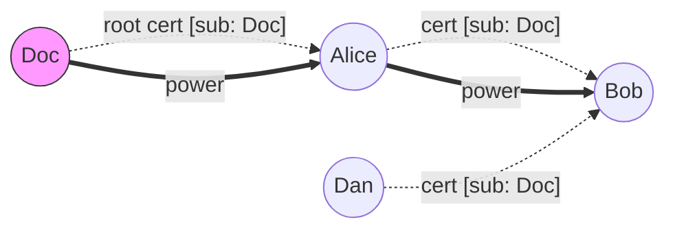
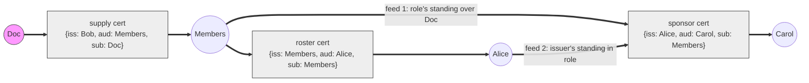
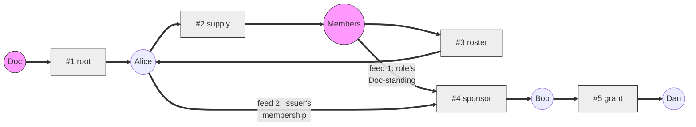

# Keyline Evaluation: Notes for Implementers

> [!NOTE]
> For implementers of a Keyline evaluator. This document explains _how evaluation works and why it is shaped the way it is_: why it cannot be a single SQL query, where the hard part lives, and which intuitions are traps. It is a companion to the normative design documents, not a replacement for them.

## Sources

| Artifact                                   | Path                                        |
|--------------------------------------------|---------------------------------------------|
| Model (normative)                          | `README.md`                                 |
| Crate spec, evaluation program (normative) | `implementation.md`                         |
| Rejected alternatives                      | `alternatives.md`                           |
| Edge cases / field eliminations            | `edge-cases.md`                             |
| Patterns (roles, pinning, rotation)        | `patterns.md`                               |
| Crate                                      | `../../keyline/`                            |
| Reference implementation                   | `../../keyline/src/memory.rs`               |
| Conformance scenarios and laws             | `../../keyline/src/test_utils/conformance/` |

Where this document and `implementation.md` disagree, `implementation.md` wins. The SQL below is illustrative; the in-repository evaluator is `MemoryKeyline`.

## Summary

Keyline is a state-based CRDT: a flat set of signed delegations and revocations over Ed25519 keys, where authority is _derived_ (similar to SDSI) by evaluating the set. Evaluation is equivalent to stratified Datalog with a single negation boundary:

1. _Positive pass_ — compute who has standing, ignoring all revocations.
2. _Coverage_ — from that, compute per-certificate forbidden nodes (`covered`).
3. _Replay_ — recompute standing, filtering routes through the coverage relation.

The pipeline (steps 1 → 2 → 3) is expressible in SQL as chained CTEs, and the negation is a legal anti-join. The hard part is _inside_ steps 1 and 3: deriving standing is a _non-linear_ fixpoint (each derivation step consumes _two_ recursively derived facts), which exceeds `WITH RECURSIVE` in SQLite/PostgreSQL (both allow exactly one reference to the in-progress relation). Consequence: _one ordinary SQL statement per fixpoint round, plus a driver loop ("repeat until no new rows")_. The loop is the only non-declarative ingredient in the entire design.

Equivalently: the design is RT₀/SDSI chain discovery (P-complete, pushdown reachability) while SQL's recursive fragment is linear Datalog (⊆ NL). No rewrite closes that gap; you buy the fixpoint procedurally.

## 1. The Two-Layer Graph Model

The single most important framing: _there are two overlaid graphs, and only one of them is stored._

| Layer           | Contents                                                                  | Status                                                                           |
|-----------------|---------------------------------------------------------------------------|----------------------------------------------------------------------------------|
| Message graph   | Certificates: who signed what to whom (`iss → aud`, labeled `sub`, `can`) | _Given._ Append-only, unconditional — any key can sign anything about anything   |
| Authority graph | Who actually holds authority over what                                    | _Derived._ Recomputed from the message graph at every evaluation; stored nowhere |



Dashed = message layer (three signed certs). Thick = authority graph (what the evaluator derives). The asymmetry: Dan's certificate is well-signed and sits in the set forever, but no power edge materializes over it, because no power ever reached Dan. It is _inert_ — not invalid, not an error.

This is the ocap/Granovetter picture with the enforcement point moved. In a live ocap system, "connectivity begets connectivity" is enforced at _send time_ by unforgeability: you cannot introduce what you do not hold. Keyline has no runtime and no clock — anyone can sign any bytes — so the same invariant is enforced at _evaluation time_ instead: the evaluator re-derives, from the message graph alone, which introductions actually conducted authority. The fixpoint at the heart of evaluation is nothing but a batch reconstruction of the invariant an ocap network maintains incrementally.

Everything the design calls _late binding_, _healing_, _implicit death_, and _resurrection_ is an authority-graph phenomenon over an immutable message layer:

- A cert issued before its issuer had standing conducts the moment standing arrives (a new power path reaches its issuer). Same bytes, same hash.
- Cutting a load-bearing cert makes downstream power edges vanish on the next evaluation — no certificate changed, only the authority graph.
- Re-adding a booted key re-materializes every authority-graph edge its old certs supported ("zombies," see the §8 ledger for the design-vs-evaluation zombie distinction, and §7 for their cost implications).

## 2. The Authority Graph is an AND/OR Graph

The authority graph is not a plain graph: it alternates between two node kinds with different combination semantics. Principals are _OR-nodes_; certificates are _AND-nodes_.

| Element | Role | Semantics |
|---------|------|-----------|
| Principal (circle) | OR | Standing arrives via _any_ incident delivering cert. Effective level = `max` over arrivals — this is redundant routes / widest-path |
| Certificate (box) | AND | Conducts only when _all_ prerequisite feeds are live. Output clamped to `min` of inputs and its own `can` — this is attenuation |



The AND-ness is where all the difficulty lives. A certificate whose `sub` is the evaluated subject itself has one feed (its issuer's standing) — those chains are paths. A certificate whose `sub` is a _role_ has _two feeds of different kinds_:

1. the role's standing over the evaluated subject (`R(subject, role)`), and
2. the issuer's standing within the role (`R(role, issuer)`).

Both feeds are outputs of the same recursion. Proofs are therefore trees, not paths, and every claim in this document about complexity, SQL, and loops is downstream of this one structural fact.

The three semantic operations of the design map exactly onto the notation:

- `max` over routes → fan-in at OR-nodes (circles)
- `min` along a route → clamping at AND-nodes (boxes)
- the fixpoint → "extend the authority graph outward from the subject until stable"

Useful corollaries of the AND/OR view:

- _Dead certs are visible at a glance:_ a box with a solid (message) edge but no incoming authority-graph feed is inert. Ungrounded islands (a role nobody ever supplied) render as authority-graph fragments that never reach any subject.
- _Griefing is a min-cut question on this graph:_ a grantee survives iff some AND/OR derivation avoids every cut node; redundant routes defend only when jurisdictionally disjoint (distinct OR-branches through distinct roles).
- _Cycles resolve to dead:_ the authority graph is the _least_ fixpoint. A clique of certs vouching for each other with no path to a subject derives nothing. (Assume-dead-on-revisit; the greatest fixpoint would make ungrounded cycles self-certifying — a one-line bug with a security consequence.)

### Worked Sketch: Five Certificates (and a Cycle)

A minimal set exercising every mechanism. One subject (Doc), one role (Members), and a sponsorship into the role:

| # | Certificate                                | Kind                                      |
|---|--------------------------------------------|-------------------------------------------|
| 1 | `{iss: Doc, aud: Alice, sub: Doc}`         | root (subject self-grounds)               |
| 2 | `{iss: Alice, aud: Members, sub: Doc}`     | supply (role receives Doc-standing)       |
| 3 | `{iss: Members, aud: Alice, sub: Members}` | roster (role self-grounds its membership) |
| 4 | `{iss: Alice, aud: Bob, sub: Members}`     | sponsorship — the role-rule AND-node      |
| 5 | `{iss: Bob, aud: Dan, sub: Doc}`           | direct grant riding derived standing      |



Fixpoint rounds (semi-naive; every fact lands at its derivation depth):

| Round | New facts                            | Via                                                      |
|-------|--------------------------------------|----------------------------------------------------------|
| 0     | `R(Doc, Doc)`, `R(Members, Members)` | subjects                                                 |
| 1     | `R(Doc, Alice)`, `R(Members, Alice)` | #1; #3                                                   |
| 2     | `R(Doc, Members)`, `R(Members, Bob)` | #2; #4 (roster side only)                                |
| 3     | `R(Doc, Bob)`                        | #4 (both feeds: `R(Doc, Members)` ∧ `R(Members, Alice)`) |
| 4     | `R(Doc, Dan)`                        | #5                                                       |
| 5     | — (stable)                           |                                                          |

Lessons packed into five certs:

- _One cert, two flavors._ #4 delivers `R(Members, Bob)` (round 2, roster feed alone suffices when the evaluated subject _is_ the role) and `R(Doc, Bob)` (round 3, both feeds required). Membership conveys the role's entire present and future portfolio: supply the role with a second subject later and Bob inherits it with no new certificate — `sub` is a scope, not an endpoint.
- _The cycle is benign._ #2 and #3 form `Alice → Members → Alice`. The role route back into Alice grounds through Alice's own root standing, so it is min-clamped to what she already had: cycles amplify nothing; only subjects ground. (Least fixpoint; assume-dead-on-revisit.)
- _False redundancy._ Alice has OR fan-in (direct root + around the role), but the role route transits her own root cert — cut #1 and every fact from round 1 downward dies. Redundant routes defend only when jurisdictionally disjoint; a loop through your own standing is maximally non-disjoint. Real redundancy here requires an _independent_ supply into Members from a second Doc-standing holder.
- _Variant:_ change #5 to `sub: Members` and Dan joins the role instead: two feeds, lands round 3, inherits future role acquisitions. The choice between "grant a thing" and "grant membership" is one field.

Extend with two revocations (assigning levels `#1/#3 Admin, #2/#4 Edit, #5 Read`) and the full pipeline becomes exercisable:

| Revocation                               | Tier                                                   | Effect                                                                                                      |
|------------------------------------------|--------------------------------------------------------|-------------------------------------------------------------------------------------------------------------|
| `rA = {iss: Bob, revoke: #2}`            | third party, `admin_reach(Bob) = {Bob}`                | inert: #2's routes are `{Doc, Alice}`; valid, admissible, zero effect                                       |
| `rB = {iss: Alice, revoke: #5}`          | deep cut, `admin_reach(Alice) = {Alice, Doc, Members}` | #5 dead (its every route transits the reach); #4 and Bob untouched — scoped, no cascade                     |
| variant `rB′ = {iss: Alice, revoke: #4}` | party (issuer) → total                                 | #4 conducts nowhere; #5 — covered by _nothing_ — dies implicitly (failure to re-derive). Cascade ≠ coverage |

Two semantic findings this example surfaces:

- _The subject can be inside an admin reach._ `#1` is a live-key `{sub: Doc, can: Admin}` cert, so `Doc ∈ admin_reach(Alice)` — and since every derivation grounds at the subject, Alice can cover _any_ cert in this graph, including #1 itself: ownership-equivalent kill power. Whether a document's root edge is deniable is not a rule; it is decided by whether any surviving key holds Admin over the subject, which the ceremony chooses by the level of the root edge ([patterns, Rooting Level](patterns.md#rooting-level)). Same rules, different certificate set, opposite outcome.
- _Reach is composed._ `admin_reach(K) = {K} ∪ {n : R⁺(n, K) = Admin}` — a row lookup over the positive pass, so Admin standing inherited through a role counts. The stricter alternative (only Admin whose final hop is a `sub: n` certificate) was considered and rejected; see [alternatives, Direct (last-hop) admin reach](alternatives.md#direct-last-hop-admin-reach).

## 3. The Datalog Formulation

Facts derived per evaluation, over `R(s, n, ℓ)` = "node `n` holds effective level `ℓ` over subject `s`":

```prolog
% grounding: every node stands at Admin over itself; root edges (iss = sub) are
% then ordinary instances of the rule below
R(S, S, Admin) :- node(S).

% the role rule — TWO recursive premises (non-linear)
R(S, Aud, min(L1, L2, Can)) :-
    edge(Iss, Aud, Role, Can),
    R(S, Role, L1),        % feed 1: role has standing over S
    R(Role, Iss, L2).      % feed 2: issuer has standing in role
```

The full pipeline, stratified:

```text
Stratum 1 (positive pass):  R⁺ = lfp(rules above), ignoring all revocations
Stratum 1b (coverage relation):       admin_reach(K) = {n : R⁺ ⊢ K ever held Admin over n} ∪ {K}
                            covered(c, n)  = for each revocation r naming c:
                                               party-signed (iss/aud of c) → all n (total)
                                               otherwise → n ∈ admin_reach(iss(r))
Stratum 2 (replay):         live = lfp(rules above), where routes justifying
                            cert c avoid every n with covered(c, n), and hops
                            must themselves be live
```

Negation appears exactly once — stratum 2 consults `covered`, which is fully computed before stratum 2 begins. Unique least model; stratified Datalog in the Binder/SecPAL tradition (the spec cites both).

Properties that make this work (from the spec, evaluation-side view):

- _Coverage is monotone-stable._ Stratum 1 consults only delegations; the positive graph only grows; coverage can expand but never retract.
- _Denials are mutually invisible._ Revocations name delegations only (`revoke: Hash<Delegation>` — a revocation of a revocation is unwritable), so no revocation's effect depends on another's. This is what makes the coverage relation computable in one stroke, order-independently.
- _`covered` is a relation, not a set._ `(cert, node)` pairs: node N may be forbidden for cert c and fine for cert c′. There is no single "graph-minus-holes"; each covered cert has its own mask.

## 4. Complexity: Why This Is Hard, and for Whom

| Fragment                | Proof shape     | Complexity | SQL analogue                             |
|-------------------------|-----------------|------------|------------------------------------------|
| Linear Datalog          | paths ("paths") | ⊆ NL       | `WITH RECURSIVE` (single self-reference) |
| Full/non-linear Datalog | trees           | P-complete | — none —                                 |

- The role rule is non-linear (two recursive premises). This is RT₀/SDSI credential chain discovery, which Jha & Reps showed equivalent to pushdown system reachability — P-complete. The hardness predates Keyline by decades and is the price of role indirection itself, in any evaluator.
- SQLite and PostgreSQL restrict recursive CTEs to _linear_ recursion: the recursive self-reference may appear exactly once, not inside a subquery, aggregate, or the nullable side of an outer join. Their evaluation model (working-table iteration) joins in-progress rows against base tables only.
- A general rewrite of the role rule into linear form would place a P-complete problem in NL, i.e., prove NL = P. Some non-linear programs are linearizable (same-generation, famously); pushdown-hard ones are believed not to be.
- Logic-side restatement: NL = FO + transitive closure; P = FO + least fixed point. Recursive CTEs bolt transitive closure onto SQL; Keyline's semantics need the least-fixed-point operator. The gap between the design and a single query is exactly the gap between those two logics.

> [!IMPORTANT]
> The hardness lives entirely in the _positive pass_ (delegation semantics, `sub`-as-scope). It exists in a Keyline with zero revocations. No redesign of revocations — e.g. the rejected `sub`-on-`Revocation` field (alternatives.md, "A `sub` (jurisdiction) field on `Revocation`") — touches it. Conversely, deleting `sub`-as-scope from delegations would linearize everything and gut the design (no roles, no late-bound membership).

## 5. SQL Expressibility, Precisely

| Piece                                     | One SQL statement?                                                                                                                              |
|-------------------------------------------|-------------------------------------------------------------------------------------------------------------------------------------------------|
| Stratum chaining (S1 → S1b → S2)          | Yes — chained CTEs (`WITH a AS (...), b AS (...)`); chaining _is_ the stratification, written out                                               |
| `covered` = revocations × admin reach     | Yes — plain joins over S1 output                                                                                                                |
| Party-signed (total) revocation tier      | Yes — anti-join or `EXCEPT`                                                                                                                     |
| Per-cert exclusions inside recursion      | Yes — `NOT EXISTS` against a _prior, completed_ CTE is legal even in a recursive term (the restriction binds only the recursive self-reference) |
| The route-search fixpoint itself (S1, S2) | _No_ — non-linear recursion                                                                                                                     |

So the shape of a correct SQL evaluator is:

```text
one SQL statement  =  one fixpoint round
   ("insert every fact whose premises are already present")
driver loop        =  repeat until a round inserts nothing
   (PL/pgSQL, application code, SQLite driver — anything with "until")
```

A plain query over a results table may join two derived facts freely; the one-reference rule binds only _inside_ `WITH RECURSIVE`. What SQL lacks is not sequencing (chaining handles any _fixed_ number of steps) but a _data-dependent repetition count_ — the word "until." `WITH RECURSIVE` is SQL's only built-in "until," and it walks paths.

Options, from most to least appropriate:

1. _Packaging (recommended)._ PostgreSQL: a set-returning function (`RETURNS TABLE`, loop inside PL/pgSQL). SQLite: a virtual-table module whose `xFilter` runs the fixpoint. Callers see one query; the loop still exists, hidden. Semantically apt: evaluation is a pure function of the cert set, so a memoized table function keyed on the set digest matches the spec's own caching story ("the set digest is a perfect cache key").
2. _Bounded unrolling._ If role-nesting depth is capped at k (a policy decision — the semantics promise unbounded depth), unroll into k chained linear CTEs and the whole evaluation is one statement.
3. _State-blob trick._ Linear recursion where each row carries the _entire fact set_ as an array/jsonb value; the two premises come from `unnest` of a column value, not a second CTE reference, so the grammar is satisfied. Works (this is the folklore that makes recursive CTEs Turing-complete); costs O(rounds × facts) copying, defeats indexes and semi-naive deltas, and is unreadable. Acceptable as a differential test oracle, wrong as an evaluator.
4. _A different engine._ Soufflé / differential dataflow / Materialize express the non-linear fixpoint natively (and incrementally, which stratum 1 wants). DuckDB's `USING KEY` recursion is closer but still not general non-linear recursion.

### Plain vs. Self-Switching Reachability

A distinction that dissolves most confusion about "SQL can't do this":

| Question                                                                                                           | Complexity              | SQL                                      |
|--------------------------------------------------------------------------------------------------------------------|-------------------------|------------------------------------------|
| "Is Bob reachable from Doc over _given_ edges?"                                                                    | NL — transitive closure | one `WITH RECURSIVE`; SQL's home turf    |
| "Is Bob reachable from Doc, where each edge only _counts_ if two other reachability facts already hold?" (Keyline) | P-complete              | exceeds `WITH RECURSIVE`; needs the loop |

Reachability is not the problem; _this_ reachability is. The edge set is an output of the search (a cert conducts only once both its feeds are derived), so the graph and the search over it are one entangled fixpoint. Delete feed 2 — or make it a base-table lookup — and the whole pipeline drops back into NL and single-statement SQL. The two-feed rule _is_ the role system.

### An SQL Sketch

An SQLite implementation of this pipeline reproduces the worked sketch: S1 converges in 5 rounds with the hand-derived facts, `admin_reach(Alice) = {Alice, Doc, Members}`, the inert revocation does nothing, the deep cuts kill only their targets, the retraction variant cascades implicitly, and exclusion contexts dedup (two cuts by one revoker share a single context — see §7).

Schema (levels as integer ranks `0 Relay … 3 Admin`; a backend translates the wire tag to a rank at ingest, since the tags are not ordered):

```sql
CREATE TABLE delegation (hash TEXT PRIMARY KEY,
                         iss TEXT, aud TEXT, sub TEXT, can INT);
CREATE TABLE revocation (hash TEXT PRIMARY KEY,
                         iss TEXT, target TEXT REFERENCES delegation(hash));
-- derived: principal (all ids), level (0..3)
```

Stratum 1 — seed subjects once, then one statement per round (the threshold encoding: a `(lvl, s, n)` fact means "standing ≥ lvl"; no aggregates needed):

```sql
-- seed every subject at Admin over itself, once:
INSERT OR IGNORE INTO reach_pos (lvl, s, n)
SELECT level.lvl, p.id, p.id FROM level, principal p;

-- conduct: repeated until it inserts nothing (the loop):
INSERT OR IGNORE INTO reach_pos (lvl, s, n)
SELECT f1.lvl, f1.s, d.aud
FROM delegation d
JOIN reach_pos f1 ON f1.n = d.sub AND f1.lvl <= d.can   -- feed 1: R(s, sub)
JOIN reach_pos f2 ON f2.lvl = f1.lvl                    -- feed 2: R(sub, iss)
                 AND f2.s = d.sub AND f2.n = d.iss;
```

The two `JOIN reach_pos` clauses are the non-linearity: as a plain statement over a real table, perfectly legal; inside `WITH RECURSIVE`, a parse error. That single contrast is the entire SQL story.

Stratum 1b — no recursion, just views:

```sql
CREATE VIEW admin_reach AS      -- {K} itself arrives free via subject facts
  SELECT n AS k, s AS node FROM reach_pos WHERE lvl = 3;

CREATE VIEW covered AS
  SELECT r.target AS cert, ar.node, 0 AS total       -- third party: reach
  FROM revocation r
  JOIN delegation d ON d.hash = r.target
  JOIN admin_reach ar ON ar.k = r.iss
  WHERE r.iss NOT IN (d.iss, d.aud)
  UNION
  SELECT r.target, NULL, 1                           -- party: total
  FROM revocation r JOIN delegation d ON d.hash = r.target
  WHERE r.iss IN (d.iss, d.aud);
```

Stratum 2 — same fixpoint over `live(ctx, lvl, s, n)`, where `ctx` is an exclusion context: `''` (unconstrained) plus _one per distinct exclusion set_ — contexts are keyed by a canonical signature of the excluded-node set (`GROUP_CONCAT(node ORDER BY node)` per covered cert, deduped), _not_ per covered cert. Certs covered by the same revoker(s) share a context; this is the k³ → k² collapse of §7 and is mandatory, not an optimization nicety. The encoding enforces node avoidance without materializing paths: a derivation in context X never transits an excluded node because the subject seed and every conduct step are filtered by `excl(X, ·)`; and every hop must additionally be justifiable in its _own_ context (its own exclusion-set signature), _rooted at the hop's own subject_ — `live(own, lvl, d.sub, d.iss)`, not `live(own, lvl, s, …)`. A hop about `Members` is judged inside `Members`' graph regardless of which subject is being queried; how `s` reaches `Members` is irrelevant to whether the hop conducts (the daisy-chain rule in [implementation, Evaluation](implementation.md#evaluation)). The shape is the S1 round plus three anti-joins (`NOT EXISTS` against `covered`/`excl`), which are legal everywhere, plus one feed-join for the hop's own-context check. Fact blowup is |contexts| = 1 + |distinct revoker-sets among covered certs| — tighter than the spec's per-dispute cost model. Final answer: `SELECT s, n, MAX(lvl) FROM live WHERE ctx = '' GROUP BY s, n`.

The fixpoint loop is the one non-SQL ingredient, and where it can live is an engine property:

| Host                 | Where the "until" lives                          | Caller sees one query?                   |
|----------------------|--------------------------------------------------|------------------------------------------|
| SQLite + application | app-side loop                                    | no                                       |
| SQLite + extension   | virtual-table `xFilter` (C/Rust, in-process)     | yes                                      |
| SQLite, pure SQL     | state-blob recursive CTE (facts as JSON per row) | yes — stunt tier, see §5 escape hatch 3  |
| PostgreSQL           | PL/pgSQL function body — fully in-database       | yes: `SELECT * FROM keyline_effective()` |

In PostgreSQL the entire pipeline is one PL/pgSQL function (temp tables per stratum, `LOOP ... GET DIAGNOSTICS ... EXIT WHEN 0` around each round statement). No external driver of any kind — callers just write:

```sql
SELECT * FROM keyline_effective();
```

One precision to keep: "fully in-database" is not "fully declarative." PL/pgSQL is procedural code that happens to be stored server-side; the loop never disappears, it just gets a respectable home. Memoize the function on the certificate-set digest (evaluation is a pure function of the set), and mark it `STABLE` so the planner can reuse results within a statement.

### The Same Program in Datalog¬

For contrast — the entire pipeline as one stratified-Datalog program, because non-linear rules and stratified negation are both native there. This is why the spec's lineage (Binder, SecPAL) chose the language: it is the minimal logic in which Keyline is a closed-form program rather than a program plus a driver.

```prolog
% stratum 1 — positive pass; two IDB atoms = the role rule, no ceremony
reach_pos(L, S, S)   :- principal(S), level(L).
reach_pos(L, S, Aud) :- delegation(C, Iss, Aud, Sub, Can), le(L, Can),
                        reach_pos(L, S, Sub), reach_pos(L, Sub, Iss).

% stratum 1b — no recursion
admin_reach(K, N) :- reach_pos(3, N, K).
covered_total(C) :- revocation(_, I, C), delegation(C, I, _, _, _).
covered_total(C) :- revocation(_, I, C), delegation(C, _, I, _, _).
covered(C, N)    :- revocation(_, I, C), delegation(C, Di, Da, _, _),
                    I != Di, I != Da, admin_reach(I, N).

% stratum 2 — negation only over completed lower strata
live(X, L, S, S)   :- ctx(X), principal(S), level(L), not excl(X, S).
live(X, L, S, Aud) :- delegation(C, Iss, Aud, Sub, Can), le(L, Can), ctx(X),
                      live(X, L, S, Sub), live(X, L, Sub, Iss),
                      own_ctx(C, O), live(O, L, Sub, Iss),     % the hop in its own context, rooted at its own subject
                      not covered_total(C), not excl(X, Iss), not excl(O, Iss).

% stratum 3 — effective level: max via negation, no aggregates needed
effective(S, N, L) :- live(empty, L, S, N), not shadowed(S, N, L).
shadowed(S, N, L)  :- live(empty, L2, S, N), lt(L, L2).
```

Datalog does not buy less work: evaluation is still P-complete — the engine's semi-naive evaluator contains exactly the "until stable" loop the SQL driver hand-writes. The lfp is a language primitive instead of an external driver; the rounds and deltas are identical. Datalog moves the loop, it does not delete it.

### Incremental Evaluation: DBSP

DBSP (the Z-set/stream-circuit theory under Feldera; Budiu, McSherry et al.) is the natural engine for this workload. Z-sets are multisets with signed multiplicities — _retractions are first-class_ — and any query circuit, including recursive fixpoints and stratified negation, can be mechanically differentiated into an incremental circuit that processes input deltas in time proportional to change size. Its distinctive construction is nested time: fixpoint iteration (inner clock) and input evolution (outer clock) as two stream dimensions, incrementalized independently. Semi-naive evaluation falls out as the derivative of naive evaluation — `MemoryKeyline`'s hand-written loops are the inner-clock derivative circuit, derived by hand.

What the outer clock buys, against a bottom-up evaluator such as `MemoryKeyline`:

| Operation              | Evaluators here                    | DBSP                                   |
|------------------------|------------------------------------|----------------------------------------|
| Add delegation         | S1 delta (if cached), S2 recompute | O(\|new facts\|)                       |
| Add revocation         | full S2 recompute                  | retraction delta — O(\|facts killed\|) |
| Heal (`seen` re-issue) | full S2 recompute                  | revival delta — O(\|facts revived\|)   |
| Query                  | read materialized                  | read materialized                      |

The revocation row is the important one: Keyline's cert set is add-only, but the derived authority graph _flickers_ — new coverage retracts live facts, cascade is facts losing support. Retraction through a recursive fixpoint is the classically miserable part of incremental view maintenance, and it is exactly what Z-set circuits handle natively. Cascade costs what it kills; healing costs what it revives; both are one mechanism run with opposite signs — a literal implementation of the spec's "death and resurrection are one late-binding rule viewed from two directions."

What DBSP does _not_ fix:

- _The semantic floor._ The k² role-ladder facts still get derived — once, incrementally, but all of them (§7).
- _Encoding choices._ DBSP happily incrementalizes a wasteful program; the context-dedup-by-exclusion-set choice must still be made at the program level.
- _State size — it gets worse._ Incremental engines trade CPU for resident memory: arrangements (indexes) of every intermediate relation stay materialized. An attacker who cannot burn CPU inflates RSS instead; eviction brings back recompute. The tradeoff relocates, it does not dissolve.

`keyline` is `no_std` and targets Wasm; the `dbsp` crate is a std, multithreaded runtime. Two tiers follow: embedded replicas (apps, Wasm) run a `memory.rs`-style evaluator with digest memoization and an S1 frontier cache; heavy replicas (relays, sync servers, org indexers) run a DBSP/Feldera circuit. That places the strongest DoS defense exactly where update volume and exposure concentrate. Differential-dataflow/Materialize occupy the same niche; DBSP's edge here is the cleaner theory, a Rust library, and Feldera's SQL frontend with first-class recursive views.

## 6. Evaluator Implementation Notes

- _Semi-naive iteration._ Each round joins only the previous round's delta against the accumulated facts. Total work is O(|derivable facts| × join fanout) regardless of round count.
- _Round count is derivation depth, not fact count._ All facts whose premises are present derive in the same round (breadth-first over the derivation DAG). Real graphs are wide and shallow (roles, pinning, constitutional flatness push that way): expect single-digit rounds. The theoretical bound (|facts| rounds, one new fact each) requires an adversarial pencil-shaped graph.
- _Threshold decomposition (recommended for the (max, min) semiring)._ Do not carry levels as data. For each ℓ ∈ {Relay, Read, Edit, Admin}, run a boolean reachability pass using only certs with `can ≥ ℓ`; effective level = max ℓ that holds. Four independent monotone passes; no aggregates inside recursion, no dominated-fact churn, and per-node convergence at the shortest route achieving the best level. This is the spec's "four levels ⇒ bucketed BFS" observation, made executable. The finite _total order_ of `Can` is load-bearing here: a partial order or real-valued lattice would break the decomposition.
- _Least fixpoint, always._ Start from root edges, derive outward. Never seed optimistically: assume-dead-on-revisit is what keeps ungrounded cycles dead.
- _Cache stratum 1 aggressively._ It consults only delegations, which are append-only; admin reach and coverage grow monotonically and never retract. Merges evaluate deltas from the cached frontier. Stratum 2 is the disputed-certificate tax: uncovered certs share one pass; each distinct exclusion set pays a route search (§7, obligation 1). A jurisdiction accumulating cuts is one under dispute; rotation moots the cuts and restores the fast path.
- _Witness hints are pure optimization._ A peer may attach the claimed route; verifying a hint costs its length; a wrong hint falls back to search. Soundness never depends on hints.
- _Partial visibility:_ provisionally honor unconfirmed revocations (over-applying a denial fails closed; fuller sync confirms or retires it).

## 7. Threat Model: Evaluation Cost as a DoS Surface

Evaluation is superlinear (quadratic fact space; more under dispute), which raises the question: can an adversary weaponize the evaluator? Answer: yes, but only from _inside_ the authorization graph — and the boundary between tiers is sharp. The model document's griefing analysis prices authority-denial; this section prices compute-denial.

### Tier 0 — Outsiders: storage spam only

Anyone can sign anything, but evaluation forward-chains from subjects: a cert whose issuer never receives standing produces _zero rule instantiations_ ("junk never enters the fixpoint" is a DoS defense). Free defenses:

- Content addressing dedups replays: deterministic Ed25519 + same payload = same hash; set union is idempotent. No amplification by repetition.
- Ungrounded certs cannot be rejected (late binding requires storing them — they may ground later), but they need no quarantine either: "store, don't evaluate" is automatic, not policy. Cost: storage plus an index probe per matching delta row (feed-1 hit, feed-2 miss).

Residual outsider surface = transport flooding, owned by the sync layer (quotas), not the evaluator.

### Tier 1 — Any member: quadratic inflation, attributable

Anyone with standing can delegate. The amplifying shape is a _club ladder_:

```text
role₁ over Doc, role₂ member of role₁, …, roleₖ member of roleₖ₋₁
  → 2k certificates → R(s_j, node_i) for all j < i ≈ k²/2 facts
```

Linear input, quadratic fact space. Aggravator: the `seen` field accepts arbitrary bytes, so one authority can mint unboundedly many distinct, grounded certificates without generating fresh audience keys (not a new capability — fresh `aud` keys do the same — but one field cheaper).

Bounds: every cert is signed (a spree is a self-incriminating audit trail); scope is limited to documents the attacker is a member of; removal + rotation ends growth; stratum 1's append-only monotonicity means honest replicas pay the delta once, not per query.

### Tier 2 — Ever-admins: the cubic version, non-expiring

Disputes multiply. Each third-party deep cut against an otherwise-live cert mints an exclusion context = one route search over the fact space. An _ex_-admin (frozen reach; permanence means their revocations validate forever) covering each of the k ladder certs, under a naive per-cert context encoding:

```text
k revocations × O(k²) facts per context ≈ O(k³) work
from O(k) adversarial input, signed by one booted key
```

_The k³ is an encoding artifact, not a semantic cost._ `covered(c)` depends only on _who revoked c_, and one ex-admin's frozen reach is one set: a k-cut spree by one key produces k _identical_ exclusion sets. Dedup contexts by exclusion-set signature and the spree costs _one_ context — O(k²) shared work plus k cheap per-cert checks. To multiply contexts the adversary needs multiple _distinct booted admin keys_ (each legitimately granted Admin at some point, each with a different frozen reach) — a high bar with a built-in audit trail. `MemoryKeyline::contexts` implements the deduped encoding.

This is the compute-denial twin of the spec's griefing analysis. Rotation is the cure for both — but for compute the evaluator carries two obligations:

> [!IMPORTANT]
> 1. Contexts MUST be keyed by exclusion-set signature, not by covered cert — otherwise a one-key revocation spree costs O(k³) instead of O(k²).
> 2. The evaluator MUST early-exit exclusion contexts whose target certs are already underivable in the shared pass. Post-rotation, cuts pinned to dead jurisdictions then cost a lookup instead of a search. Without this, inert revocations keep their price forever — permanence guarantees nobody can ever semantically garbage-collect them.
> 3. Top-down/demand-driven evaluators MUST demand the subject-side feed first and short-circuit on its failure, and SHOULD memoize failed demands per set-state. Role internals (self-grounded rosters, which an attacker shapes to be expensive) must never be explored until the role's standing over the query's subject is established. Bottom-up evaluators such as `MemoryKeyline` are immune by construction: dead facts are never derived, so a dead ladder is never walked.

### Which n²? A disambiguation

"Quadratic" is doing several jobs in this analysis, and they are routinely conflated with each other and with unrelated n²'s from graph algorithms:

| # | The n² | Nature |
|---|--------|--------|
| 1 | Single-source reachability | _Not quadratic._ O(V + E), BFS/DFS — one of the cheapest graph problems |
| 2 | Array-based Dijkstra / A* | O(V²) implementation artifact, fixed by a heap. (A* is a red herring here anyway: heuristic-guided _optimal pathfinding_ on weighted graphs; Keyline needs existence, has no weights, and no goal to aim a heuristic at) |
| 3 | All-pairs / transitive closure | Ω(V²) because the _output_ is that big — information-theoretic |
| 4 | A* on implicit search spaces | Exponential; different beast entirely |

Keyline's k² is #3: because roles are themselves subjects, the fact space is `(subject × node)` — materializing all standing is inherently closure-shaped, and the role ladder makes the closure contain Θ(k²) true facts. No evaluator avoids Ω(output).

### Single queries and the gift-cert attack

For a single existence query ("does Dan have Read over Doc?") the output is one bit, so bound #3 vanishes — and the honest/adversarial split opens up:

| | Honest graphs | Adversarial graphs |
|---|---|---|
| Materialize all standing | ~linear-ish | Θ(k²) — it _is_ the answer |
| Single existence query, demand-driven | ~O(depth × nesting) | Ω(k²) forcible (below); paid once (memoized); requires standing + a signed link to the victim |
| Verify a supplied witness | O(witness) | O(witness) + coverage checks (denials cannot be witness-carried by an adversarially-interested claimant) |

The forcing construction — the _gift-cert attack_ — is why demand-driven evaluation does not lower the worst case. Certificates are issuer-signed only; recipients never consent. So relevance is attacker-writable:

```text
1. Attacker (Tier 1 member) builds a k-role ladder with adversarially
   nested rosters — self-grounded, expensive to walk, relevant to no one:
   costs nothing while unaimed.
2. Attacker signs ONE cert: {iss: attacker, aud: victim, sub: ladder_top}
   — the "gift." No acceptance step exists; it is in the set after sync.
3. The victim's own access check now has the ladder as a candidate route.
   An existence search must explore candidates — it might be the valid
   path — so one boolean query demands the Ω(k²) closure.
```

Fine-grained complexity agrees this is not an evaluator deficiency: the problem family (RT₀ chain discovery / pushdown reachability) carries conditional lower bounds that apply to _single-pair_ queries, unlike plain reachability where single-source really is linear.

### Why the gift-cert attack is survivable: cost follows liveness

The certificates are permanent; the _cost_ is late-bound. The quadratic requires two things simultaneously, both revocable:

| Component | Permanent? | Killed by |
|---|---|---|
| Certificates (storage) | yes — add-only set | nothing (quotas bound growth) |
| Ladder's k² fixpoint cost | no — follows liveness | booting the attacker: the ladder's standing over Doc rides their membership, so it dies in the ordinary cascade; dead facts are never derived |
| Demand-path relevance | no | the victim _renouncing_ the gift — it names them as `aud`, so the party rule gives an unconditional, total revocation. Re-gifts need fresh hashes (varied `seen`; identical fields collide with the revoked hash and silently fail), are rate-bounded, individually renounceable, and each is a fresh signed artifact naming the victim |
| Dead-ladder exploration bait | no — evaluator artifact | obligation 3 above (subject-first ordering); note a booted attacker's ladder stays _internally_ self-grounded, which is exactly what obligation 3 defends against |
| Revival risk | latent | fresh-key re-add discipline — the DoS analysis independently rejustifies the spec's compromise-hygiene rule, since same-key re-add revives the ladder's cost along with everything else |

Two structural consolations. First, attribution is maximal: a signed cert from attacker naming victim, pointing into a junk ladder — a smoking gun, not merely an audit trail. Second, the cost-inflicter set collapses into the already-trusted set: to force expensive queries on a victim, the attacker must sit upstream-adjacent to the victim's demanded routes — and upstream parties already hold outright deny-power (the spec's griefing analysis). Demand-driven evaluation aligns "who can burn your CPU" with "who could already cut you off," adding little marginal power.

### Non-issues

| Worry | Why it is not one |
|-------|-------------------|
| "P-complete = expensive" | It means inherently sequential-ish; cost is polynomial with small constants |
| Deep chains → many rounds | Serializes latency, not work: semi-naive total work is bounded by fact count |
| Unrelated documents' graphs | Queries root at one subject; you pay only for graphs you replicate |

### Mitigation checklist for implementations

1. Context dedup by exclusion-set signature (implemented in both evaluators here) — collapses one-key revocation sprees from O(k³) to O(k²)
2. Early-exit inert disputes (shared pass first; context search only for certs otherwise-live) — upgrades rotation from authority-hygiene to compute-hygiene
3. Incremental strata: S1 delta-evaluation from a cached frontier; digest-keyed memoization of full results. The maximal version of this row is an incremental engine — see "Incremental Evaluation: DBSP" in §5
4. Per-issuer quotas at sync admission — enforceable (every cert is signed) and sybil-resistant within a document (standing requires an existing member's grant). Must be asymmetric: refusing delegations fails closed, refusing revocations fails _open_, so revocations are admitted preferentially
5. Demand-driven evaluation (magic sets): evaluate only the queried subject/audience; unqueried side-branch inflation goes unpaid (worst case unchanged — the attacker can sit on the queried route)
6. Witness hints: peers attach routes; verification degrades from search to an O(route-length) check in the common case
7. Monitoring: fact count and context count per issuer are cheap anomaly signals, with a built-in audit trail to act on

Items 1–2 are evaluator obligations; 3–5 attack different terms of the cost product (amortization, rate, scope) and compose. The residual after all of them: _a member can spend their own quota to make replicas do quadratic work once, attributably_. That floor is semantic — the k² fact space is the answer to the query, not overhead — and shrinking it requires giving up design properties (depth caps: composability + consensus-criticality; witness-mandatory verification: half the UCAN trade, and denials still need verifier-side search; Admin-gated delegation: rejected in `alternatives.md`; dropping `sub`-as-scope: the role system itself).

## 8. Misconception Ledger

Plausible readings of the model that are wrong, and why.

| Misconception | Correction |
|---------------|------------|
| "S2 is a set difference: positive results minus covered" | Subtraction must happen on the _inputs_ (rule instances / route steps), not the outputs. Subtracting facts from the closure leaves _evaluation zombies_: facts whose every derivation died but which nothing names (cascade is failure-to-rederive, not removal). Correct form: anti-join inside the replay's recursion, then re-derive |
| "Evaluation zombies are the design's accepted zombies" | Different animals. Design zombies: same evaluator, _grown set_ (re-added key revives old certs) — spec-compliant, signature-gated, accepted trade. Evaluation zombies: _same set_, evaluator disagrees with spec, fail-open — a soundness bug |
| "One subtracted graph, then reachability" | `covered` is per-certificate: node N forbidden for cert c, fine for c′. No single G⁻ exists; each covered cert carries its own mask. (Also, coverage computed against an already-cut graph is the spec's explicitly rejected order-dependent shortcut — "Why the Strata Are Mandatory") |
| "The SQL problem is the negation / stratification" | Negation over a completed stratum is a legal anti-join, even inside a recursive term. Stratification = chained CTEs. Both trivial. The blocker is non-linear _positive_ recursion |
| "Redesigning revocations (e.g. `sub` field) would fix expressibility" | Coverage was always the easy part; the fixpoint over delegations is untouched. The rejected design still needs the same positive pass to validate issuer standing — it computes the identical fixpoint and uses one row of it |
| "The hard part is pathfinding (shortest/widest path)" | Path _optimization_ is easy (and mostly dissolves via threshold decomposition). The hard part is computing _which edges exist at all_ — the graph is an output of the search, not an input (edges conduct only when their issuer's derived standing exists) |
| "The planner should infer stratification" | Within one recursive definition there is no stratification to find (self-negation is unstratifiable by definition); across definitions, SQL's CTE dependency order makes strata explicit. Engines enforce monotonicity per stratum with blunt syntax rules; nothing is being 'missed' |
| "Rounds ≈ \|nodes\|² × 4 — brutal" | That is the adversarial ceiling. Rounds = derivation depth ≈ graph diameter (single digits in practice); threshold decomposition gives per-node convergence at the best path; semi-naive makes total work independent of round slicing |
| "`WITH RECURSIVE`'s restrictions are arbitrary syntax" | They are a cheap syntactic overapproximation guaranteeing monotonicity + linearity, mirroring the working-table algorithm's one-row-in-hand evaluation. Operational semantics, not pedantry. (Also operationally: the recursive reference denotes only the _previous round's delta_, not the accumulated result — and the role rule's two feeds land in different rounds, so one delta can never hold both) |
| "So reachability itself is the SQL problem" | Backwards — plain reachability over given edges is the one recursive thing SQL does natively (transitive closure, NL). The problem is reachability over a _self-switching_ graph: edge-usability is itself a derived fact. See "Plain vs. Self-Switching Reachability" |
| "Datalog with negation would have the same problem" | No — non-linear rules are ordinary Datalog, and the coverage relation needs only stratified negation. The whole pipeline is one Datalog¬ program (see §5). But Datalog moves the loop into the engine rather than deleting it: evaluation is still P-complete, same rounds, same deltas |
| "Stratum 1b is where the hardness (NL/P) lives" | 1b is the cheapest box: admin reach is a row filter over completed R⁺, COVER is one join — first-order, no recursion. All recursion lives in the two big fixpoints (S1, S2). NL is not a stage of the pipeline at all; it is the _budget_ SQL's recursive fragment brings, which the fixpoints exceed |
| "Graph reachability is inherently quadratic (Dijkstra/A* are n²)" | Single-source reachability is O(V + E) — linear; the remembered n² is the array-based Dijkstra implementation artifact. Keyline's k² is the all-pairs/output-size bound (#3 in §7's disambiguation), which applies because roles are subjects and the closure is the answer — not because reachability is expensive |
| "Each covered cert needs its own route search (hence k³ sprees)" | `covered(c)` depends only on who revoked c; one ex-admin's frozen reach is one set. Key contexts by exclusion-set signature and a one-key spree costs one context (§7, evaluator obligation 1). |

## 9. Testing an Evaluator

- `keyline/src/test_utils/conformance/{scenarios,laws}.rs` are a ready-made corpus; `memory.rs` is the reference implementation to differential-test against.
- The spec's worked example (README §Worked Example: Doc, Dan, Members, Alice, Bob, M2, Carol — boot, heal, re-grant, zombie) exercises every mechanism in eight certificates; encode it first.
- Property-based targets (bolero is already in the workspace): evaluation is a pure function of the set (permutation invariance = the CRDT property); monotonicity of stratum 1 under cert insertion; revocation coverage never retracts under merge; least-fixpoint-ness (no fact without a derivation — inject ungrounded cycles and assert they stay dead); threshold decomposition agrees with a naive (max, min) evaluator.

### Gift-cert scenario

A conformance case for demand-driven evaluators; bottom-up evaluators pass phases 1, 3 and 5 by construction:

```text
certs:
  L1..Lk : a k-role ladder, self-grounded, with nested rosters
           (adversarially deep internal membership chains)
  S      : {iss: attacker, aud: L1, sub: Doc}        — supply: grounds the
           ladder in Doc's graph (attacker must hold Doc-standing)
  G      : {iss: attacker, aud: victim, sub: Lk}     — the gift

phases and assertions:
  1. pre-gift:    victim's query "R(Doc, victim)?" must not explore the
                  ladder (unaimed junk costs ~nothing)
  2. post-gift:   query explores the ladder; assert cost is paid ONCE
                  (memoized across repeated queries on the same set)
  3. boot:        revoke the attacker's Doc-standing. Assert the query no
                  longer derives ladder facts — AND assert the evaluator
                  does not walk the ladder's still-self-grounded internals
                  (obligation 3: subject-side feed first). This is the
                  assertion a naive top-down evaluator fails.
  4. renounce:    victim revokes G (party rule, aud). Assert relevance is
                  severed even if the attacker is re-added; assert an
                  identical re-gift (same fields) collides with the revoked
                  hash and silently fails; a varied re-gift (fresh `seen`)
                  is a new hash requiring a new renunciation.
  5. resurrect:   re-add the attacker's same key (no renunciation). Assert
                  the ladder cost returns — zombie economics — and that a
                  fresh-key re-add does not revive it.
```

Bottom-up evaluators pass phases 1, 3, 5 by construction; phases 2 and 4 are meaningful for any evaluator. Encoding this in `conformance/scenarios.rs` form would also pin the spec-level claims (renunciation totality, `seen`-collision fail-closed) that the cost argument leans on.

## 10. Status

| Obligation or idea | Status |
|---|---|
| Context dedup by exclusion set (§7, obligation 1) | Implemented: `MemoryKeyline::contexts` groups covered delegations by exclusion set; one search per group per round |
| Early exit on inert disputes (§7, obligation 2) | Implemented: covered edges whose issuer is unreachable in the shared pass are never searched |
| Subject-first demand ordering (§7, obligation 3) | Not applicable to bottom-up evaluators; binding for any demand-driven one |
| Gift-cert scenario (§9) | Not in the conformance suite; phases 2 and 4 apply to bottom-up evaluators |
| Compute-denial analysis in the model document | §7 has no counterpart in `README.md`, whose griefing section prices authority-denial only |
| Depth cap as a semantic lever | Analysed and not recommended; consensus-critical if ever adopted, since every replica must agree |
| Differential testing of SQL backends | `test_utils::conformance::gen::CertSet` can drive an SQL backend against `MemoryKeyline` |

## Glossary

| Term | Meaning |
|------|---------|
| AND-node | A certificate in the authority graph: conducts iff all feeds live; output = min of feeds and own `can` |
| Admin reach | Nodes a key _ever_ held Admin over (computed on the positive pass, revocation-blind) ∪ its own node; frozen by construction |
| Role rule | The non-linear derivation step: a `sub`-scoped cert needs the role's standing over the subject AND the issuer's standing in the role |
| Covered | The per-certificate `(cert, forbidden node)` relation cut from the positive pass; applied as an anti-join during replay |
| Inert | A well-signed certificate deriving nothing (issuer never reached, or revocation whose reach touches no route). Not an error |
| Message graph | The stored certificate set; append-only; merge = set union |
| OR-node | A principal in the authority graph: standing = max over incident conducting certs |
| Authority graph | Derived standing facts (the README's term); recomputed per evaluation; stored nowhere. The _positive graph_ is the same thing computed blind to revocations (stratum 1) |
| Path vs tree | Linear vs non-linear proof shape; the boundary between `WITH RECURSIVE` and a driver loop |
| Subject | The node an evaluation is rooted at; a document or a role (root edges: `iss = sub`) |
