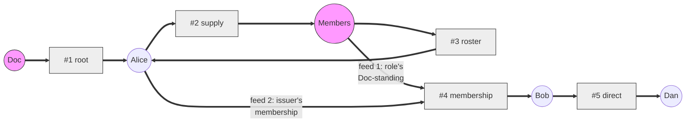

# Keyline Evaluation: Notes for Implementers

> [!NOTE]
> For implementers of a Keyline evaluator. This document explains _how evaluation works and why it is shaped the way it is_: why it cannot be a single SQL query, where the hard part lives, and which intuitions are traps. It is a companion to the model and the crate documentation, not a replacement for them.

## Sources

| Artifact                                      | Path                                        |
|-----------------------------------------------|---------------------------------------------|
| Model                                         | `README.md`                                 |
| Crate, reference program                      | `implementation.md`                         |
| Rejected alternatives                         | `alternatives.md`                           |
| Edge cases / field eliminations               | `edge-cases.md`                             |
| Patterns (roles, pinning, rotation)           | `patterns.md`                               |
| Crate                                         | `../../keyline/`                            |
| Reference implementation                      | `../../keyline_memory/`                     |
| Conformance scenarios and laws (the contract) | `../../keyline/src/test_utils/conformance/` |

Where this document and the conformance suite disagree, the suite wins. The SQL below is illustrative; the in-repository evaluator is `MemoryKeyline`.

## Summary

Keyline is a state-based CRDT: a flat set of signed delegations and revocations over Ed25519 keys, where authority is _derived_ (similar to SDSI) by evaluating the set. Evaluation is equivalent to stratified Datalog with a single negation boundary:

1. _Positive pass:_ compute who has standing, ignoring all revocations.
2. _Coverage:_ from that, compute per-certificate forbidden nodes (`covered`).
3. _Replay:_ recompute standing, filtering routes through the coverage relation.

The pipeline (steps 1 → 2 → 3) is expressible in SQL as chained CTEs, and the negation is a legal anti-join. What resists is _inside_ steps 1 and 3: deriving standing is a _non-linear_ fixpoint (a derivation step can consume _two_ recursively derived facts), which exceeds `WITH RECURSIVE` in SQLite and PostgreSQL (both allow exactly one reference to the in-progress relation). A SQL backend therefore needs one ordinary statement per fixpoint round, plus a driver loop that repeats until a round adds no rows. The loop is the only non-declarative ingredient in the design.

This is a statement about expressibility, not cost. Evaluation is polynomial with small constants. The delegation semantics are what cause it: a Keyline with no revocations at all has the same shape. See [§4](#4-why-it-is-not-one-query).

In the terms of the literature, the shape is RT₀/SDSI chain discovery, while SQL's recursive fragment is linear Datalog (⊆ NL). Whether _no_ rewrite closes that gap is inherited from the RT₀ literature rather than shown here (§4). What is certain is that the rule is not expressible verbatim, so a backend runs the fixpoint procedurally.

## 1. The Two-Layer Graph Model

Evaluation works over two graphs, and only one of them is stored. The _message graph_ is the certificate set: who signed what, to whom, about what. It only grows, and any key may sign anything about anything. The _authority graph_ is who actually holds standing over what. The evaluator derives it from the message graph at every evaluation and stores it nowhere. The model document sets this out in [Two Graphs, One Stored](README.md#two-graphs-one-stored).

For an evaluator, what matters is where the ocap invariant is enforced. In a live ocap system, "connectivity begets connectivity" is enforced at _send time_ by unforgeability: you cannot introduce what you do not hold. Keyline has no runtime and no clock, and anyone can sign any bytes, so the same invariant is enforced at _evaluation time_: the evaluator re-derives, from the message graph alone, which introductions actually conducted authority. The fixpoint at the heart of evaluation is a batch reconstruction of the invariant an ocap network maintains incrementally.

Late binding, implicit death, revival, and healing are all changes to the authority graph over a message graph that only grows:

- A delegation issued before its issuer had standing conducts the moment standing arrives. Same bytes, same hash.
- Revoking a delegation that others depend on makes downstream standing vanish on the next evaluation. No certificate changed, only the authority graph.
- Re-adding a removed key revives every authority-graph edge its old delegations supported. §8 separates this from an evaluator bug that looks similar, and §7 covers its cost.

## 2. The Authority Graph is an AND/OR Graph

Principals are _OR-nodes_: standing arrives by any certificate that conducts to them, and effective power is the `max` over arrivals. Certificates are _AND-nodes_: one conducts only when every feed into it is live, and its output is the `min` of its feeds and its own `power`. [Two Graphs, One Stored](README.md#two-graphs-one-stored) has the diagram and the general consequences: dead certificates are visible at a glance, cycles resolve to dead, and griefing is a cut.

The part that matters for evaluation is the second feed. A certificate whose `subject` is the evaluated subject has one feed (its issuer's standing), and chains of those are paths. A certificate whose `subject` is a _role_ has two feeds of different kinds:

1. the role's standing over the evaluated subject (`R(subject, role)`), and
2. the issuer's standing within the role (`R(role, issuer)`).

Both feeds are outputs of the same recursion. Derivations are therefore trees, not paths, and every claim below about complexity, SQL, and loops follows from this.

The design's three operations map onto the AND/OR graph:

- `max` over routes: fan-in at OR-nodes
- `min` along a route: clamping at AND-nodes
- the fixpoint: extending the authority graph outward from the subject until it is stable

The authority graph is the _least_ fixpoint. A clique of delegations vouching for each other with no route to a subject derives nothing. An evaluator gets this by treating a revisited node as dead. Seeding from the greatest fixpoint instead would make ungrounded cycles self-certifying ([README, Cost](README.md#cost)).

### Worked Sketch: Five Certificates (and a Cycle)

A minimal set exercising every mechanism. One subject (Doc), one role (Members), and a membership issued by a member:

| #   | Certificate                                            | Kind                                      |
|-----|--------------------------------------------------------|-------------------------------------------|
| 1   | `{issuer: Doc, audience: Alice, subject: Doc}`         | root (subject self-grounds)               |
| 2   | `{issuer: Alice, audience: Members, subject: Doc}`     | supply (role receives Doc-standing)       |
| 3   | `{issuer: Members, audience: Alice, subject: Members}` | roster (role self-grounds its membership) |
| 4   | `{issuer: Alice, audience: Bob, subject: Members}`     | membership: the role-rule AND-node        |
| 5   | `{issuer: Bob, audience: Dan, subject: Doc}`           | direct delegation riding derived standing |


```mermaid
flowchart LR
    classDef subject fill:#f9f,stroke:#333
    classDef cert fill:#eee,stroke:#333

    Doc((Doc)):::subject
    Members((Members)):::subject
    Alice((Alice))
    Bob((Bob))
    Dan((Dan))

    c1["#1 root"]:::cert
    c2["#2 supply"]:::cert
    c3["#3 roster"]:::cert
    c4["#4 membership"]:::cert
    c5["#5 direct"]:::cert

    Doc ==> c1 ==> Alice
    Alice ==> c2 ==> Members
    Members ==> c3 ==> Alice
    Members ==>|"feed 1: role's<br/>Doc-standing"| c4
    Alice ==>|"feed 2: issuer's<br/>membership"| c4
    c4 ==> Bob
    Bob ==> c5 ==> Dan
```

Fixpoint rounds (semi-naive; every fact lands at its derivation depth):

| Round | New facts                            | Via                                                      |
|-------|--------------------------------------|----------------------------------------------------------|
| 0     | `R(Doc, Doc)`, `R(Members, Members)` | subjects                                                 |
| 1     | `R(Doc, Alice)`, `R(Members, Alice)` | #1; #3                                                   |
| 2     | `R(Doc, Members)`, `R(Members, Bob)` | #2; #4 (roster side only)                                |
| 3     | `R(Doc, Bob)`                        | #4 (both feeds: `R(Doc, Members)` ∧ `R(Members, Alice)`) |
| 4     | `R(Doc, Dan)`                        | #5                                                       |
| 5     | — (stable)                           |                                                          |

What the example shows:

- _One certificate, two kinds of fact._ #4 delivers `R(Members, Bob)` (round 2: the roster feed alone suffices when the evaluated subject _is_ the role) and `R(Doc, Bob)` (round 3: both feeds required). Membership conveys everything the role reaches, now and later: supply the role with a second subject and Bob inherits it with no new certificate. `subject` is a scope, not an endpoint.
- _The cycle is benign._ #2 and #3 form `Alice → Members → Alice`. The role route back into Alice grounds through Alice's own root standing, so it is min-clamped to what she already had. Cycles amplify nothing; only subjects ground (least fixpoint, revisited nodes treated as dead).
- _False redundancy._ Alice has OR fan-in (the direct root and the route around the role), but the role route transits her own root delegation: revoke #1 and every fact about Doc from round 1 onward dies. Redundant routes defend only when they are disjoint through distinct roles, and a loop through your own standing is not disjoint at all. Real redundancy here requires an _independent_ supply into Members from a second holder of standing over Doc.
- _Variant:_ change #5 to `subject: Members` and Dan joins the role instead: two feeds, lands in round 3, and inherits whatever the role reaches later. Delegating power over a thing and delegating membership differ in one field.

Extend with two revocations (assigning levels `#1/#3 Admin, #2/#4 Edit, #5 Read`) and the full pipeline becomes exercisable:

| Revocation                                  | Tier                                                          | Effect                                                                                                    |
|---------------------------------------------|---------------------------------------------------------------|-----------------------------------------------------------------------------------------------------------|
| `rA = {issuer: Bob, revoke: #2}`            | third party, `admin_reach(Bob) = {Bob}`                       | inert: #2's routes are `{Doc, Alice}`; valid, admissible, zero effect                                     |
| `rB = {issuer: Alice, revoke: #5}`          | deep revocation, `admin_reach(Alice) = {Alice, Doc, Members}` | #5 dead (its every route transits the reach); #4 and Bob untouched: scoped, no cascade                    |
| variant `rB′ = {issuer: Alice, revoke: #4}` | by the issuer → total                                         | #4 conducts nowhere; #5, covered by _nothing_, dies implicitly (failure to re-derive). Cascade ≠ coverage |

The example also shows two things about admin reach:

- _The subject can be inside an admin reach._ #1 is a `{subject: Doc, power: Admin}` delegation to a live key, so `Doc ∈ admin_reach(Alice)`. Every derivation grounds at the subject, so Alice can cover _any_ delegation in this graph, including #1 itself: kill power equivalent to ownership. Whether a document's root edge is revocable is not a separate rule. It depends on whether any surviving key holds Admin over the subject, and the level of the root edge, chosen at creation, decides that ([patterns, Rooting Level](patterns.md#rooting-level)).
- _Reach is composed._ `admin_reach(K) = {K} ∪ {n : R⁺(n, K) = Admin}`, a row lookup over the positive pass, so Admin standing inherited through a role counts. The stricter alternative (only Admin whose final hop is a `subject: n` certificate) was considered and rejected; see [alternatives, Direct (last-hop) admin reach](alternatives.md#direct-last-hop-admin-reach).

## 3. The Datalog Formulation

Facts derived per evaluation, over `R(s, n, ℓ)` = "node `n` holds effective power `ℓ` over subject `s`":

```prolog
% grounding: every node stands at Admin over itself; root edges (issuer = subject)
% are then ordinary instances of the rule below
R(S, S, Admin) :- node(S).

% the role rule: TWO recursive premises (non-linear)
R(S, Aud, min(L1, L2, Pow)) :-
    edge(Iss, Aud, Role, Pow),
    R(S, Role, L1),        % feed 1: role has standing over S
    R(Role, Iss, L2).      % feed 2: issuer has standing in role
```

The full program, with coverage, revocation by the audience, and caps, is in [implementation, Evaluation](implementation.md#evaluation) (value form) and [The Same Program in Threshold Form](implementation.md#the-same-program-in-threshold-form). In outline: stratum 1 computes `R⁺` from the rules above with every revocation ignored; stratum 1b derives admin reach and `covered` from `R⁺` with plain joins; stratum 2 recomputes standing, where a route justifying delegation `c` avoids every `n` with `covered(c, n)`, every hop must itself be live, and a delegation its audience has revoked is dead.

Negation appears once: stratum 2 consults `covered`, which is fully computed before stratum 2 begins. The program has a unique least model, as stratified Datalog in the Binder/SecPAL tradition does (the model document's [Prior Art](README.md#prior-art) cites both).

Properties an evaluator relies on:

- _Coverage only grows._ Stratum 1 consults only delegations, and the certificate set only grows, so coverage can expand but never retract.
- _Revocations are mutually invisible._ Revocations name delegations only (`revoke: Digest<Delegation>`; a revocation of a revocation cannot be written), so no revocation's effect depends on another's. That is what makes the coverage relation computable in one step, independent of order.
- _`covered` is a relation, not a set._ It holds `(delegation, node)` pairs: node N may be forbidden for delegation c and fine for c′. There is no single "graph minus holes"; each covered delegation has its own mask.

## 4. Why It Is Not One Query

_Where the difficulty is._ Entirely in the positive pass: stratum 1, delegation semantics, `subject`-as-scope. A Keyline with zero revocations has it in full. Coverage and replay, which look like the complicated parts, are a join and an anti-join over an already-computed relation. No redesign of revocations touches this; the rejected `subject`-on-`Revocation` field ([alternatives](alternatives.md#a-subject-field-on-revocation)) would have left it exactly as it is. Conversely, deleting `subject`-as-scope from delegations would collapse the whole thing to per-subject reachability, and delete the role system with it.

_What "hard" means here._ It is not a cost claim: the evaluation is polynomial with small constants; `MemoryKeyline` answers `members()` in about a millisecond for a document with 180 members. The claim is about _expressibility_: the rule cannot be written as a single recursive SQL query, so a backend needs a driver loop. Even the P-completeness inherited below would mean _in P_; it says nothing about the constants.

### The Rule That Causes It

```text
rule 2:  reaches(n, audience, …) :- reaches(n, issuer, l), del(_, issuer, audience, n, power)
                                    └───── derived ─────┘  └────────── base table ──────────┘   one recursive premise

rule 3:  reaches(s, x, …)        :- reaches(s, n, l₁), reaches(n, x, l₂)
                                    └─── derived ───┘  └─── derived ───┘                          two recursive premises
```

Rule 2 is linear, and linear is exactly what `WITH RECURSIVE` implements: SQLite and PostgreSQL allow the recursive self-reference once, not inside a subquery, aggregate, or the nullable side of an outer join, because the working-table algorithm joins in-progress rows against base tables only. Rule 3 has two, so it is not expressible there verbatim.

### "Isn't That Just the Ancestor Rule?"

It is. The textbook pair

```prolog
ancestor(X, Y) :- parent(X, Y).
ancestor(X, Y) :- ancestor(X, Z), ancestor(Z, Y).
```

is also non-linear as written, and is famously _linearizable_: rewrite the second rule as `ancestor(X, Y) :- parent(X, Z), ancestor(Z, Y)` and it drops back into NL and into a single recursive CTE. So "non-linear as written" does not by itself mean "needs a loop".

What defeats the same rewrite here is that the edge relation is not given. Linearizing transitive closure works because a path splits into _first edge, then the rest_, and edges live in a base table. Rule 2 can only follow edges whose `subject` is the subject under evaluation, so a composition step has nowhere to go. Concretely:

```text
Doc    → Owners   (subject: Doc)
Owners → Bob      (subject: Owners)
```

`reaches(Doc, Owners)` and `reaches(Owners, Bob)` each come from rule 2. `reaches(Doc, Bob)` comes only from rule 3: there is no `subject: Doc` edge into Bob, so no sequence of rule-2 steps in Doc's graph derives it, and the missing step lies in a different edge set. The relation being closed over is an output of the closure.

### What Is and Is Not Established

| Claim | Status |
|---|---|
| Rule 3 is non-linear as written, so it cannot be a recursive CTE verbatim | Certain; syntactic |
| Composition is essential: the program is not per-subject transitive closure | Certain; the example above |
| No linearization exists, so a loop is genuinely required rather than merely convenient | _Inherited, not proved here._ Rule 3 is RT₀'s linking inclusion `A.r ← A.r₁.r₂`; Jha & Reps map SPKI/SDSI resolution onto pushdown system reachability, which is P-complete. The reduction has not been checked against this rule set, and the P-hardness direction is taken on the citation's word |

The third row is the one the `ancestor` objection attacks, and it is the one to be careful about. Nothing downstream depends on it: the first two rows already say a backend needs a loop today, and the cost argument never rested on the complexity class.

Logic-side restatement, for orientation rather than argument: NL is FO plus transitive closure, P is FO plus least fixed point; recursive CTEs bolt transitive closure onto SQL, while this program is stated as a least fixed point.

## 5. SQL Expressibility, Precisely

| Piece                                        | One SQL statement?                                                                                                                             |
|----------------------------------------------|------------------------------------------------------------------------------------------------------------------------------------------------|
| Stratum chaining (S1 → S1b → S2)             | Yes: chained CTEs (`WITH a AS (...), b AS (...)`); chaining _is_ the stratification, written out                                               |
| `covered` = revocations × admin reach        | Yes: plain joins over S1 output                                                                                                                |
| Revocation by the issuer or audience (total) | Yes: anti-join or `EXCEPT`                                                                                                                     |
| Per-delegation exclusions inside recursion   | Yes: `NOT EXISTS` against a _prior, completed_ CTE is legal even in a recursive term (the restriction binds only the recursive self-reference) |
| The route-search fixpoint itself (S1, S2)    | _No_: non-linear recursion                                                                                                                     |

So the shape of a correct SQL evaluator is:

```text
one SQL statement  =  one fixpoint round
   ("insert every fact whose premises are already present")
driver loop        =  repeat until a round inserts nothing
   (PL/pgSQL, application code, a SQLite driver: anything with "until")
```

A plain query over a results table may join two derived facts freely; the one-reference rule binds only _inside_ `WITH RECURSIVE`. What SQL lacks is not sequencing (chaining handles any _fixed_ number of steps) but a _data-dependent repetition count_: the word "until". `WITH RECURSIVE` is SQL's only built-in "until", and it walks paths.

Options, from most to least appropriate:

1. _Packaging (recommended)._ PostgreSQL: a set-returning function (`RETURNS TABLE`, loop inside PL/pgSQL). SQLite: a virtual-table module whose `xFilter` runs the fixpoint. Callers see one query; the loop still exists, hidden. This fits the semantics: evaluation is a pure function of the certificate set, and `Keyline::digest` is a cache key (same digest, same answers), so the table function can be memoized on it.
2. _Bounded unrolling._ If role-nesting depth is capped at k (a policy decision; the semantics promise unbounded depth), unroll into k chained linear CTEs and the whole evaluation is one statement.
3. _State-blob trick._ Linear recursion where each row carries the _entire fact set_ as an array/jsonb value; the two premises come from `unnest` of a column value, not a second CTE reference, so the grammar is satisfied. Works (this is the folklore that makes recursive CTEs Turing-complete); costs O(rounds × facts) copying, defeats indexes and semi-naive deltas, and is unreadable. Acceptable as a differential test oracle, wrong as an evaluator.
4. _A different engine._ Soufflé / differential dataflow / Materialize express the non-linear fixpoint natively (and incrementally, which stratum 1 wants). DuckDB's `USING KEY` recursion is closer but still not general non-linear recursion.

### Plain vs. Self-Switching Reachability

| Question                                                                                                           | Complexity                   | SQL                                      |
|--------------------------------------------------------------------------------------------------------------------|------------------------------|------------------------------------------|
| "Is Bob reachable from Doc over _given_ edges?"                                                                    | NL: transitive closure       | one `WITH RECURSIVE`; SQL's home turf    |
| "Is Bob reachable from Doc, where each edge only _counts_ if two other reachability facts already hold?" (Keyline) | Non-linear fixpoint (see §4) | exceeds `WITH RECURSIVE`; needs the loop |

Plain reachability is easy; the difficulty is that edge usability is derived. The edge set is an output of the search (a delegation conducts only once both its feeds are derived), so the graph and the search over it are one entangled fixpoint. Delete feed 2, or make it a base-table lookup, and the whole pipeline drops back into NL and single-statement SQL. Removing feed 2 would remove roles.

### An SQL Sketch

The statements below sketch this pipeline in SQLite. The sketch is not in the repository, and nothing tests it. On the worked sketch it is meant to reproduce the hand-derived results: S1 converges in 5 rounds with the facts in the table, `admin_reach(Alice) = {Alice, Doc, Members}`, the inert revocation does nothing, the deep revocation kills only its target, the revocation-by-the-issuer variant cascades implicitly, and delegations revoked by the same signers share a single exclusion context (§7).

Schema (levels as integer ranks `0 Relay … 3 Admin`; a backend translates the wire tag to a rank at ingest, since the tags are not ordered):

```sql
CREATE TABLE delegation (hash TEXT PRIMARY KEY,
                         issuer TEXT, audience TEXT, subject TEXT, power INT);
CREATE TABLE revocation (hash TEXT PRIMARY KEY,
                         issuer TEXT, revoke TEXT);  -- no foreign key: a revocation may arrive before its target
-- derived: principal (all ids), level (0..3)
```

Stratum 1 seeds subjects once, then runs one statement per round. This is the threshold encoding: a `(lvl, s, n)` fact means "standing ≥ lvl", so no aggregates are needed.

```sql
-- seed every subject at Admin over itself, once:
INSERT OR IGNORE INTO reaches (lvl, s, n)
SELECT level.lvl, p.id, p.id FROM level, principal p;

-- conduct: repeated until it inserts nothing (the loop):
INSERT OR IGNORE INTO reaches (lvl, s, n)
SELECT f1.lvl, f1.s, d.audience
FROM delegation d
JOIN reaches f1 ON f1.n = d.subject AND f1.lvl <= d.power   -- feed 1: R(s, subject)
JOIN reaches f2 ON f2.lvl = f1.lvl                          -- feed 2: R(subject, issuer)
               AND f2.s = d.subject AND f2.n = d.issuer;
```

The two `JOIN reaches` clauses are the non-linearity: legal as a plain statement over a real table, a parse error inside `WITH RECURSIVE`.

Stratum 1b needs no recursion, just views:

```sql
CREATE VIEW admin_reach AS      -- {K} itself arrives free via subject facts
  SELECT n AS k, s AS node FROM reaches WHERE lvl = 3;

CREATE VIEW covered AS
  SELECT r.revoke AS delegation, ar.node, 0 AS total  -- third party: reach
  FROM revocation r
  JOIN delegation d ON d.hash = r.revoke
  JOIN admin_reach ar ON ar.k = r.issuer
  WHERE r.issuer NOT IN (d.issuer, d.audience)
  UNION
  SELECT r.revoke, NULL, 1                            -- issuer or audience: total
  FROM revocation r JOIN delegation d ON d.hash = r.revoke
  WHERE r.issuer IN (d.issuer, d.audience);
```

Stratum 2 runs the same fixpoint over `live(ctx, lvl, s, n)`, where `ctx` is an exclusion context: `''` (unconstrained) plus one per distinct exclusion set. Contexts are keyed by a canonical signature of the excluded-node set (`GROUP_CONCAT(node ORDER BY node)` per covered delegation, deduplicated), not one per covered delegation, so delegations covered by revocations from the same issuers share a context. Sharing never changes the answers, and it is required for the cost bound: it is the k³ → k² collapse of §7, obligation 1.

The encoding enforces node avoidance without materializing paths. A derivation in context X never transits an excluded node, because the subject seed and every conduct step are filtered by `excl(X, ·)`. Every hop must also be justifiable in its _own_ context (its own exclusion-set signature), _rooted at the hop's own subject_: `live(own, lvl, d.subject, d.issuer)`, not `live(own, lvl, s, …)`. A hop about `Members` is judged inside `Members`' graph whichever subject is being queried; how `s` reaches `Members` does not affect whether the hop conducts (the daisy-chain rule in [implementation, Evaluation](implementation.md#evaluation)). The statement is the S1 round plus three anti-joins (`NOT EXISTS` against `covered` and `excl`), which are legal everywhere, plus one feed-join for the hop's own-context check. The fact count grows by a factor of |contexts| = 1 + the number of distinct exclusion sets. Final answer: `SELECT s, n, MAX(lvl) FROM live WHERE ctx = '' GROUP BY s, n`.

The fixpoint loop is the one non-SQL ingredient, and where it can live is an engine property:

| Host                 | Where the "until" lives                          | Caller sees one query?                   |
|----------------------|--------------------------------------------------|------------------------------------------|
| SQLite + application | app-side loop                                    | no                                       |
| SQLite + extension   | virtual-table `xFilter` (C/Rust, in-process)     | yes                                      |
| SQLite, pure SQL     | state-blob recursive CTE (facts as JSON per row) | yes; test oracle only (option 3 above)   |
| PostgreSQL           | PL/pgSQL function body, fully in-database        | yes: `SELECT * FROM keyline_effective()` |

In PostgreSQL the entire pipeline is one PL/pgSQL function (temp tables per stratum, `LOOP ... GET DIAGNOSTICS ... EXIT WHEN 0` around each round statement). No external driver is needed; callers write:

```sql
SELECT * FROM keyline_effective();
```

"Fully in-database" is not "fully declarative": PL/pgSQL is procedural code stored server-side, and the loop still exists, inside the database. The function can be memoized on the certificate-set digest, since evaluation is a pure function of the set, and marked `STABLE` so the planner can reuse results within a statement.

### The Same Program in Datalog¬

Non-linear rules and stratified negation are both native to Datalog¬, so there the whole pipeline is one program with no driver. That program is [implementation, The Same Program in Threshold Form](implementation.md#the-same-program-in-threshold-form), a transcription of the value form in [implementation, Evaluation](implementation.md#evaluation). The SQL sketch above follows the threshold form.

This is why Keyline's lineage (Binder, SecPAL) chose the language: it is the smallest logic in which Keyline is a closed-form program rather than a program plus a driver. Datalog does not buy less work, though. The engine's semi-naive evaluator contains the same "until stable" loop the SQL driver writes by hand. The least fixpoint is a language primitive instead of an external driver, and the rounds and deltas are identical.

### Incremental Evaluation: DBSP

DBSP (the Z-set/stream-circuit theory under Feldera; Budiu, McSherry et al.) is the natural engine for this workload. Z-sets are multisets with signed multiplicities, so _retractions are first-class_, and any query circuit, including recursive fixpoints and stratified negation, can be mechanically differentiated into an incremental circuit that processes input deltas in time proportional to change size. Its distinctive construction is nested time: fixpoint iteration (inner clock) and input evolution (outer clock) as two stream dimensions, incrementalized independently. Semi-naive evaluation falls out as the derivative of naive evaluation. `MemoryKeyline` is not semi-naive: it iterates to a fixed point, keeping only new delegations each round, but re-runs the full search every round.

What the outer clock buys, against `MemoryKeyline`:

| Operation                  | `MemoryKeyline`                              | DBSP                                     |
|----------------------------|----------------------------------------------|------------------------------------------|
| Add delegation             | map insert; the next query recomputes S1, S2 | O(\|new facts\|)                         |
| Add revocation             | map insert; the next query recomputes S1, S2 | retraction delta: O(\|facts killed\|)    |
| Heal (`citation` re-issue) | map insert; the next query recomputes S1, S2 | restoration delta: O(\|facts restored\|) |
| Query                      | recompute S1 and S2, then search             | read materialized                        |

The revocation row is the important one. Keyline's certificate set is add-only, but the derived authority graph _flickers_: new coverage retracts live facts, and cascade is facts losing support. Retraction through a recursive fixpoint is the hard case for incremental view maintenance, and Z-set circuits handle it natively. Cascade costs what it kills; healing and revival cost what they restore. Both run one mechanism with opposite signs, the late-binding rule of [Death, Revocation, and Revival](README.md#death-revocation-and-revival) seen from the evaluator.

What DBSP does _not_ fix:

- _The semantic floor._ The k² role-ladder facts still get derived: once, incrementally, but all of them (§7).
- _Encoding choices._ DBSP happily incrementalizes a wasteful program; the context-dedup-by-exclusion-set choice must still be made at the program level.
- _State size gets worse._ Incremental engines trade CPU for resident memory: arrangements (indexes) of every intermediate relation stay materialized. An attacker who cannot burn CPU inflates RSS instead, and eviction brings back recompute.
- _Eagerness inverts the cost model._ Today insertion is a map write and queries pay. Incrementally, ingest pays and queries are reads. For a replica taking a certificate stream, that means paying for every certificate received, including ones nobody ever asks about. Ungrounded junk is still free, since it derives nothing, but the [gift-cert attack](#single-queries-and-the-gift-cert-attack) gets worse: the attacker's ladder is grounded, so its facts materialize at ingest on every replica that holds them, rather than only on those that ask. A lazy evaluator with memoization pays once, when asked; an eager one pays at ingest, always. Which tier a replica belongs to is decided by this more than by throughput: exposure to junk argues for lazy evaluation, update volume for eager.

`keyline` is `no_std` and targets Wasm; the `dbsp` crate is a std, multithreaded runtime. That suggests two tiers. Embedded replicas (apps, Wasm) run a bottom-up evaluator like `keyline_memory::MemoryKeyline`, which can add digest memoization and a stratum-1 frontier cache (`MemoryKeyline` has neither; see §10). Heavy replicas (relays, sync servers, org indexers) run a DBSP/Feldera circuit. That puts the strongest DoS defense where update volume and exposure concentrate. Differential-dataflow/Materialize occupy the same niche; DBSP's edge here is the cleaner theory, a Rust library, and Feldera's SQL frontend with first-class recursive views.

## 6. Evaluator Implementation Notes

- _Semi-naive iteration._ Each round joins only the previous round's delta against the accumulated facts. Total work is O(|derivable facts| × join fanout) regardless of round count.
- _Round count is derivation depth, not fact count._ All facts whose premises are present derive in the same round (breadth-first over the derivation DAG). Real graphs are wide and shallow: roles, pinning, and wiring roles together by supply rather than by nested Admin memberships ([patterns, Constitutional Flatness](patterns.md#constitutional-flatness)) all push that way. Expect single-digit rounds. The theoretical bound (|facts| rounds, one new fact each) requires an adversarial pencil-shaped graph.
- _Threshold decomposition (recommended for the (max, min) semiring)._ Do not carry levels as data. For each ℓ ∈ {Relay, Read, Edit, Admin}, run a boolean reachability pass using only delegations with `power ≥ ℓ`; effective power is the largest ℓ that holds. Four independent monotone passes: no aggregates inside recursion, no dominated-fact churn, and per-node convergence at the shortest route achieving the best level. This is the bucketed BFS of [README, Cost](README.md#cost), made executable. The decomposition relies on `Power` being a finite total order; a partial order or real-valued lattice would break it.
- _Least fixpoint, always._ Start from root edges, derive outward. Never seed optimistically: treating a revisited node as dead is what keeps ungrounded cycles dead.
- _Stratum 1 can be cached._ It consults only delegations, which are append-only, and admin reach and coverage only grow. A backend can keep them and, on merge, extend them from the previous frontier. `MemoryKeyline` does not: every query recomputes both strata (§10). Stratum 2 is the tax on disputed delegations: uncovered delegations share one pass, and each distinct exclusion set pays a route search (§7, obligation 1). A role accumulating revocations is under dispute; rotation moots them and restores the fast path.
- _Witness hints are pure optimization._ A peer may attach the claimed route; verifying a hint costs its length; a wrong hint falls back to search. Soundness never depends on hints.
- _Partial visibility:_ provisionally honor unconfirmed revocations. Over-applying a revocation fails closed, and fuller sync confirms or retires it. Missing certificates can still fail open: a replica short of delegations under-computes admin reach, and so judges live revocations inert. What a replica must hold, and why a bounded subset suffices, is [What a Replica Must Hold](README.md#what-a-replica-must-hold).

### The Split That Matters: Monotone Stratum, Negated Stratum

The tiering that matters is not embedded-versus-relay or lazy-versus-eager. It follows the stratification:

|                                    | Scope                                              | Behavior under insertion                                              | What it wants                                                                                                           |
|------------------------------------|----------------------------------------------------|-----------------------------------------------------------------------|-------------------------------------------------------------------------------------------------------------------------|
| Stratum 1 + admin reach + coverage | shareable across every subject on the replica      | append-only; facts activate and expand, never retract                 | a materialized table, extended from the previous frontier. "Incremental" for a monotone relation is just "never delete" |
| Stratum 2 (live set, caps)         | rooted at one subject                              | retracts: a revocation kills facts, a heal or a revival restores them | recomputation per disputed subject, or a real IVM engine                                                                |

Retraction through a recursive fixpoint, the part that actually needs Z-sets, is confined to the smaller, per-subject half; the large global half needs nothing more exotic than a table and an append. And the per-subject half decomposes: two documents sharing no roles share no stratum-2 work, and two that share a role share that role's row, computed once. Parallelism across documents is recovered exactly when the monotone half is hoisted out of the query path.

The daisy-chain rule is what makes that decomposition hold. Because `live(h)` is rooted at `subject(h)` rather than at the querying subject, a role's liveness is one answer every document supplying it can share. Rooted at the querying subject instead, every document would need a private copy of every shared role's evaluation.

### Cost in Practice

Measured against `MemoryKeyline` (with release opt flags on 2026-09-11), one document, one role, _n_ members:

| members | `members(doc)` |
|---------|----------------|
| 1 000   | 3.1 ms         |
| 10 000  | 26 ms          |
| 60 000  | 285 ms         |

Roughly linear to 10 000 members, then about _n_^1.3, from map inserts and cache pressure rather than from the rule. At 60 000 members a _point_ query costs the same as the full view, because the implementation materializes the subject's whole row and then indexes into it.

Which parts of that are inherent:

| Cost                              | Inherent | Why                                                                      |
|-----------------------------------|----------|--------------------------------------------------------------------------|
| `members(s)` is Ω(members)        | yes      | the answer is that size                                                  |
| Depth-many sequential rounds      | yes      | single digits on realistic graphs                                        |
| Stratum 1 evaluated globally      | no       | an over-approximation; only subjects reachable from the query can matter |
| Stratum 1 recomputed per query    | no       | it is monotone, so it can be materialized                                |
| A point query costing a full view | no       | demand-driven evaluation makes it O(route)                               |
| Serial execution within a round   | no       | rounds are joins; parallel over tuples                                   |

The expensive entries are all on the "no" side. A backend that materializes the monotone stratum and evaluates demand-driven should be orders better on everything except `members()` of a genuinely large document, where nothing beats Ω(output).

### Parallelism and Paging

_Strata_ are three phases, fixed by the negation boundary, and no amount of data changes that count. _Rounds_ are the fixpoint iteration inside a stratum, and their count is derivation depth, which depends on the data. Three fixed phases would imply nothing about complexity; the unbounded round count is what the non-linear rule costs.

Within a round there is no such constraint, and that is where the size lives. Which axis you can exploit depends on the formulation:

- _Per-root search_ (what `MemoryKeyline` does) parallelizes across _subjects_. A document with two subjects and ten million members offers 2×. The axis scales with the dimension that is small.
- _Relational_ (`Δreaches ⋈ del`, `Δreaches ⋈ reaches`) parallelizes across _tuples_. Hash-partition on the join key and fan out, regardless of subject count. This is what a parallel hash join gives, and why the one-statement-per-round shape, forced by the limits of recursive CTEs, turns out to suit Postgres well.

Paging follows the same split, for the same reason. A per-root search chases pointers: random access over the derived relation, in no useful order, so it wants residency. A relational formulation is joins, and external hash or sort-merge join keeps one partition resident and spills the rest, so the working set becomes a tuning parameter rather than a function of graph size. The real bound is _depth-many passes_ over the relation, not the whole graph at once. The non-linear rule constrains the number of passes, not the space each one needs.

## 7. Threat Model: Evaluation Cost as a DoS Surface

Evaluation is superlinear (quadratic fact space; more under dispute), which raises the question: can an adversary weaponize the evaluator? An adversary can, but only from _inside_ the authorization graph, and the boundary between tiers is sharp. The model document's [griefing analysis](README.md#griefing) prices authority-denial; this section prices compute-denial. A member with standing has easier avenues than clever graph constructions: writing very many edges works, much as it would against an Automerge document, and needs no insight at all. The shapes below amplify input: a role ladder turns 2k certificates into k²/2 facts, so a thousand-odd certificates reach what flooding needs a million for. The amplification ends when the attacker is removed. The derived cost follows liveness and vanishes when the attacker is revoked, though the certificates themselves are add-only and stay.

### Tier 0: Outsiders, Storage Spam Only

Anyone can sign anything, but evaluation forward-chains from subjects. A delegation whose issuer never receives standing over its subject produces _zero rule instantiations_, so junk that never grounds never enters the fixpoint.

An outsider's revocation is pruned the same way. A route of the revoked delegation transits only nodes with standing over its subject in the positive graph, and an outsider has none of those in their admin reach. A delegation none of whose covered nodes has such standing behaves exactly like an uncovered one, so it gets no exclusion context. (The exclusion set itself is kept whole, so it still depends only on who revoked the delegation.) It costs storage and a lookup while coverage is computed, and nothing in either stratum's search.

Other defenses come free:

- Content addressing dedups replays. The digest covers the payload, not the signature, so the same payload is the same certificate however often it is signed, and set union is idempotent. No amplification by repetition.
- Ungrounded delegations cannot be rejected (late binding requires storing them, since they may ground later), but they need no quarantine either: storing without evaluating is automatic, not policy. Cost: storage plus an index probe per matching delta row (feed 1 hits, feed 2 misses).

An outsider can also build structure grounded at keys they control: every node stands at Admin over itself, so `{issuer: E, audience: F, subject: E}` is a root edge in `E`'s own graph. The semantics never need it. A query about `s` reads only stratum-1 rows rooted at `s` and the nodes with standing over `s` ([implementation, Evaluation](implementation.md#evaluation)), and an outsider is not among them, so to the semantics this structure is storage only. An evaluator that roots stratum 1 at the queried subject's closure never visits it. `MemoryKeyline` computes stratum 1 over every subject on the replica, so it does pay for such structure on every query. That is an implementation choice, the over-approximation listed in [Cost in Practice](#cost-in-practice), not a property of the model.

The residual outsider surface is transport flooding, which the sync layer owns (quotas), not the evaluator.

### Tier 1: Any Member, Quadratic Inflation, Attributable

Anyone with standing can delegate. The amplifying shape is a _club ladder_:

```text
role₁ over Doc, role₂ member of role₁, …, roleₖ member of roleₖ₋₁
  → 2k certificates → R(s_j, node_i) for all j < i ≈ k²/2 facts
```

Linear input, quadratic fact space. Aggravator: evaluation never checks `citation` against the set, so any digest value is accepted, and one authority can mint unboundedly many distinct, grounded certificates without generating fresh audience keys. That is not a new capability (fresh `audience` keys do the same), but it is one field cheaper.

Bounds: every certificate is signed, so a spree is a self-incriminating audit trail; scope is limited to documents the attacker is a member of; removal and rotation end growth. Stratum 1 is append-only, so a backend that caches it pays each delta once rather than per query. `MemoryKeyline` does not cache, and pays per query (§10).

### Tier 2: Anyone Who Ever Held Admin, the Cubic Version, Non-Expiring

Disputes multiply. Each third-party deep revocation against an otherwise-live delegation mints an exclusion context, which costs one route search over the fact space. Take an _ex_-admin (frozen reach; permanence means their revocations stay valid forever) covering each of the k ladder delegations, under a naive per-delegation context encoding:

```text
k revocations × O(k²) facts per context ≈ O(k³) work
from O(k) adversarial input, signed by one removed key
```

_The k³ is an encoding artifact, not a semantic cost._ `covered(c)` depends only on _who revoked c_, and one ex-admin's frozen reach is one set: a k-revocation spree by one key produces k _identical_ exclusion sets. Dedup contexts by exclusion-set signature and the spree costs _one_ context: O(k²) shared work plus k cheap per-delegation checks. To multiply contexts the adversary needs multiple _distinct removed admin keys_, each legitimately granted Admin at some point and each with a different frozen reach. That is a high bar with a built-in audit trail. `MemoryKeyline::contexts` implements the deduplicated encoding.

This is the compute-denial counterpart of the model document's [griefing analysis](README.md#griefing), and rotation is the cure for both. For compute, the evaluator also carries these obligations:

> [!IMPORTANT]
> 1. Contexts must be keyed by exclusion-set signature, not by covered delegation. Otherwise a one-key revocation spree costs O(k³) instead of O(k²).
> 2. The evaluator must early-exit exclusion contexts whose target delegations are already underivable in the shared pass. After a rotation, revocations of delegations in the abandoned role then cost a lookup instead of a search. Without this, inert revocations keep their price forever, because permanence means nobody can ever garbage-collect them.
> 3. Top-down (demand-driven) evaluators must demand the subject-side feed first and short-circuit on its failure, and should memoize failed demands per set state. Role internals (self-grounded rosters, which an attacker shapes to be expensive) must never be explored until the role's standing over the query's subject is established. Bottom-up evaluators never demand anything, so the ordering question does not arise for them; whether they still pay for self-grounded internals depends on whether stratum 1 is global (see the [gift-cert scenario](#gift-cert-scenario)).

### Which n²? A Disambiguation

"Quadratic" has several meanings here, and they are routinely conflated with each other and with unrelated n²'s from graph algorithms:

| #   | The n²                         | Nature                                                                                                                                                                                                                   |
|-----|--------------------------------|--------------------------------------------------------------------------------------------------------------------------------------------------------------------------------------------------------------------------|
| 1   | Single-source reachability     | _Not quadratic._ O(V + E), BFS/DFS: one of the cheapest graph problems                                                                                                                                                   |
| 2   | Array-based Dijkstra / A*      | O(V²) implementation artifact, fixed by a heap. (A* is a red herring here anyway: heuristic-guided _optimal pathfinding_ on weighted graphs; Keyline needs existence, has no weights, and no goal to aim a heuristic at) |
| 3   | All-pairs / transitive closure | Ω(V²) because the _output_ is that big (information-theoretic)                                                                                                                                                           |
| 4   | A* on implicit search spaces   | Exponential; different beast entirely                                                                                                                                                                                    |

Keyline's k² is #3: because roles are themselves subjects, the fact space is `(subject × node)`. Materializing all standing is inherently closure-shaped, and the role ladder makes the closure contain Θ(k²) true facts. No evaluator avoids Ω(output).

### Single Queries and the Gift-Cert Attack

For a single existence query ("does Dan have Read over Doc?") the output is one bit, so bound #3 vanishes, and honest and adversarial graphs come apart:

| | Honest graphs | Adversarial graphs |
|---|---|---|
| Materialize all standing | ~linear-ish | Θ(k²): it _is_ the answer |
| Single existence query, demand-driven | ~O(depth × nesting) | Ω(k²) forcible (below); paid once if memoized; requires standing + a signed link to the victim |
| Verify a supplied witness | O(witness) | O(witness) + coverage checks (revocations cannot be witness-carried by an adversarially-interested claimant) |

The forcing construction, the _gift-cert attack_, is why demand-driven evaluation does not lower the worst case. Certificates are issuer-signed only; the audience never consents. So relevance is attacker-writable:

```text
1. Attacker (Tier 1 member) builds a k-role ladder with adversarially
   nested rosters: self-grounded, expensive to walk, relevant to no one.
   A demand-driven evaluator pays nothing for it while it is unaimed.
2. Attacker signs ONE delegation, the "gift":
   {issuer: attacker, audience: victim, subject: roleₖ}  (the bottom rung)
   No acceptance step exists; it is in the set after sync.
3. The victim's own access check now has the ladder as a candidate route.
   An existence search must explore candidates (any one might be the
   valid route), so one boolean query demands the Ω(k²) closure.
```

The problem family (RT₀ chain discovery / pushdown reachability) is believed to carry conditional lower bounds that apply to _single-pair_ queries, unlike plain reachability where single-source really is linear. So this is probably not an evaluator deficiency, though see §4 on how much weight that literature can bear here.

### Why the Gift-Cert Attack Is Survivable: Cost Follows Liveness

The certificates are permanent, but their evaluation cost follows liveness. The quadratic requires two things simultaneously, and a revocation can kill either:

| Component                    | Permanent?              | Killed by                                                                                                                                                                                                                                                                                                                                                                                                 |
|------------------------------|-------------------------|-----------------------------------------------------------------------------------------------------------------------------------------------------------------------------------------------------------------------------------------------------------------------------------------------------------------------------------------------------------------------------------------------------------|
| Certificates (storage)       | yes (add-only set)      | nothing (quotas bound growth)                                                                                                                                                                                                                                                                                                                                                                             |
| Ladder's k² fixpoint cost    | no (follows liveness)   | removing the attacker: the ladder's standing over Doc rides the attacker's standing over Doc, so it dies in the ordinary cascade; dead facts are never derived                                                                                                                                                                                                                                                            |
| Demand-path relevance        | no                      | the victim _revoking_ the gift: it names them as `audience`, so revocation by the audience is unconditional and total. Re-gifts need fresh hashes (varied `citation`; identical fields collide with the revoked hash and silently fail), are rate-bounded, each revocable by the audience individually, and each is a fresh signed artifact naming the victim                                             |
| Dead-ladder exploration bait | no (evaluator artifact) | obligation 3 above (subject-first ordering); note a removed attacker's ladder stays _internally_ self-grounded, which is exactly what obligation 3 defends against                                                                                                                                                                                                                                        |
| Revival risk                 | latent                  | fresh-key re-add discipline: the DoS analysis independently supports the model document's compromise-hygiene rule, since a same-key re-add revives the ladder's cost along with everything else. A fresh key is not the whole story: the attacker still holds Admin seats inside the ladder, so supplying its top again under _any_ key regrounds the attacker, and with them the old supply and the gift |

The gift certificate is signed by the attacker and names the victim, so attribution is direct. And the keys that can inflict this cost are keys the victim already depends on: to force expensive queries on a victim, the attacker must sit upstream-adjacent to the victim's demanded routes, and upstream parties already hold outright deny-power ([griefing](README.md#griefing)). Demand-driven evaluation aligns "who can burn your CPU" with "who could already revoke the delegations you depend on," adding little marginal power.

### Non-Issues

| Worry                       | Why it is not one                                                                                                                                |
|-----------------------------|--------------------------------------------------------------------------------------------------------------------------------------------------|
| "Non-linear = expensive"    | Non-linearity is a statement about SQL expressibility (§4), not about cost: the constants are small and a 180-member document evaluates in ~1 ms |
| Deep chains → many rounds   | Serializes latency, not work: semi-naive total work is bounded by fact count                                                                     |
| Unrelated documents' graphs | Queries root at one subject; you pay only for graphs you replicate                                                                               |

### Mitigation Checklist for Implementations

1. Context dedup by exclusion-set signature (implemented in `MemoryKeyline`): collapses one-key revocation sprees from O(k³) to O(k²)
2. Early-exit inert disputes (shared pass first; context search only for delegations otherwise live): rotation then restores the compute fast path as well as authority
3. Incremental strata: S1 delta-evaluation from a cached frontier; digest-keyed memoization of full results. Not implemented in `MemoryKeyline` (§10). The fullest version of this row is an incremental engine; see [Incremental Evaluation: DBSP](#incremental-evaluation-dbsp)
4. Per-issuer quotas at sync admission: enforceable (every certificate is signed) and sybil-resistant within a document (standing requires an existing member's delegation). Must be asymmetric: refusing delegations fails closed, refusing revocations fails _open_, so revocations are admitted preferentially
5. Demand-driven evaluation (magic sets): evaluate only the queried subject/audience; unqueried side-branch inflation goes unpaid (worst case unchanged, since the attacker can sit on the queried route)
6. Witness hints: peers attach routes; verification degrades from search to an O(route-length) check in the common case
7. Monitoring: fact count and context count per issuer are cheap anomaly signals, with a built-in audit trail to act on

Items 1–2 are evaluator obligations; 3–5 attack different terms of the cost product (amortization, rate, scope) and compose. The residual after all of them: _a member can spend their own quota to make replicas do quadratic work once, attributably_. That floor is semantic (the k² fact space is the answer to the query, not overhead), and shrinking it requires giving up design properties (depth caps: composability + consensus-criticality; witness-mandatory verification: half the UCAN trade, and revocations still need verifier-side search; Admin-gated delegation: rejected in `alternatives.md`; dropping `subject`-as-scope: the role system itself).

## 8. Misconception Ledger

Plausible readings of the model that are wrong, and why.

| Misconception                                                             | Correction                                                                                                                                                                                                                                                                                                                                                                                |
|---------------------------------------------------------------------------|-------------------------------------------------------------------------------------------------------------------------------------------------------------------------------------------------------------------------------------------------------------------------------------------------------------------------------------------------------------------------------------------|
| "S2 is a set difference: positive results minus covered"                  | Subtraction must happen on the _inputs_ (rule instances / route steps), not the outputs. Subtracting facts from the closure leaves _stale facts_: facts whose every derivation died but which nothing names (cascade is failure to re-derive, not removal). Correct form: anti-join inside the replay's recursion, then re-derive                                                         |
| "Stale facts are the same as revival on re-add"                           | Different things. Revival on re-add: same evaluator, _grown set_ (a re-added key revives its old delegations); follows the model, gated by a signature, an accepted trade. Stale facts: _same set_, the evaluator disagrees with the model and fails open; a soundness bug                                                                                                                |
| "One subtracted graph, then reachability"                                 | `covered` is per-delegation: node N forbidden for delegation c, fine for c′. No single G⁻ exists; each covered delegation carries its own mask. (Also, coverage computed against a graph already pruned by revocations is the order-dependent shortcut the model document rejects in [Why the Strata Are Mandatory](README.md#why-the-strata-are-mandatory))                              |
| "The SQL problem is the negation / stratification"                        | Negation over a completed stratum is a legal anti-join, even inside a recursive term. Stratification = chained CTEs. Both trivial. The blocker is non-linear _positive_ recursion                                                                                                                                                                                                         |
| "Redesigning revocations (e.g. `subject` field) would fix expressibility" | Coverage was always the easy part; the fixpoint over delegations is untouched. The rejected design still needs the same positive pass to validate issuer standing: it computes the identical fixpoint and uses one row of it                                                                                                                                                              |
| "The hard part is pathfinding (shortest/widest path)"                     | Path _optimization_ is easy (and mostly dissolves via threshold decomposition). The hard part is computing _which edges exist at all_: the graph is an output of the search, not an input (edges conduct only when their issuer's derived standing exists)                                                                                                                                |
| "The planner should infer stratification"                                 | Within one recursive definition there is no stratification to find (self-negation is unstratifiable by definition); across definitions, SQL's CTE dependency order makes strata explicit. Engines enforce monotonicity per stratum with blunt syntax rules; nothing is being 'missed'                                                                                                     |
| "Rounds ≈ \|nodes\|² × 4, which is brutal"                                | That is the adversarial ceiling. Rounds = derivation depth ≈ graph diameter (single digits in practice); threshold decomposition gives per-node convergence at the best path; semi-naive makes total work independent of round slicing                                                                                                                                                    |
| "`WITH RECURSIVE`'s restrictions are arbitrary syntax"                    | They are a cheap syntactic overapproximation guaranteeing monotonicity + linearity, mirroring the working-table algorithm's one-row-in-hand evaluation. (Also operationally: the recursive reference denotes only the _previous round's delta_, not the accumulated result, and the role rule's two feeds land in different rounds, so one delta can never hold both)                     |
| "So reachability itself is the SQL problem"                               | Backwards: plain reachability over given edges is the one recursive thing SQL does natively (transitive closure, NL). The problem is reachability over a _self-switching_ graph: edge-usability is itself a derived fact. See [Plain vs. Self-Switching Reachability](#plain-vs-self-switching-reachability)                                                                              |
| "Datalog with negation would have the same problem"                       | No: non-linear rules are ordinary Datalog, and the coverage relation needs only stratified negation. The whole pipeline is one Datalog¬ program ([implementation, threshold form](implementation.md#the-same-program-in-threshold-form)). But Datalog moves the loop into the engine rather than deleting it: the recursion is still non-linear, with the same rounds and the same deltas |
| "Stratum 1b is where the hardness (NL/P) lives"                           | 1b is the cheapest box: admin reach is a row filter over completed R⁺, and `covered` is one join: first-order, no recursion. All recursion lives in the two big fixpoints (S1, S2). NL is not a stage of the pipeline at all; it is the _budget_ SQL's recursive fragment brings, which the fixpoints exceed                                                                              |
| "Graph reachability is inherently quadratic (Dijkstra/A* are n²)"         | Single-source reachability is O(V + E), linear; the remembered n² is the array-based Dijkstra implementation artifact. Keyline's k² is the all-pairs/output-size bound (#3 in §7's disambiguation), which applies because roles are subjects and the closure is the answer, not because reachability is expensive                                                                         |
| "Each covered delegation needs its own route search (hence k³ sprees)"    | `covered(c)` depends only on who revoked c; one ex-admin's frozen reach is one set. Key contexts by exclusion-set signature and a one-key spree costs one context (§7, evaluator obligation 1). Pruning decides only whether c needs a context at all, never what its set is.                                                                                                             |

## 9. Testing an Evaluator

- `keyline/src/test_utils/conformance/{scenarios,laws}.rs` are a ready-made corpus; `keyline_memory::MemoryKeyline` is the reference implementation to differential-test against. A backend runs the whole suite with `keyline_conformance!(Backend)`.
- The laws compare a backend against two oracles in `conformance::oracle`: `naive` (the value form) and `threshold` (a literal transcription of the threshold form).
- The model document's [Worked Example](README.md#worked-example) (Doc, Dan, Members, Alice, Bob, M2, Carol: pinning, removal, healing, a fresh membership from a surviving admin, and unintended revival on a same-key re-add) exercises every mechanism with about a dozen certificates; encode it first. Its pinning step is the construction `scenarios::pinned_delegation_answers_to_the_role` checks.
- The laws already cover permutation invariance (the CRDT property) and agreement with both oracles. Further property-based targets (bolero is already in the workspace): monotonicity of stratum 1 under insertion; coverage never retracts under merge; least-fixpoint-ness (no fact without a derivation: inject ungrounded cycles and assert they stay dead).

### Gift-Cert Scenario

A conformance case aimed at demand-driven evaluators:

```text
certs:
  L1..Lk : a k-role ladder, self-grounded, with nested rosters
           (adversarially deep internal membership chains)
  S      : {issuer: attacker, audience: L1, subject: Doc}     supply: grounds the ladder
           in Doc's graph (the attacker must hold standing over Doc)
  G      : {issuer: attacker, audience: victim, subject: Lk}  the gift
```

Each phase has _semantic_ assertions, which change answers and are pinned by `conformance::scenarios::gift_cert_attack_follows_liveness`, and _cost_ assertions, which are not visible through the `Keyline` trait and need a backend's own instrumentation.

| Phase          | Semantic (pinned by the scenario)                                                                                                                                                                                                                                                                                             | Cost (backend instrumentation)                                                                                                          |
|----------------|-------------------------------------------------------------------------------------------------------------------------------------------------------------------------------------------------------------------------------------------------------------------------------------------------------------------------------|-----------------------------------------------------------------------------------------------------------------------------------------|
| 1. Pre-gift    | The victim holds only her own standing over Doc                                                                                                                                                                                                                                                                               | The victim's query `R(Doc, victim)?` does not explore the ladder                                                                        |
| 2. Post-gift   | G raises the victim's standing over Doc with no consent                                                                                                                                                                                                                                                                       | The ladder is explored, and the cost is paid once across repeated queries on the same set                                               |
| 3. Remove      | Revoking the delegation that gives the attacker standing over Doc takes the ladder out of Doc; its internals stay self-grounded and live                                                                                                                                                                                      | The query does not walk those internals (obligation 3: subject-side feed first). This is the assertion a naive top-down evaluator fails |
| 4. Revoke gift | The victim's revocation of G (by the audience) is total, even after the attacker is re-added; an identical re-gift collides with the revoked hash; a varied re-gift (fresh `citation`) is a new hash that needs its own revocation                                                                                            | None                                                                                                                                    |
| 5. Revive      | Re-adding the attacker's same key revives the ladder and the gift (G not revoked). Re-adding the attacker under a fresh key revives nothing the old key signed, but supplying the ladder's top again under _any_ key regrounds the attacker through their Admin seat in the ladder, and with them the old supply and the gift | The ladder's cost returns with the same-key re-add or a new supply into the ladder, and not with a fresh-key re-add alone               |

An evaluator that forward-chains only from the queried subject passes the cost assertions of phases 1, 3 and 5 by construction: it never visits structure the subject does not reach. `MemoryKeyline` is bottom-up but evaluates stratum 1 globally, so it evaluates the ladder's self-grounded internals on every query, aimed or not; and phase 2's "paid once" needs memoization, which it does not do (§10).

## 10. Status

| Obligation or idea                                | Status                                                                                                                                                                                                                                                                                                                                                                                                                                                                                                       |
|---------------------------------------------------|--------------------------------------------------------------------------------------------------------------------------------------------------------------------------------------------------------------------------------------------------------------------------------------------------------------------------------------------------------------------------------------------------------------------------------------------------------------------------------------------------------------|
| Context dedup by exclusion set (§7, obligation 1) | Implemented: `MemoryKeyline::contexts` groups covered delegations by exclusion set; one search per group per round                                                                                                                                                                                                                                                                                                                                                                                           |
| Early exit on inert disputes (§7, obligation 2)   | Implemented: covered edges whose issuer is unreachable in the shared pass are never searched                                                                                                                                                                                                                                                                                                                                                                                                                 |
| Coverage pruning (§7, Tier 0)                     | Implemented: a revoked delegation none of whose covered nodes has standing over its subject in the positive graph gets no context. The exclusion set of one that does is kept whole, so contexts are still grouped by who revoked                                                                                                                                                                                                                                                                            |
| Subject-first demand ordering (§7, obligation 3)  | Not applicable to bottom-up evaluators; binding for any demand-driven one                                                                                                                                                                                                                                                                                                                                                                                                                                    |
| Caching (stratum-1 frontier, digest memoization)  | Not implemented: `MemoryKeyline` recomputes both strata on every query                                                                                                                                                                                                                                                                                                                                                                                                                                       |
| Gift-cert scenario (§9)                           | `scenarios::gift_cert_attack_follows_liveness` pins the semantic column of §9: the gift needs no consent, removing the attacker drops the ladder out of Doc's graph while its internals stay self-grounded, a same-key re-add revives it, a fresh-key re-add does not but a new supply into the ladder under any key does, revocation by the audience is total, and an identical re-gift collides. The cost column cannot be observed through the trait and remains an obligation for demand-driven backends |
| Compute-denial analysis in the model document     | Summarized in [Griefing, Evaluation Cost](README.md#evaluation-cost), which links back here                                                                                                                                                                                                                                                                                                                                                                                                                  |
| Depth cap as a semantic lever                     | Analyzed and not recommended; consensus-critical if ever adopted, since every replica must agree                                                                                                                                                                                                                                                                                                                                                                                                             |
| Differential testing of SQL backends              | `test_utils::conformance::gen::CertSet` can drive an SQL backend against `MemoryKeyline`                                                                                                                                                                                                                                                                                                                                                                                                                     |

## Glossary

Evaluator-specific terms only; for the model's vocabulary see [README, Glossary](README.md#glossary).

| Term              | Meaning                                                                                                                                                         |
|-------------------|-----------------------------------------------------------------------------------------------------------------------------------------------------------------|
| AND-node          | A certificate in the authority graph: conducts iff all feeds are live; output is the min of its feeds and its own `power`                                       |
| Exclusion context | The set of nodes a search must avoid for the covered delegations that share it; one per distinct exclusion set, plus the empty one                              |
| OR-node           | A principal in the authority graph: standing is the max over incident conducting certificates                                                                   |
| Path vs tree      | Linear vs non-linear derivation shape; the boundary between `WITH RECURSIVE` and a driver loop                                                                  |
| Role rule         | The non-linear derivation step: a delegation whose subject is a role needs the role's standing over the evaluated subject AND the issuer's standing in the role |
