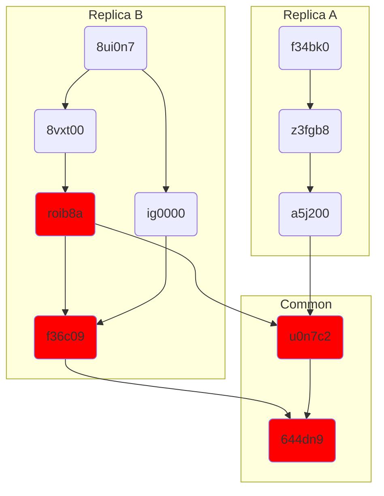
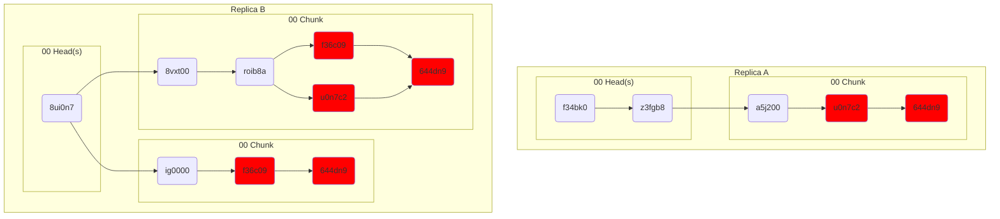
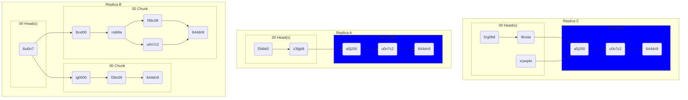
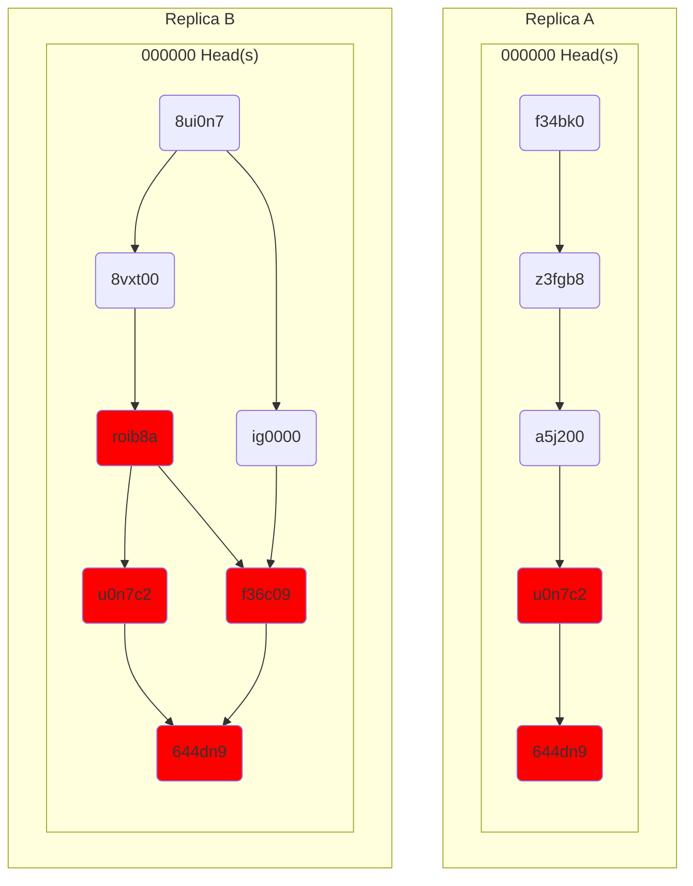
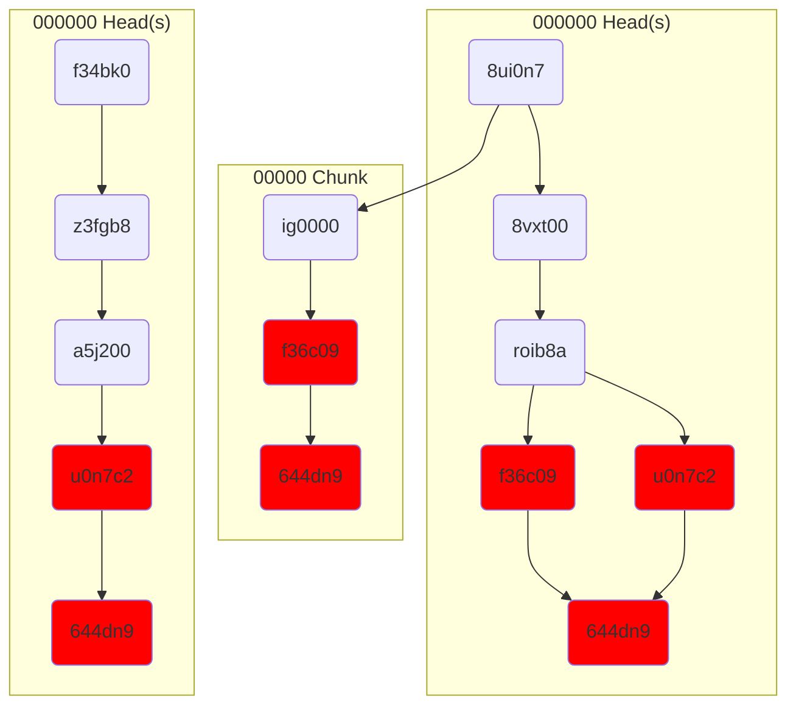
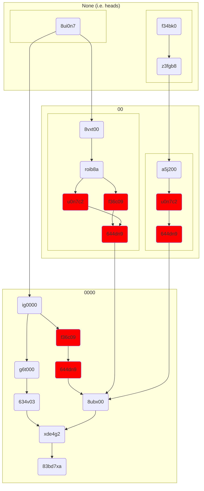

# Stable Chunking

Take the following causal graph on two replicas.



Replica A and B each start from their heads, and walk until they encounter their hardness metric:



> [!NOTE]
> Typically this hardness metric would produce larger chunks, but for explanatory purposes they've been kept small

Note that we have the same ops in multiple chunks! This is both across replicas (`u0n7c2` and `644dn9`), and inside chunks on replica B (`f36c09` and `644dn9`). This duplication will only persist until the next common chunk (which we're guaranteed by hash chaining).

This bounded, limited duplication is in service of a very important property: being coordination-free. If another Replica C has ops from the `8vxt00` chunk but not the `ig000` or `a5j200` (plus others not seen above), it will _also_ produce the same `8vxt00` chunk.



# Granularity

If we make the hash function _too_ hard, we cease to retain common sections between replicas. Below we have a hash hardness of six zeroes (`000000`). 



# Merging

Later, we decide that we want to merge chunks. We choose a harder hash metric (six `0`s). We know that everything inside each `00` chunk will get grouped together, so we don't have to recompute that traversal (though we _do_ want to deduplicate). We only need to look at the heads of each graph to know if we should stop.

In this example, let's assume that the replicas from earlier have synced, so we'll treat it as a single graph:



## Archival Strategy

To reduce the duplication across chunks, we can merge chunks into larger runs. _Extremely_ generally, ops much earlier in the causal history are less likely to have siblings. Under this assumption, we can use a metric like hash hardness to determine ranges with a backoff.

One such metric is to decrease the hash hardness as chunks are generated. In essence, this is a search problem on the causal graph, splitting it into probabilistically smaller regions the nearer it gets to the latest head. This strategy is stable across all replicas with shared history, and produces stable subsumptions.

(Forgive me, I added more ops under `ig0000` to make the chunk more illustrative)



## Merging & Encryption

Under encryption, the contents cannot be inspected, and the same ops may be encrypted with a different key (yielding a different ciphertext). An [Agent] with [Pull] access may want to know which granular chunks can be be retired after a period of time. This is achieved by nothing the head hashed and metric used:

```rust
struct EncryptedChunk {
    head: Vec<Hash>,
    hardness: u8,
    contains: Vec<(Hash, MaxHardness)>,
}
```

We do need to note the hardness in addition to the hash, since the two together uniquely determine the resulting subgraph. We only need to note the maximum hardness used, since hardness is a monotone function. We cannot only rely on the zeros in the hash because we may have used a weaker metric to calculate the region.

> [!NOTE]
> This is — in a sense — a known plaintext attack _against ourselves_ in the common case where we produce the exact same chunk prior to encryption. This means that any encryption method used MUST be secure against known plaintext.

# Adversarial Garbage Collection

# Future Directions

This chunking strategy can also be used to generate stable flattened histories (AKA "squash compression").
