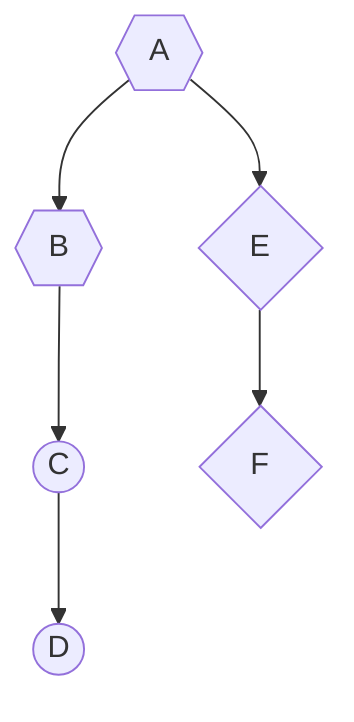
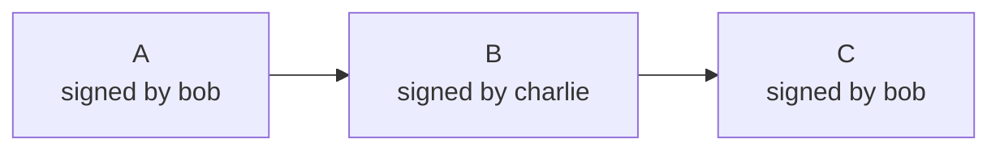
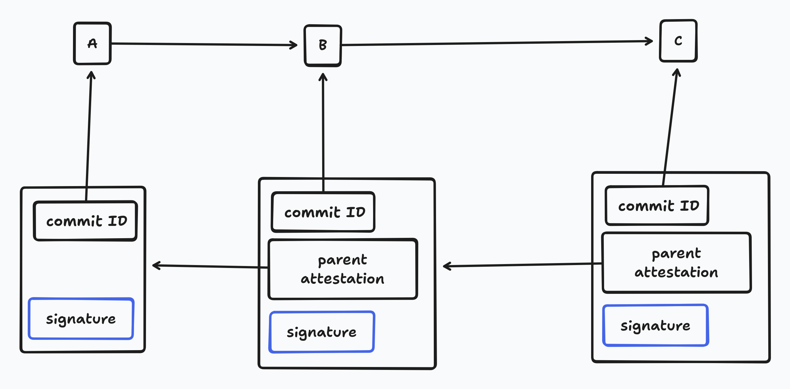

# Signatures in Keyhive/Beelay

Keyhive gives us an access control primitive which allows us to determine which devices - identified by Ed25519 public keys - are allowed to write to which parts of the history of a document. Specifically, the content of a document is a commit graph and the keyhive auth graph tells us which ranges of the commit graph are writable by particular keys.

This is great, to be useful though we have to actually know who authored a particular commit. Clearly we want some way of signing commits, but this is a little more fiddly than it might first appear. There are two high level problems:

1. We have to handle the situation where there are multiple signatures for the same commit
2. We need to find a way to compress signatures when building chunks in sedimentree

The combination of these problems is tricky and I think suggests that we need to choose one of these two designs:

* Allow there to be multiple signatures per commit which will result in additional complexity in the keyhive/beelay codebase in return for looser requirements on the document types and a more flexible concept of attestation
* Require that the commits in a keyhive document (i.e. Automerge commits) have some concept of an author which can be related to keyhive identities. This would be an additional requirement we would need to add to Automerge and any other document type which wants to be used with Keyhive

## Multiple Signatures?

The only thing we currently require of a commit in keyhive is that it be some sequence of bytes with some identifier and the identifiers of it's parents. For an Automerge document the sequence of bytes is the encoded commit and the identifier of the commit and it's parents is the hash of the commit and the hash of it's parents. A commit then looks something like this;

```rust
struct Commit<Id> {
	hash: Id,
	parents: Vec<Id>,
	contents: Vec<u8>,
}
```

A straightforward way to add a signature to this would be something like:

```rust
struct Commit<Id> {
	hash: Id,
	parents: Id,
	contents: Vec<u8>,
	signature: ed25519_dalek::Signature,
}
```

Where the signature is over the `hash`, `parents`, and `contents`. The difficulty with this is that there is nothing stopping multiple devices from producing the same commit. What then should we do when we receive two commits with the same contents but different signatures, who should we say is the author of this commit? A scenario which I think is very likely to lead to this happening is keyhive nodes importing changes into a keyhive document from outside of a keyhive context (i.e. changes produced with vanilla Automerge somewhere, like a legacy app), multiple nodes might import such changes concurrently.

We have to arrive at the same state on every node which has received the same messages, so I think we have these options:

* Choose the author with the lexicographically smallest signature (or some other arbitrary but deterministic rule)
* Ignore commits with multiple signatures
* Allow commits to have multiple authors

The first two seem quite undesirable to me, in the first case the author of a commit would change for no obvious reason and in the second the document would appear to lose data. This entire scenario also suggests that "author" is not really the correct framing for this kind of signature and instead we should think of it more as "attestation". Accepting multiple signatures on a change means that if at least one signature has write permission then it should be accepted in the document. This model is much more flexible and would allow workflows where a user is revoked but then some other user who has access to the document can still attest to changes the revoked user made if those changes are deemed good.

### Compressing signed commits

Another problem with signing commits is that signatures do not compress well. We have done a great deal of work to compress away the hashes on each commit in an Automerge document, retaining the signatures for each commit would undo all that work. We need to know who is attesting to each commit though, what can we do?

Well, we can perform the same kind of trick that we do with the change hashes. The insight is that in linear runs of commits we only need the signature of the end of the run. E.g. in this graph where hexagons are signed by Bob, rhombuses by Alice, and circles by Charlie.



Conceptually we only need to store the last signature in each run, plus a counter saying how many changes back the run goes. So we would store something like:

| Head of run | Count |
| ----------- | ----- |
| D           | 2     |
| F           | 2     |
| B           | 2     |

All well and good, but what are we actually signing at the end of each run? If the signature is just over the commit (its hash and its parent hashes) then when we receive a run of commits we have no way of verifying them. Say we had this run of commits originally:



But Bob sends you a compressed chunk containing A, B, and C, Bob can just send you the signature on C and tell you the run was three commits long and you will infer that Bob was the author of B!

The problem is the same as with the multiple signatures on a commit problem, we have no way of binding the contents of a commit to an author. In this case we can solve the problem by requiring that signatures not be over the commit directly, but over a wrapper we will call an attestation:

```rust
struct AttestationPayload<CommitId> {
	commit: CommitId,
	parent_attestation: AttestationHash,
	author: ed25519_dalek::VerifyingKey
}

struct Attestation<CommitId> {
	payload: AttestationPayload<CommitId>,
	signature: ed25519_dalek::Signature,
}

// The hash of a n`AttestationPayload
struct AttestationHash(blake3::Hash)
```

Now, in order to verify the run we can start at head of the run and walk backwards `count` steps, then we can construct the `AttestationPayload` for each commit in the run, we can check that the hash of the penultimate `AttestationPayload` matches the `parent_attestation` in the `Attestation` for the head of the run before validating the signature.

## Attestations

Putting all this together, we end up with a design where signatures are not made over commits directly, but instead over an envelope which includes the commit ID and a link to  a similar envelope around the parent commits. That is, we have our original commit graph, and then a mirrored graph of attestations



This is a very flexible structure which allows us to have multiple signatures per commit. We can compress these attestations into attestation runs when compressing a chunk and we can union the attestation runs for two chunks when compressing that chunk into a larger chunk. The tricky part is storing and synchronising attestations.

### Synchronising attestations

Attestations are not part of a commit, or a chunk. That's the whole point of this setup, it decouples the signature from the commit. This means that we will need to store attestations alongside the commits that they refer to. Likewise we will have to store attestation runs separately to the chunks which they are part of. Most upsettingly, we will have to synchronise them separately. Now, we already have two phases when synchronising a document - one for the CGKA ops and one for the sedimentree. CGKA ops should change relatively infrequently so this isn't too big a deal, but attestations will likely change as frequently as the document does.

The document content is synchronised via sedimentree sync. What that means is that we download the minimal set of chunk boundaries which the other end says is needed to cover the whole document content.  Due to the fact that exponentially larger chunks are created as the commit graph gets larger this means we end up needing to download around $log_{10}(n)$ hashes (where $n$ is the number of commits) in order to figure out what we are missing. Including all the attestations in this summary would enormously increase the amount of information to download. Instead, I think we should put on each chunk a hash of all the attestations we are aware of for that chunk. Then if one end discovers that the other end has a different attestation hash for some chunk it can re-download all the attestations. This should be a relatively uncommon operation and not too much bandwidth anyway.

### API

At a high level the advantage of the attestation approach is that Beelay can manage attribution for the application. This means that Beelay can ensure that new commits added by the application are attested to by the active peer, and can perform the logic of validating attestations received over the network. This in turn means that the application (Automerge) needs no modifications in order to attest to commits - just call `Beelay.addCommits`.

It's slightly more complex to load documents because attestations are separate from the commits and chunks which make up a document, which means the API has to return them separately. More irritatingly, the application has to be able to accept attestations appearing later. Thus the API ends up looking a bit like this:

```typescript
class Beelay {
	// Adding commits doesn't require any signing logic
	function addCommits(doc: DocumentId, commits: Commit[]) {}
	// Load a document returning the current commits and attestations
	function loadDocument(): Loaded | null {}
	// Listen for changes to a document after it is loaded. 
	// as you will see from the DocEvent type below, an event is fired when 
	// the content changes, or when the attestations change
	function on("doc_event", callback: DocEvent => void)
}

type Loaded = {
	// The actual content of the document
	commits: CommitOrChunk[]
	// The ranges of the commit graph which have known attestors
	attestations: Attestation[]
	// Ranges of the commit graph each attestor has write access to
	ranges: WriteRange[]
}

type Attestation = {
	start: CommitHash,
	end: CommitHash,
	author: PeerId
}

type WriteRange = {
	attestor: PeerId
	start: CommitHash[],
	end: CommitHash[],
}

type DocEvent = 
	| { type: "content", data: CommitOrChunk }
	| { type: "attestation", attestation: Attestation }


type CommitOrChunk = 
	| { type: "commit", data: Uint8Array }
	| { type: "chunk", data: Uint8Array }

// A hex encoded ed25519 public key
type PeerId = string
```

This seems awkward because Automerge now has to know how to handle commit attestations changing after having loaded them, which means that at any time the visibility of commits in the document could just change. However, this is something Automerge has to be able to handle anyway in order to handle revocation events which will change the `WriteRange` which a particular attestor has access to.

### Decompressing Chunks
Beelay has no understanding of how chunks are compressed, but in order to validate the attestation runs it needs to have access to the commit graph of a chunk. This means that in order for Beelay to own the attestation validation work we will need to add an extra API for Beeelay to request that Automerge decompress a chunk into a change graph. This might look something like this:

* Beelay emits an event saying "I need the commit graph for this compressed chunk"
* Automerge picks up the chunk, decompresses the commit graph, and passes it back to Beelay
* Beelay walks the commit graph along with any attestations it has available and then emits a "doc_changed" event with any new attestations it discovered

Beelay can cache validated attestations, so we would only need to do this when new attestations are received for a chunk.

## Or just do it in Automerge

All of this attestation malarkey is downstream of the fact that there is no way to bind the content of a commit to the public key which authored it. The mapping from public key to authorised range of the commit graph which Keyhive gives us is not much use to Automerge without some way of knowing the author of a commit. However, instead of making this Keyhive's problem we could make it Automerge's problem. 

Concretely what this would look like is that we would add a signature field to Automerge commits. We could them perform a similar compression trick to the attestation chains, but within Automerge. For simplicity we should probably only support Ed25519 signatures. This would mean that Automerge would natively know who the author of a commit was and there would be no need to handle multiple signatures for the same commit or for Beelay to know about the signatures at all.

This would have some consequences for Automerge:

* When importing changes into a document (via `merge` or `applyChanges` or `loadIncremental`) we would have to decide what to do with changes which _don't_ have a signature. In a Beelay context we probably want to either:
	* Throw an error
	* Rewrite the commits with the importing device as the author. If multiple devices perform such an import concurrently then we will end up with duplicated ops - until we have cherry-pick at which point we would implement this kind of import as a cherry-pick.
* When creating changes we now need to provide a signature for the change. We want to support using WebCrypto or other asynchronous APIs for signing, which means that we would need to introduce some new API for creating changes - maybe `Automerge.change` would become asynchronous, maybe we have some kind of queue within a document which doesn't "publish" changes until we've received a signature for them.

## Pros and Cons

### Attestations

#### Pros
* Much more general, we can support workflows where changes from a revoked peer are approved by some other peer
* Document type generic, the underlying document only has to provide a commit DAG, no concept of authorship
	* In particular, the underlying document type does not need to implement asynchronous signing mechanisms, those are handled by Beelay

#### Cons
* More complex to implement and a more complex API
* We have to synchronise another data type and a bit more data
* Attestations can arrive out of sync with commits, which means they could not arrive at all

### Automerge native commits

#### Pros
* Much simpler model, all commits have a single author
* Keeps complexity out of Beelay
* The authorship information can be used to provide better change history APIs in Automerge - e.g. "give me patches grouped by author"
* Not really more data to sync
* No strange scenarios where the document content has synchronised but not the signatures

Cons
* Automerge APIs for creating changes now become more complex due to asynchronous signature requirements
* Requires cherry-pick to properly handle importing changes from unsigned documents
* Less general - we require any document type which wants to sync via Beelay to implement it's own signature layer.

